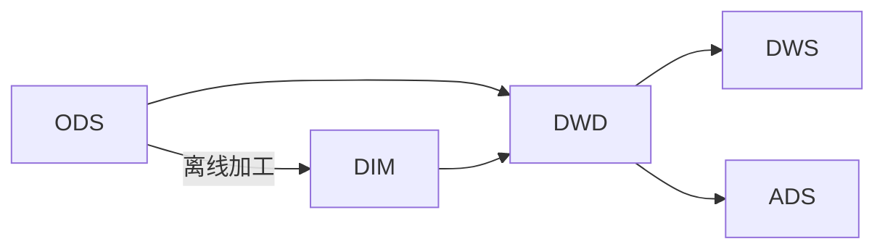

## 说明

- 直接看书看不下去
- 只有边看边做笔记才有效率

[TOC]

## 架构分析

- 

## 日志采集

### 浏览器采集过程

#### 页面浏览日志采集流程

#### 页面交互日志采集

#### 页面日志的清洗和预处理

### 无线客户端采集过程

- 阿里巴巴内部使用UserTrack的SDK采集
- 用户的行为通过“事件”这一概念来描述，也作为程序处理的基本单位

#### 页面事件

#### 控件点击及其他事件

#### 特殊场景

#### 遇到的问题

##### app应用繁多

##### 设备的不同

##### 传输的透明性

#### 现阶段的挑战

## 数据同步

### 同步类型

- 直连同步
- 数据文件同步
- 数据库日志解析同步

### 直连同步

- 规范的接口API
- 动态链接库的方式连接业务库
- 因为所有类型数据库全部根据统一的api作为接口，所以比较容易转移业务

### 数据文件同步

- 定义好文件编码，大小，格式。
- 多个不同类型全部读写到一个文件服务器
- 然后在统一上传，下载，进行管理
- 可以包含一个校验文件，记录数据量大小，和数据同步准确行

### 数据库日志解析同步

- 日志文件的系统恢复用来记录数据库的操作
- 操作有：增删改查
- 所以一条记录用同一个主键，但是操作类型不一样或者说执行流程不一样。需要进行一个去重处理
  - 不过滤删除流水
  - 过滤最后一天删除流水
  - 过滤删除流水和之前的流水

### 现阶段问题

- 数据延迟
- 日志分析难度较大耗时间
- 数据漂移和遗漏，如零点的时候的增量表，该如何处理

## 阿里数据同步的解决方案

- 可以处理多样化的数据来源，各种数据库
- 处理数据量大，可以达到EB级别，同步数据达到PB级别

### 批量数据同步

- 建立一个数据仓库系统
- 需要统一数据格式，结构化的数据
- 统一可以使用SQL标准语言
- 数据类型均可以转换字符串

### DataX

- Job:数据同步作业
- Splitter:作业切分模块，将一个大任务分解成多个可以并发行的小任务
- Sub-Job：小任务
- Reader：数据读入模块
- Channel：交换数据的管道
- Writer：数据写出模块

### 实时数据同步

- 天猫双11，需要实时汇总，秒级数据刷新
- 解析mysql的binlog日志来实时获得增量的数据更新
- 通过消息订阅模式来实现数据的实时同步
- 一个数据交换中心
  - 从每台服务器源源不断读取日志数据
  - 然后解析binlog
  - 再同步到日志交换中心

### TimeTunnel

- 基于生产者，消费者和topic消息标识的消息中间件，将消息数据持久化到HBase的高可用，分布式数据交互系统
- 生产者：数据的产生端
- 消费者：数据的接收端
- 同批次

### 遇到的问题

#### 分库分表

- TDDL：taobao Distributed Data Layer,分布式数据库的访问引擎
- 解决分库分别的规则引擎问题
- 解决了SQL解析，规则计算，表名替换，选择执行单元并合并结果集的功能
- 解决数据库表的读写分离
- 主从备份，主备切换问题

#### 高效同步和批量同步

- oneclick

#### 增量与全量同步的合并

#### 同步性能的处理

#### 数据漂移的处理

## 离线数据开发

### 开发平台

- 业务迭代频繁
- 需求快速交付
- 上线频繁
- 运维任务多
- 系统环境负责

#### MaxCompute

- 共享安全，存储，数据管理和资源调度
- 客户端
  - Web：以restful api提供服务
  - SDK：封装API
  - CLT：完成project管理，DDL，DML等
  - IDE：上层可视化
- 接入层
  - 提高http
  - cache
  - 负载均衡
  - 用户认证
  - 服务访问控制
- 逻辑层
  - 用户空间和对象的管理
  - 命令的解析与执行逻辑
  - 数据对象的访问控制与授权
  - worker
  - scheduler
  - executor
- 计算层
  - 飞天内核
  - pangu分布式文件系统
  - fuxi资源调度系统
  - zuwa域名服务
  - shennong监控模块
  - OTS:OPEN TABLE SERVICE开放结构化数据服务，保存元数据内容
- 特点，也可以说这是基本要求
  - 计算性能高且便宜
  - 集群规模大且稳定性
  - 功能组间非常强大
  - 安全性高

#### 统一开发平台

- 任务开发及调式
- 测试
- 规则校验
- 发布
  - 任务运维
  - 质量监控
  - 运维监控
  - 数据管理
- D2
  - 集成任务开发，生成任务调度记大数据运维
  - 数据权限管理
  - 数据分析工作台的功能
- SQLSCAN
  - 专门检查用户编写的SQL质量差，性能低，不遵守规范等
- DQC data quality center 数据质量中心
  - 数据监控，监控数据质量并报警
  - 数据清洗，将不符合规则的数据清洗掉，保证没有脏数据
  - 强规则和弱规则，强规则会阻塞任务，弱规则只会报警
- 数据测试
  - 验证数据是否符合目标预期
  - 新增业务需求
  - 数据迁移，重构和修改
  - 数据对比：不同集群，异构数据库的表做数据对比
  - 数据分布：提取表和字段的一些特征值，并将这些特征值与预期值进行比对
  - 数据脱敏：将敏感数据模糊化。主要保证数据安全

### 任务调度系统

- 传统调度系统，设计一个有向无环图，每个节点都是一个定时任务。这就和AOV图有点关系了

#### 数据开发流程和调度系统的关系

- 需要达到一种低耦合的关系。调度系统有一个个节点任务。每次增加和删除任务，都要达到无感性

#### 调度系统设计

- 两个模块：调度引擎和执行引擎。阿里内部的phoenix engine 和 alisa
- 调度引擎之任务状态模型
  - 未运行
  - 等待运行
  - 等待资源
  - 运行中
  - 成功或者失败
- 调度引擎之工作流状态机模型
  - 人创建工作流
  - 已经创建
  - 启动
  - 运行中
  - 全部任务成功或者部分任务成功
- 调度引擎之工作原理
  - 异步处理任务调度
  - 同步处理任务调度
  - 任务事件处理器
  - DAG事件处理器
- 执行引擎之工作原理
  - 任务管理接口：供用户系统想ALISA中提交，查询和操作离线任务，并获得异步通知
  - 系统管理接口：供系统管理员进行后台管理，包括集群增加新的机器，划分资源组
  - Driver：alisa的调度器，负责接口之间的交互，任务调度，集群容灾和伸缩，负载均衡以及数据失效备份
  - Task poo：任务池中的所有管理，包括等待资源，数据质量检测，运行中，运行成功，和失败的所有任务。
  - Resource manager：关注集群整体资源的管理
  - Task container：类似于Web server，为task提供运行的容器
  - session magager：实现对task session的管理
  - Node：代表集群中的一个节点。逻辑上的节点。不是完全对应物理结构上的。一个物理机器上可以有多个node

### 调度系统的使用

- 通过配置
- 定时调度
- 周期调度
- 手动运行
- 补数据，也就是增量
- 基线管理，业务数据优先
- 监控报警

## 实时技术

### 要求

- 时效性高
- 常驻任务
- 性能要求高
- 应用局限性

### 流式技术架构

- 数据采集：各个日志服务器，数据的源头
- 数据处理：中间件负责上游和下游对接。下游要可以订阅数据，并拉取到流式计算系统的任务中进行加工处理
- 数据存储：数据被实时加工处理后，会写到某个在线服务的存储系统，更多要关注是个增量操作并且是源源不断的
- 数据服务：在存储系统上会架设一层统一的数据服务层，用于获取实时计算结果

#### 数据采集

- 数据库变更日志，比如mysql的binlog，hbase的hlog日志。总之时变更日志
- 引擎访问日志：比如用户访问网站产生的Apache引擎日志，搜索引擎的接口查询日志
- 更新数据
  - 数据大小限制：批次写入。一条条写入效率太低而且没有必要。512KB一批
  - 时间阈值限制：有时候数据量特别少，总是很难短时间收集到512KB，所以要有个时间限制，时间一到就写一批

#### 数据处理

- 主要是计算力，和数据的正确性。因为都是对增量数据和变更日志处理。所以不是单纯的写数据，有个解析过程
- 去重指标
  - 因为计算指标会放在内存中计算，以此提高效率。同时会保存很多中间计算的结果。对于内存来说会造成溢出情况。所以需要去重不必要的指标
  - 精确去重：对于必须保存的明细数据，遇到内存问题时，可以通过数据倾斜来进行处理，把一个节点压力分到多个节点
  - 模糊去重：如果对业务数据精读要求不高，可以用去重算法降低内存使用量
  - 布隆过滤器
  - 只保存明细数据对应的哈希值的标记位。可以用来统计uv数据
  - 基数估计
  - 按照数据分散程度来估算现有数集的边界，从而得出大概的去重值综合。这里估算的去重值可能比真是值大，也可能更小。同样适合统计UV数据
- 数据倾斜
  - 数据量特别无法一个节点计算所有的值，需要进行分桶处理
  - 去重指标分桶，用hash
  - 非去重指标分桶，随机分配到每个桶
- 事务处理
  - 在分布式系统中，如何以一个事务为单位，保证系统的稳定运行了
  - 超时时间：用来是否重发的一个条件
  - 事务信息：用事物ID来识别重发与第一次发的区别
  - 备份机制：用于数据恢复

#### 数据存储

- 数据维度太多
- 中间计算结果：发生故障时，从数据库中的数据恢复内存现场
- 最终结果数据：直接写入下游
- 维表数据：后面详说

##### 数据库的使用

- 表名设计
  - 汇总层标识+数据域+主维度+时间维度
- rowkey设计
  - MD5+主维度+维度标识+子维度1+时间维度+子维度2
  - MD5可以把数据散列，减少热点数据，是服务器整体负载均衡

#### 数据服务

- 提供良好API
- 屏蔽数据库差异

### 流式数据模型

- 五层：ODS,DWD,DWS,ADS,DIM

#### 数据分层

##### ODS

- 操作数据层，是直接从业务系统采集过来的原始数据，包含了所有业务的变更过程
- 数据粒度最细

##### DWD

- 根据业务过程建模出来的实时事实明细层，对于访问日志这种数据，回回流到离线系统供下游使用
- 保证ODS和DWD层是一致的
- 如订单支付明细表，退款明细表，用户的访问日志明细表

##### DWS

- 对于明细层的数据，要实时计算各个维度的汇总指标
- 如果维度是各个垂直业务线通用的，则会放在实时通用汇总层，作为通用的数据模型使用

ADS

- 个性化维度汇总层，对于不是特别通用的统计维度数据会放在这一层中，这里计算只有自身业务才会关注的维度和指标
- 用于垂直创新业务中

##### DIM

- 是一种维表
- 商品维表，卖家维表，卖家维表等待

##### 例子

- ODS：订单粒度的变更过程，一笔订单有多条记录
- DWD：订单粒度的支付记录，一笔订单只有一条记录
- DWS：卖家的实时成交金额，一个卖家只有一条记录，并且指标在实时刷新
- ADS：外卖地区的实时成交金额，只有外卖业务使用
- DIM：订单商品类似和行业的对应关系维表

#### 多流关联

- 多个实时流进行主键关联，以得到对应的实时明细表
-  在离线系统中，两个表在启动的时候可以获得全量数据，然后根据关联键进行分桶
- 在流式计算中，面对的是增量数据，而且数据的时间是不确定的，且无序的
- 所以需要中间状态的保存和恢复机制来把控数据
- A表，B表使用ID进行关联。每次获取A表一条数据，就在B表中全量查询是否有关联。然后拼凑一条数据
- 查找性能是个问题，建议分桶。同时订单变更问题，要考虑去重问题

#### 维表使用

- 在实时计算中，关联维表一般会使用当前的实时数据去关联T-2的维表数据，相当于在T的数据到达之前需要把维表数据准备好，并且一般是一份静态的数据

##### 问题

- 数据无法及时准备好
- 无法准确获取全量的最新数据
- 数据的无序性

##### 准备数据问题

- 在零点时，实时流数据必须去关联维表，而这个时候T-1的维表数据一般不能在零点马上准备就绪（因为T-1的数据需要在T这一天加工生成），因此去关联T-2维表，相当于在T-1的一天时间里加工好T-2的维表数据
- 这里还是没有明白？

##### 准确获取全量的最新数据

- 需要T-1的数据+当天变更才能获取到完整的维表数据
- 维表作为一个实时流输入，这就需要使用多流实时关联来实现

##### 数据无序性问题

- 在实时计算中维表关联一般都统一使用T-2的数据，这样可以获取更准确的数据
- 显然这是有延时的
- 对于数据每天晚上10点开始对维表进行加工处理，在零点到达之前，处理的两个小时同时也失去新的变更增量
- 方法一
  - 全量加载
  - 维表数据量少，一次性加载到内存中，在内存中直接和实时流数据进行关联，效率较高
- 方法二
  - 增量加载
  - 维表数据量多，增量查找以及LRU过期的形式

### 双11的挑战

#### 挑战

- 毫秒级延时
- 洪峰明显
- 高保障性

## 数据服务

### 服务架构演进

### 技术架构

### 实践

## 数据挖掘

- 面向机器学习算法的并行计算框架和平台
- 面向企业级数据挖掘的算法资产管理体系

### 算法平台

### 中台体系

### 案例讲解

## 数据模型

