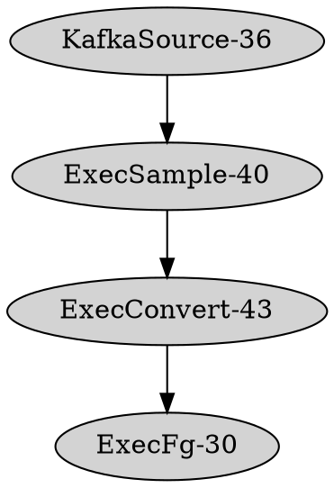
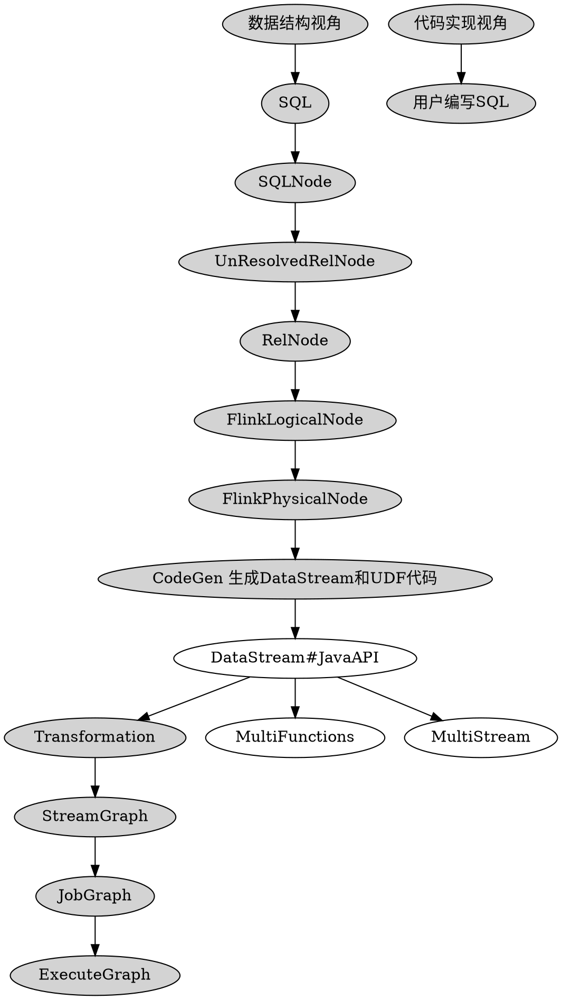

## Flink

## 目录参考
1. 理解时间
2. 背景介绍
3. 参考资料
4. 核心思考问题
5. 入门概念
6. 阅读笔记
7. 项目工作流
8. 技术流图和图解
9.  源码目录
10. 模块拆解-横向
11. 模块拆解-纵向
12. 性能总结
13. 设计总结
14. 经验总结
15. 第三方依赖
16. 应用场景
17. 业务通点
18. 行业实践
19. case代码


### 理解时间
```
2023年7月10号启动

完整理解flink项目
如果只是在搜索引擎 搜 flink是远远不够的
flink + 架构图

flink + 概念关键词

flink + 问题排查

flink + 面试汇总

flink + 极客挑战赛

flink + 论坛会议

flink + 论文

flink + 前沿分享

flink + 场景应用

flink + flink大佬名字

flink + 公司项目
等等才能完全熟悉flink


```

### 核心思考问题
1. flink为什么那么快
   1. 内存复制
      1. BufferEntry
   2. 指针运用
   3. 单条数据处理的关键路径
   4. 非常低的读写延迟（µs）
   5. 轻量稳定的 Checkpointing 流程
   6. fs优化
   7. memory优化
      1. BinaryRow 应用，高效索引
   8. io优化
2. flink内存管理
   1. flink中在自定义自己的内存组件，中间有哪些内存泄漏的情况，不可能一次性写的无bug
   2. 这类case需要积累下来，都是经验
3. flink如何保证稳定性
   1. 回滚机制
   2. 资源申请与释放
   3. 机器节点故障排查
   4. 状态恢复机制
4. flink设计
   1. dag 描述符 pipeline 和 Transformation
   2. op ，function ， input 和 output 的父类和所有子类关系
   3. 状态的应用
   4. 时间水位线的应用
5. flink如何高效开发，测试，迭代和发布
   1. 代码如果看的越熟，开发效率越快。本身项目非常复杂，要想短时间内提高效率，那就只能多看代码解析的文章，帮助自己加速理解代码设计
   2. 从这个文章2023年7月10号到今天 2024年11月18号，我算是勉强能上手并开发flink代码，所以整个过程还是比较漫长的，门槛有一定要求
   3. 理解的过程中，直接看代码基本不现实，我是结合业务逻辑，业务报的异常，网络上的文章，不同公司落地视频分享，收集一些对flink的问题，spark和flink的异同点，流批一体的设计点和平时与同事的沟通聊天中
   4. 整理了许多问题，这些问题是多角度的，带着问题作为入口再去看flink，就能一点点撕开flink的整个设计流程，最终又像网状结构耦合在一起。
   5. 如果有人带是最好的，帮助你分析每个模块作用，模块与模块之间关系，甚至具体到类与类之间关系，以及类的设计含义，同时还能告诉你先看哪个模块，再看哪个模块，这样效率就能提高很多
6. flink技术问题
   1. task 数据如何交换
   2. streamgraph jobgraph exegraph 映射图
   3. checkpoint如何实现
   4. OperatorChain
7. 进一步高效深入理解flink，需要结合峰会主题分享，挖掘高价值问题
   1. 带着高价值问题，再深入找重要技术细节
   2. flink issue https://issues.apache.org/jira/projects/FLINK/issues/FLINK-36867?filter=allopenissues
      1. 找找有价值优化思路 和 排查问题的手段
   3. 


### 参考资料
1. 官方分享：https://space.bilibili.com/33807709
   1. 深入解析 Flink 细粒度资源管理：https://mp.weixin.qq.com/s/Rs5RWeSNf9n1wTo0M93s8w
   2. Flink 大规模作业调度性能优化：https://mp.weixin.qq.com/s/bcSgHty9h7GYsGVTjKQ2-Q
   3. parquet：https://mp.weixin.qq.com/s/KktmGLBoXoHeM9E1H_5r9w
   4. Flink Remote Shuffle：https://mp.weixin.qq.com/s/3O_DVY9U7r-sRMhs1DH4IA
   5. Calcite剖析：https://cloud.tencent.com/developer/column/102596?from_column=20421&from=20421
   6. [源码分析] 带你梳理 Flink SQL / Table API内部执行流程：https://www.cnblogs.com/rossiXYZ/p/12770436.html
   7. Apache Hudi 中自定义序列化和数据写入逻辑：https://mp.weixin.qq.com/s/-xeLfuoL28EO7gqQMLeKTw
   8. Flink Sort-Shuffle 实现简介：https://mp.weixin.qq.com/s/y7okSgf7vFB5JMwvaWZl5g
   9. HBase 读链路解析：https://mp.weixin.qq.com/s/yQ8Cg3dgPnJp9AtYSm5A2A
2. Flink2024 峰会
   1. 并行度全托管 过低过高或者固定
   2. 高效扩缩容
3. Flink专家blog
   1. https://liebing.org.cn/
   2. https://cloud.tencent.com/developer/user/1350579
   3. https://cloud.tencent.com/developer/user/1207538
4. 选品（选优质文章）的公众号
   1. HBase技术社区
5. OLAP
   1. 多维分析概念：https://cloud.tencent.com/developer/article/2434642
   2. 解读Implementing data cubes efficiently：https://cloud.tencent.com/developer/article/2450528
6. SQL解析组件大对比：https://cloud.tencent.com/developer/article/2416358
7. 行业应用
   1. Flink 在蚂蚁实时特征平台的深度应用：https://blog.csdn.net/weixin_44904816/article/details/136204440   
   2. Flink 在风控场景实时特征落地实战 - 是咕咕鸡的文章 - 知乎 https://zhuanlan.zhihu.com/p/477262244
   3. 微信安全基于 Flink 实时特征开发平台实践 - Flink 中文社区的文章 - 知乎https://zhuanlan.zhihu.com/p/646114539
   4. 腾讯基于 Flink SQL 的功能扩展与深度优化实践：https://juejin.cn/post/6924868645537792008
   5. flink2024云相册地址：http://live.jimage.cn/gti/36dfd2e4?from=groupmessage
   6. 
```
xiaogang shi
动态数据流上的实时迭代计算
sunmengyao


watermark内容
watermark 原理：https://zhuanlan.zhihu.com/p/507776567
深入理解流计算中的 Watermark：http://www.whitewood.me/2019/02/24/%E6%B7%B1%E5%85%A5%E7%90%86%E8%A7%A3%E6%B5%81%E8%AE%A1%E7%AE%97%E4%B8%AD%E7%9A%84-Watermark/
FLIP-126: Unify (and separate) Watermark Assigners：https://cwiki.apache.org/confluence/display/FLINK/FLIP-126%3A+Unify+%28and+separate%29+Watermark+Assigners


state内容
什么是 Flink State Evolution?：http://www.whitewood.me/2019/03/17/%E4%BB%80%E4%B9%88%E6%98%AF-Flink-State-Evolution/


专家带你吃透 Flink 架构：一个新版 Connector 的实现
https://cloud.tencent.com/developer/article/1930263


Apache Flink 必知必会经典课程
https://www.bilibili.com/video/BV1vf4y1x7se/?spm_id_from=333.999.0.0&vd_source=0f9d0e0a195e3352b97b5cb0ca3e57a2

flink官方教程
https://github.com/flink-china/flink-training-course/


有状态流式处理引擎基石
https://files.alicdn.com/tpsservice/b55f732fbc32522ca5394544f3834530.pdf


快手流批一体
https://flink-learning.org.cn/article/detail/110131b6a6c6c707c647459726ef039a?spm=a2csy.flink.0.0.49495badMgiAjD

flink业界用法

自定义jar包

flink sql写法

flink dag用法

流批一体

```

## flink前沿技术更新
1. 版本迭代：https://cwiki.apache.org/confluence/display/FLINK/1.18+Release
2. 展望Flink各版本及新特性：https://blog.csdn.net/qq_36470898/article/details/130451864 
3. Flink 2.0
   1. 由于RocksDB中LSM结构的周期性 Compaction 导致计算资源尖峰的问题
   2. 大规模状态快速扩缩容的挑战
   3. 容器化环境下计算节点受本地磁盘大小限制的问题
   4. 原生的轻量级和快速检查点
4. Flink 1.19
   1. https://mp.weixin.qq.com/s/DxoI38o7TpzpMXto8ep6ow
   2. 源表自定义并行度
   3. 使用 SQL 提示配置不同的状态 TTL
   4. 函数和存储过程支持命名参数
   5. Window TVF 聚合支持处理更新流
   6. 新的 UDF 类型：AsyncScalarFunction
   7. Regular Join 支持 MiniBatch 优化
   8. Source 反压时支持使用更大的 Checkpointing 间隔
   9. CheckpointsCleaner 并行清理单个检查点状态
   10. 与 Source API 一致的 SinkV2 新接口
   11. 用于跟踪Committables状态的新Committer指标
5. Flink 1.18
6. Flink 1.17
   1. https://developer.aliyun.com/article/1226832
   2. 对 TM 的网络层配置做了很多简化，新增了多个核心特性，提高了 Runtime 层面网络的开箱即用
   3. 在 SQL 层面引入了 PLAN ADVICE 功能
   4. Batch 作业的全链路都支持了预测执行
   5. local hash agg
   6. 消除虚函数调用
7. Flink 1.16
   1. https://developer.aliyun.com/article/1173732
   2. Slow Task Detector 的组件。这个组件会周期性的查看是否有一些慢任务以及慢任务对应的热点机器
   3. 一个是 Pipelined Shuffle，另一个是 Blocking Shuffle。Hybrid Shuffle 在数据落盘方面，有两套策略。一套是全落盘，另一套是选择性落盘。
   4. Protobuf Format 的支持
   5. 引入了 RateLimitingStrategy
8. Flink 1.15
   1. https://mp.weixin.qq.com/s/eTPq_P0oPthgUCGe3SqTRA
   2. JSON Plan 计划
   3. 基于 Changelog 的状态存储
   4. 澄清 Checkpoint 与 Savepoint 语义
   5. 基于 Reactive 模式与自适应调度器的弹性伸缩
   6. 跨源节点的 Watermark 对齐
9. Flink 1.14
   1. https://mp.weixin.qq.com/s/Gy3RYfQ_qFTXsJvufOng4g
   2. 同一个应用当中混合使用有界流和无界流
   3. 有界流 Checkpoint 机制
   4. DataStream 和 Table/SQL 混合应用的批执行模式
   5. 缓冲区去膨胀
   6. 细粒度资源管理
   7. Facebook 流式数据处理的报告
   8. 阿里巴巴使用 Apache Flink 生成统一的、一致的业务报告的文章
10. Benchmark
   1. https://github.com/nexmark/nexmark
11. flink 向量化引擎 flash
   1. https://developer.aliyun.com/article/1634363


## 阅读笔记
### Streaming System 


Watermarked
- 加入逻辑时间时间戳，每条消息，在in-flight场景中，呈现正态分布
- 正态分布的最左值，也就是最旧的事件时间戳，定义为 watermarked
- 

### Flink内核与实现
1. Datastream
   1. KeyedStream用来表示根据指定的key进行分组的数据流。一个KeyedStream可以通过调用DataStream.keyBy（）来获得。而在KeyedStream上进行任何Transformation都将转变回DataStream。在实现中，KeyedStream把key的信息写入了Transformation中。每条记录只能访问所属key的状态，其上的聚合函数可以方便地操作和保存对应key的状态。
   2. WindowedStream代表了根据key分组且基于WindowAssigner切分窗口的数据流。所以WindowedStream都是从KeyedStream衍生而来的，在WindowedStream上进行任何Transformation也都将转变回DataStream。
   3. Join是CoGroup的一种特例，JoinedStreams底层使用CoGroupedStreams来实现。两者的区别如下。CoGrouped侧重的是Group，对数据进行分组，是对同一个key上的两组集合进行操作，可以编写灵活的代码来实现特定的业务功能。Join侧重的是数据对，对同一个key的每一对元素进行操作。CoGroup更通用，但因为Join是数据库上常见的操作，所以在CoGroup基础上提供Join的特性。
   4. join和owindow 底层均是window逻辑
   5. ConnectedStreams表示两个数据流的组合，两个数据流可以类型一样，也可以类型不一样。ConnectedStreams适用于两个有关系的数据流的操作，共享State。一种典型的场景是动态规则数据处理。两个流中一个是数据流，一个是随着时间更新的业务规则，业务规则流中的规则保存在State中，规则会持续更新State。当数据流中的新数据到来时，使用保存在State中的规则进行数据处理。
   6. BroadcastStream实际上是对一个普通DataStream的封装，提供了DataStream的广播行为。BroadcastConnectedStream一般由DataStream/KeyedDataStream与BroadcastStream连接而来，类似于ConnectedStream。
2. 数据分区
3. 时间推理工具 - 乱序问题
4. 强一致性：MillWheel:Fault-Tolerant Stream Processing at InternetScale和Discretized Streams:Fault-Tolerant Streaming Computation at Scale
5. 批处理本质是处理有限不变的数据集，流处理本质是处理无限持续产生的数据集，所以批本质上来说是流的一种特例，那么窗口就是流和批统一的桥梁，对流上的数据进行窗口切分，每一个窗口一旦到了计算的时刻，就可以被看成一个不可变的数据集，在触发计算之前，窗口的数据可能会持续地改变，因此对窗口的数据进行计算就是批处理。
6. 窗口
   1. 每个窗口只计算自己窗口内的数据
   2. 重叠窗口，按照触发器的发送时间作为新值，不可避免有重复计算
   3. 在Flink中窗口有两套实现，分别位于flink-streaming-java和flink-table-runtime-blink模块中
   4. 1）窗口对象合并和清理。2）窗口State的合并和清理。3）窗口触发器的合并和清理。
7. 水印
   1. Source Function中生成Watermark
   2. DataStream API中生成Watermark
   3. Flink SQL Watermark生成
   4. 作业中存在多个并行的Watermark
   5. 所以对于多流Watermark的处理也就是双流Watermark的处理，无论是哪一个流的Watermark进入算子，都需要跟另一个流的当前算子进行比较，选择较小的Watermark
8. TimeService
   1. 名称、命名空间类型N（及其序列化器）、键类型K（及其序列化器）和Triggerable对象（支持延时计算的算子，继承了Triggerable接口来实现回调）。
   2. 那么Timer到底是如何触发然后回调用户逻辑的呢?答案在InternalTimerServiceImpl中
   3. 基于堆内存的优先级队列HeapPriorityQueueSet
   4. 基于RocksDB的优先级队列：分为Cache+RocksDB量级，Cache中保存了前N个元素，其余的保存在RocksDB中。写入的时候采用Write-through策略，即写入Cache的同时要更新RocksDB中的数据，可能需要访问磁盘。
9.  TypeInfomation类型系统
   1. java 和 scala之间桥梁
   2. Flink SQL使用TypeInfomation类型系统
   3. 解决了DataStream类型系统在SQL中使用的问题
   4. Flink Row
      1. org.apache.flink.types.Row：在Flink Planner中使用，是1.9版本之前Flink SQL使用的Row结构，在SQL相关的算子、UDF函数、代码生成中都是使用该套Row结构。
      2. org.apache.flink.table.dataformat.BaseRow及其子类：是在Blink Runtime和Blink Planner中使用的新的Row类型数据结构，在Blink算子、UDF函数和代码生成中使用此结构。
      3. 在数据计算过程中，需要消耗大量的CPU来序列化/反序列化Row对象。 我一直就好奇这个问题怎么解
      4. Flink Row本身不是强类型的，所以需要为Row提供RowTypeInfo来描述Row中的数据类型，在序列化/反序列化的时候使用。
   5. Blink Row
      1. BinaryRow：表数据的二进制行式存储，分为定长部分和不定长部分，定长部分只能在一个MemorySegment内。
         1. 定长部分：定长部分包含3个内容:头信息区（Header）、空值索引（Null Bit Set）、字段值区（Field Values）。
         2. 变长部分用来保存超过8个字节长度的字段的值，可能会保存跨越多个MemorySegment的字段
         3. BinaryRow实际上是参照Spark的UnsafeRow来设计的，两者的区别在于Flink的BinaryRow不是保存在连续内存中，如果不定长部分足够小，可以保存在一个固定长度的内存中。
      2. NestedRow：与BinaryRow的内存存储结构一样，区别在于NestedRow的定长部分可以跨MemorySegment
      3. UpdatableRow：该类型的Row比较特别，其保存了该行所有字段的数据，更新字段数据的时候不修改原始数据，而是使用一个数组记录被修改字段的最新值。读取数据的时候，首先判断数据是否被更新过，如果更新过则读取最新值，如果没有则读取原始值。
      4. ObjectArrayRow：使用对象数据保存数据，比二进制结构存储形式多了对象的序列化/反序列化
      5. JoinedRow：表示Join或者关联运算中的两行数据的逻辑结构，如Row1、Row2，两行数据并没有进行物理上的合并，物理合并成本高。但是从使用者的角度来说，看起来就是一行数据，无须关注底层。
      6. ColumnarRow：表数据的二进制列式存储，每一列是一个Vector向量。
         1. 内存中的列式存储形式，目前在Flink中用来读取ORC类型的列式存储的数据。
10. 内存管理
   1.  Flink从一开始就选择了使用自主的内存管理，避开了JVM内存管理在大数据场景下的问题，提升了计算效率。
   2.  Flink在计算中采用了DBMS的Sort和Join算法，直接操作二进制数据，避免数据反复序列化带来的开销。Flink的内部实现更像C/C++ 而非Java。
   3.  MemorySegment
11. 状态管理
    1.  State是实现有状态计算下的Exactly-Once的基础。
    2.  状态重分布
    3.  状态过期
12. CEP
13. 容灾
    1. 检查点在Flink中叫作Checkpoint，是Flink实现应用容错的核心机制，根据配置周期性通知Stream中各个算子的状态来生成检查点快照，从而将这些状态数据定期持久化存储下来，Flink程序一旦意外崩溃，重新运行程序时可以有选择地从这些快照进行恢复，将应用恢复到最后一次快照的状态，从此刻开始重新执行，避免数据的丢失、重复。
    2. 保存点在Flink中叫作Savepoint，是基于Flink检查点机制的应用完整快照备份机制，用来保存状态，可以在另一个集群或者另一个时间点，从保存的状态中将作业恢复回来，适用于应用升级、集群迁移、Flink集群版本更新、A/B测试以及假定场景、暂停和重启、归档等场景
    3. 两阶段提交协议，端到端严格一次
       1. （1）数据源支持断点读取即能够记录上次读取的位置（offset或者其他可以标记的信息），失败之后能够从断点处继续读取。  
       2. （2）外部存储支持回滚机制或者满足幂等性
       3.  回滚机制：即当作业失败之后能够将部分写入的结果回滚到写入之前的状态。
       4.  幂等性：即当作业失败之后，写入了部分结果，但是当重新写入全部结果的时候，不会带来负面作用，重复写入不会带来错误的结果。
14. Flink SQL
    1.  动态表
    2.  连续查询
    3.  更新和追加查询
    4.  Table
        1.  groupedTable
        2.  groupWindowedTable
        3.  windowedGroupTable
        4.  OverWindowTable
        5.  AggregatedTable
        6.  FlatAggregateTable
    5.  source
        1.  FilterableTableSource：过滤不符合条件的记录。
        2.  LimitableTableSource：限制记录条数。
        3.  ProjectableTableSource：过滤不会被使用的字段。
    6.  sink
        1.  AppendStreamTableSink：追加模式的TableSink，支持追加写入，不支持更新。
        2.  RetractStreamTableSink：支持召回模式的TableSink，召回模式其实就是流上的update的核心。
        3.  UpsertStreamTableSink：Upsert，有则更新，无则插入。目前有ElasticSearch、HBase、JDBC 3种实现。


## flink必画图解 & 流图
1. stream table core java scala 关系图
2. task opchain op function window join  state 调用链路，构造到执行层
3. time watermark

## blog
### 罗西 blog
1. flink应用理解
   1. Alink漫谈(一) : 从KMeans算法实现不同看Alink设计思想：https://www.cnblogs.com/rossiXYZ/p/12831175.html
   2. Alink漫谈(二) : 从源码看机器学习平台Alink设计和架构：https://www.cnblogs.com/rossiXYZ/p/12861848.html
   3. [Alink漫谈之三] AllReduce通信模型：https://www.cnblogs.com/rossiXYZ/p/12898743.html
   4. Alink漫谈(四) : 模型的来龙去脉：https://www.cnblogs.com/rossiXYZ/p/12940942.html
   5. Alink漫谈(五) : 迭代计算和Superstep：https://www.cnblogs.com/rossiXYZ/p/12990632.html
   6. Alink漫谈(六) : TF-IDF算法的实现：https://www.cnblogs.com/rossiXYZ/p/13052449.html
   7. Alink漫谈(七) : 如何划分训练数据集和测试数据集：https://www.cnblogs.com/rossiXYZ/p/13110960.html
   8. Alink漫谈(八) : 二分类评估 AUC、K-S、PRC、Precision、Recall、LiftChart 如何实现：https://www.cnblogs.com/rossiXYZ/p/13194023.html
   9. Alink漫谈(九) ：特征工程之特征哈希/标准化缩放：https://www.cnblogs.com/rossiXYZ/p/13233067.html
   10. Alink漫谈(十) ：线性回归实现 之 数据预处理：https://www.cnblogs.com/rossiXYZ/p/13282333.html
   11. Alink漫谈(十一) ：线性回归 之 L-BFGS优化：https://www.cnblogs.com/rossiXYZ/p/13289634.html
   12. Alink漫谈(十二) ：在线学习算法FTRL 之 整体设计：https://www.cnblogs.com/rossiXYZ/p/13325308.html
   13. Alink漫谈(十三) ：在线学习算法FTRL 之 具体实现：https://www.cnblogs.com/rossiXYZ/p/13357435.html
   14. Alink漫谈(十四) ：多层感知机 之 总体架构：https://www.cnblogs.com/rossiXYZ/p/13381235.html
   15. Alink漫谈(十五) ：多层感知机 之 迭代优化：https://www.cnblogs.com/rossiXYZ/p/13399527.html
   16. Alink漫谈(十六) ：Word2Vec源码分析 之 建立霍夫曼树：https://www.cnblogs.com/rossiXYZ/p/13427829.html
   17. Alink漫谈(十七) ：Word2Vec源码分析 之 迭代训练：https://www.cnblogs.com/rossiXYZ/p/13456468.html
   18. Alink漫谈(十八) ：源码解析 之 多列字符串编码MultiStringIndexer：https://www.cnblogs.com/rossiXYZ/p/13429876.html
   19. Alink漫谈(十九) ：源码解析 之 分位点离散化Quantile：https://www.cnblogs.com/rossiXYZ/p/13531980.html
   20. Alink漫谈(二十) ：卡方检验源码解析：https://www.cnblogs.com/rossiXYZ/p/13580716.html
   21. Alink漫谈(二十一) ：回归评估之源码分析：https://www.cnblogs.com/rossiXYZ/p/13733152.html
   22. Alink漫谈(二十二) ：源码分析之聚类评估：https://www.cnblogs.com/rossiXYZ/p/13733182.html
2. flink源码
   1. 当 Java Stream 遇见 Flink：https://www.cnblogs.com/rossiXYZ/p/13515612.html
   2. 带你梳理 Flink SQL / Table API内部执行流程：https://www.cnblogs.com/rossiXYZ/p/12770436.html
   3. 从"UDF不应有状态" 切入来剖析Flink SQL代码生成：https://www.cnblogs.com/rossiXYZ/p/12773123.html
      1. https://www.cnblogs.com/rossiXYZ/p/12805698.html
   4. [源码解析] Flink UDAF 背后做了什么：https://www.cnblogs.com/rossiXYZ/p/13460408.html
   5. 从FlatMap用法到Flink的内部实现：https://www.cnblogs.com/rossiXYZ/p/12594424.html
   6. GroupReduce，GroupCombine和Flink SQL group by：https://www.cnblogs.com/rossiXYZ/p/13148695.html
   7. Flink的groupBy和reduce究竟做了什么：https://www.cnblogs.com/rossiXYZ/p/13080429.html
   8. [源码分析] 从实例和源码入手看 Flink 之广播 Broadcast：https://www.cnblogs.com/rossiXYZ/p/12594315.html
   9. [白话解析] Flink的Watermark机制：https://www.cnblogs.com/rossiXYZ/p/12286407.html
   10. 从源码入手看 Flink Watermark 之传播过程：https://www.cnblogs.com/rossiXYZ/p/12345969.html
   11. Flink的Slot究竟是什么？：https://www.cnblogs.com/rossiXYZ/p/13554085.html
   12. Flink 的slot究竟是什么？(2)：https://www.cnblogs.com/rossiXYZ/p/13554156.html
   13. 从TimeoutException看Flink的心跳机制：从TimeoutException看Flink的心跳机制
3. [源码解析]为什么mapPartition比map更高效：https://www.cnblogs.com/rossiXYZ/p/13033949.html
4. [记录点滴] Spark迁移到Flink的几个点：https://www.cnblogs.com/rossiXYZ/p/13172145.html
5. [业界方案] Yarn的业界解决方案和未来方向：https://www.cnblogs.com/rossiXYZ/p/13413273.html

### 有一个娃 blog
1. https://home.cnblogs.com/u/GeQian-hq

## 数据流图
1. 实时数据流 - 移动到flink源码解析文档
   1. flink计算图
   2. 所有算子区别
      1. FilterOperator 
      2. 
   3. 每一层 graph区别
   4. shuffle
   5. 内存管理
   6. join能力
      1. Tumbling Window Join
      2. Sliding Window Join
      3. Session Window Join
      4. Interval Join
   7. window能力
      1. 
   8. 流类型区别
      1. DataStreamSink DataStreamSink BroadcastStream CoGroupedStreams ConnectedStreams
      2. DataStream
         1. union
         2. map
         3. flatMap
         4. filter
         5. project
         6. process
         7. 区别
            1. connect
            2. coGroup
            3. join
         8. transform
         9. keyBy
         10. partitionCustom
         11. broadcast
         12. shuffle
         13. forward
         14. rebalance
         15. iterate
   9.  Transformation
       1.  ChainingStrategy
       2.  KeySelector
       3.  KeyTypeInfo
       4.  
   10. Operator
       1.  SingleOutputStreamOperator
       2.  
   11. 状态
   12. checkpoint
   13. 代码生成
   14. 优化规则
   15. 表达式设计

### 流图参考
1. 语法：https://graphviz.org/docs/attr-types/style/




### Flink SQL 流图
1. SqlClient 纯sql提交器和基础正则解析拆分SQL
   1. parse 包含Environment 表元信息
   2. 元信息 entry
      1. CatalogEntry TableEntry ViewEntry TemporalTableEntry FunctionEntry 
   3. 解析能力scope
      1. SqlCommandParser 正则实现
      2. SqlMultiLineParser 
2. SqlParse
   1. 词法分析
      1. Parse.tdd 关键词能力
      2. parseimpl.ftl 语法
      3. 生成 parse.jj
      4. 实现类 FlinkSqlParserImpl
      5. sql2SqlNode
      6. SqlNode.toSqlString
3. Planner Blink 计划层
   1. sql -> sqlNode -> (SqlToOperationConverter)operation 
      1. 可以转 TableImpl(Table) 只有元信息，遍历oplist
      2. 可以转 RelNode 
      3. 可以转 Transformation 
      4. 可以转 DataStream<>(executionEnvironment, transformation);
   2. 优化规则集合
      1. FlinkStreamRuleSets
      2. FlinkBatchRuleSets
   3. 优化规则注册
      1. PlannerBase 
         1. parse 
         2. translate 
         3. optimize 
         4. translateToExecNodePlan ExecNodePlanDumper
      2. ExecNode
   4. 在scala包 实现ExecCalc2runtime层的OP
      1. FlinkConvention
      2. FlinkRelNode
4. Runtime Blink 执行层
   1. 数据格式优化
   2. 文件读写优化
   3. 网络传输优化
   4. 分区
   5. key分发
   6. 执行算子
5. 底层
   1. Planner
      1. plan各种范式和接口，方便上游模块继承和实现
   2. API Java
      1. Table sqlQuery 可以执行sql，同时也能封装where 和 select等等
   3. Common
      1. 进一步封装core能力
6. Flink Table的数据结构
   1. 




### Flink DataStream 流图
1. 热知识
   1. stream其实和state是解耦开的
   2. 只在flinkSql中两者会完全结合一起
   3. stream scala模块强依赖stream java，所以java是最底层基础能力
   4. 可以任意定制化Row


### Flink Core 图（最小的集合flink能力）
1. flink client包含core的基本使用方法


## 源码目录
### 功能架构

1. 客户端
   1. 启动jobManager
   2. 启动taskManager
   3. 启动client
2. 服务端
3. flink-gelly
   1. Gelly是Flink的图API库，它包含了一组旨在简化Flink中图形分析应用程序开发的方法和实用程序。在Gelly中，可以使用类似于批处理API提供的高级函数来转换和修改图。Gelly提供了创建、转换和修改图的方法，以及图算法库。
   2. https://www.jianshu.com/p/95adbd5bdad7
4. flink-cep
5. api 层
   1. java 单独实现
   2. scala 单独实现 可不看
6. stream 层
   1. java 单独实现
   2. scala 单独实现 可不看
   3. 底层有op工厂 生成各种op并串起来执行层
      1. SimpleOperatorFactory
7. table 层
   1. java 单独实现
   2. scala 单独实现 可不看
8. runtime 层
   1. 
9.  core 层
   1.  function
10. datastream 和 table 区别
    1.  datastream 的输入和输出可以自定义，也需要自己维护一套schema流程
    2.  table 内部有自己的rowdata 和 schema，同时严格遵循sql拼表语义


### 基础概念
1. KeyGroup
2. KeyGroupEntry
3. KeyGroupRange：https://blog.csdn.net/hzymarine/article/details/129560550


### 模块架构 - 从底向上
1. Core
2. Table
   1. Common
   2. API Java
3. Connectors
   1. File Sink Common
4. RPC
5. Queryable state
6. FileSystems
7. Runtime
8. Streaming Java
9.  Table
   1.  API bridge base
   2.  API Java bridge
   3.  Code Splitter
10. Optimizer
11. Clients
12. State backends
    1.  RocksDB
    2.  Common
    3.  Changelog
13. Table
    1. Runtime
    2. SQL Parser
    3. Calcite Bridge
    4. API Scala
14. Streaming Scala
15. Connectors
    1.  Base
    2.  Files
16. Table
    1.  Planner
    2.  SQL Gateway : API 
    3.  SQL Gateway
    4.  SQL Client
17. FileSystems
    1.  Hadoop FS shaded
    2.  S3 FS Base
    3.  S3 FS Hadoop
    4.  S3 FS Presto
18. Container
19. Queryable state : Runtime
20. State backends : Heap spillable 
21. Walkthrough
    1.  Common
    2.  Datastream Java

### flink-connectors
- 已实践
- flink-connectors-hbase-1.4
- flink-connectors-hbase-2.2
- flink-connectors-hive

### flink-core
- core
  - 核心类
  - 核心包 memory io fs 内存文件io读写
  - 非核心包 plugin execution
- api
  - common
    - 重要类
      - DistributedCache Plan TaskInfo
    - 核心包 eventtime stat operators functions cache
    - 非核心包 aggregators accumulators externalresource io
  - connector
    -  sink source
  - dag 
    - Pipeline Transformation
- configuration 所有配置和options
  - 如AlgorithmOptions DeploymentOptions HeartbeatManagerOptions
- java
  - tuple keySelector KryoSerializer DataInputViewStream DataOutputViewStream ListTypeInfo
  - ClosureCleaner AvroUtils
- 非核心包 types util

#### 模块详解
1. RowSerializer RowComparator


### flink-table 初识
- common
  - annotation
    - DataTypeHint/FunctionHint
  - api
    - Constraint
    - DataView/ListView/MapView
    - TableColumn/TableSchema/WatermarkSpec
  - catalog
    - CatalogDatabase/CatalogBaseTable/CatalogFunction/CatalogPartition/CatalogView
    - CatalogColumnStatistics
  - connector
    - BulkDecodingFormat/DecodingFormat/EncodingFormat
    - SupportsOverwrite/SupportsPartitioning/SupportsWritingMetadata
    - SupportsFilterPushDown/SupportsLimitPushDown/SupportsPartitionPushDown
  - data/expressions/functions
    - GenericArrayData/GenericMapData
  - 非核心包 descriptors factories module plan types util
- api java
  - api
  - operations 
  - delegation
  - expressions
  - catalog
  - 非核心包 typeutils tsextractors module functions factories descriptors
- api bridge
  - 非核心模块
- code splitter
  - 非核心模块
- 


### RPC/Queryable state/FileSystems
- rpc - 无相关代码，只有依赖
- qs - runtime
  - KvState(client, request, server)
  - KvStateID QueryableStateClient 
- FileSystems
  - hadoop
  - oss
  - s3
  - HadoopFileStatus HadoopFileSystem

### Runtime 核心模块
- runtime
  - checkpoint 核心逻辑 
  - execution
    - FlinkUserCodeClassLoader 用户代码类加载器
      - core模块有工具 ChildFirstClassLoader FlinkUserCodeClassLoader
  - execution graph
    - ExecutionGraph
  - job
    - job graph
    - job manager
    - job master
  - task
    - task executor
    - task manager
  - state
  - scheduler
  - 选主
    - leadereletion
    - leaderretrival
  - dispatcher
  - entrypoint
  - blob 模块
  - broadcast
  - shuffle
  - slots
  - 
  - 优秀设计
    - topology
    - event
  - 中等核心
    - acumulator 累加器 可自定义 
    - io compression disk network
    - iterative
    - memory
    - message
    - metrics
    - operators
    - persistence
    - query
    - security
    - rpc
    - rest
  - 不核心 
    - executionsource heartbeat history instance management minicluster net plugable registration

#### 模块详解
1. checkpoint
   1. Chandy-Lamport算法
   2. CheckpointCoordinator
   3. PendingCheckpoint
   4. CheckpointIDCounter
   5. CompletedCheckpoint
      1. CompletedCheckpointStore
   6. MasterHook
   7. CheckpointStatsTracker
      1. JobStatus
   8. ScheduledExecutor
      1. trigger 设计
      2. CompletableFuture
      3. Clock
      4. isExactlyOnceMode
2. state
   1. filesystem
   2. memory
   3. ttl
   4. KeyedState
   5. KeyGroup
   6. StateBackend

#### 调度器
1. ScheduledExecutor org.apache.flink.runtime.concurrent

#### RuntimeContext
1. org.apache.flink.streaming.api.operators.StreamingRuntimeContext
#### 状态
1. KeyedStateHandle
2. OperatorStateHandle
3. OperatorStreamStateHandle
4. StreamStateHandle
5. ResultSubpartitionStateHandle
6. OperatorSubtaskState
7. TaskStateSnapshot
8. 

#### 工具
1. StateUtil
2. LambdaUtil
3. JarUtils

#### InputChannelStateHandle

### Streaming Java flink-stream-jave
1. api
   1. functions
   2. SourceFunction
   3. RichParallelSourceFunction
2. runtime
3. util
4. experimental

#### 模块详解
1. CountingOutput

### Optimizer/State backends
1. optimizer 能力比较弱
2. backends主要是堆外内存和rocksdb的管理


#### 模块详解
1. Optimizer 
2. DataStatistics 统计能力用于cost

### flink-table 进阶
- Runtime
- sql parser
- calcite bridge
- api scala

1. Table 和 TableResult区别
2. 

### flink-table 高阶
- planner
- Planner Loader
- SQL Jdbc Driver
- blink介绍 专注批量计算plan构建
  - https://nightlies.apache.org/flink/flink-docs-release-1.18/release-notes/flink-1.9/
  - https://nightlies.apache.org/flink/flink-docs-release-1.18/release-notes/flink-1.11/


## 横向拆解 - Core
1. 四大模块
   1. core 内核源码
      1. 核心能力：内存，io，文件读写和对外执行任务接口（调度）
   2. api 对外接口
      1. 核心能力：ClosureCleaner dag 和 connector
   3. types 数据类型系统
      1. 核心能力：DataInputView DataOutputView 高效数据读写
      2. 上层应用：typeinfo typeutil 
   4. configuration util 工具和配置类，函数式开发模式
2. 梳理思路
   1. 上层应用
   2. 下层实现
   3. test测试链路
   4. 业务属性
   5. 上下游相同包名能力对比
   6. 相同包名，如何一层层叠加形成完整功能比如 io fs op function等等
   7. 具体代码类实现

### core


### Funciton DualInputOperator 和 CopyingListCollector 实现一个最简易的流式计算
1. flink-core/src/test/java/org/apache/flink/api/common/operators/base/InnerJoinOperatorBaseTest.java
2. state checkpoint 和 watermark 都是附加

```
public void testJoinPlain(){
		final FlatJoinFunction<String, String, Integer> joiner = new FlatJoinFunction<String, String, Integer>() {

			@Override
			public void join(String first, String second, Collector<Integer> out) throws Exception {
				out.collect(first.length());
				out.collect(second.length());
			}
		};

		@SuppressWarnings({ "rawtypes", "unchecked" })
		InnerJoinOperatorBase<String, String, Integer,
						FlatJoinFunction<String, String,Integer> > base = new InnerJoinOperatorBase(joiner,
				new BinaryOperatorInformation(BasicTypeInfo.STRING_TYPE_INFO, BasicTypeInfo.STRING_TYPE_INFO,
						BasicTypeInfo.INT_TYPE_INFO), new int[0], new int[0], "TestJoiner");

		List<String> inputData1 = new ArrayList<String>(Arrays.asList("foo", "bar", "foobar"));
		List<String> inputData2 = new ArrayList<String>(Arrays.asList("foobar", "foo"));
		List<Integer> expected = new ArrayList<Integer>(Arrays.asList(3, 3, 6 ,6));

		try {
			ExecutionConfig executionConfig = new ExecutionConfig();
			executionConfig.disableObjectReuse();
			List<Integer> resultSafe = base.executeOnCollections(inputData1, inputData2, null, executionConfig);
			executionConfig.enableObjectReuse();
			List<Integer> resultRegular = base.executeOnCollections(inputData1, inputData2, null, executionConfig);

			assertEquals(expected, resultSafe);
			assertEquals(expected, resultRegular);
		}
		catch (Exception e) {
			e.printStackTrace();
			fail(e.getMessage());
		}
	}

```

### core - memory

### core - io
1. 上层应用 - api.io

### core - fs


### core - execution 调度


### api
### api - Transformation


### api - operators

### api - State


### api - functions

### api - eventtime


### api - aggregators accumulators


### api - distributions cache 


## 横向拆解 - Java API
1. 核心模块
   1. ExecutionEnvironment
   2. operators 比如map join filter
   3. Function
   4. io 比如csv 和 test format 以及读写


### Environment

### operators

### aggregation

### function


### io - 基于flink-core扩展


## 横向拆解 - Scala API 基于Java封装，可以不细看

## 横向拆解 - 查询服务和客户端 Queryable state server/client


## 横向拆解 - Runtime 运行层第一部分
1. 代码非常复杂，需要结合代码分析工具，找到核心类
2. Dependency Structure Matrices：https://www.infoq.cn/article/2008/02/idea-dependency-structure-matrix
3. runtime 和 flink-java 很难直接关联，因为设计重点不在于flink-core的扩展和应用了
4. 核心模块
   1. executorgraph
   2. jobgraph
   3. jobmaster
   4. scheduler
   5. iterative
   6. taskmanager
   7. taskexecutor
   8. dispatcher
   9. checkpoint
5. 中频
   1. resourcemanager
   2. operators
   3. execution
   4. metrics

### 参考资料
1. Flink 运行时[Runtime] 整体架构：https://blog.csdn.net/zhengzhaoyang122/article/details/135162074
2. 自适应批作业调度器：为 Flink 批作业自动推导并行度：http://47.98.188.209/article/detail/12e3d68e270942311e3830023d7b425d
3. 调度源码分析1：调度过程：https://blog.csdn.net/White_Ink_/article/details/136873091
4. logical Slot 分配策略：https://blog.csdn.net/White_Ink_/article/details/136940948
5. Physical Slot 分配过程：https://blog.csdn.net/White_Ink_/article/details/138966819
6. Flink的Slot究竟是什么？：https://www.cnblogs.com/rossiXYZ/p/13554085.html
7. 一个TaskManager 实例下，多个slot线程分别执行不同job任务，如何隔离jar包资源以及计算资源：https://blog.csdn.net/qq_31454379/article/details/119204095


### 整体框架
1. 一个 Flink Cluster 是由一个 Flink Master 和多个 Task Manager 组成的，一个 Flink Master 中有一个 Resource Manager 和多个 Job Manager。
2. 

### Runtime 和 querable-state之间关系


### runtime核心设计 - scheduler 调度
1. 入口
   1. SchedulerBase
   2. SchedulerNG SchedulerNGFactory
   3. DefaultScheduler extends SchedulerBase implements SchedulerOperation
   4. SchedulingStrategy.startScheduling
   5. allocateSlotsAndDeploy 方法为每个示例分配 slot
2. 调度策略
   1. SchedulingStrategy SchedulingStrategyFactory 策略接口和工厂
   2. SimpleExecutionSlotAllocator
   3. SlotSharingExecutionSlotAllocator
   4. ExecutionSlotAllocator 自定义
3. 调度拓扑图
   1. SchedulingTopology
   2. 执行节点
      1. SchedulingExecutionVertex ExecutionVertexID
   3. 中间结果
      1. IntermediateResultPartitionID
   4. 输出结果
      1. SchedulingResultPartition
4. 第三方依赖
   1. jobgraph
   2. executiongraph
   3. jobmanager
   4. checkpoint
   5. taskexecutor
   6. 低
      1. instance
      2. checkpoint
      3. shuffle
      4. BackPressureStatsTracker


### runtime核心设计 - operators 算子链

### manager - client

### manager - dispatcher

### manager - resourcemanager
1. 实际上在1.9之前，Flink是不支持细粒度的资源描述的，而是统一的认为每个Slot提供的资源和Task需要的资源都是相同的

### manager - jobmanager

#### 完整的 job 层描述 - jobgraph
1. JsonPlanGenerator 可视化和调试工具
2. 逻辑拓扑图 topology
   1. 节点 输出结果 和 关系图
3. 业务job图
   1. job 节点 输出结果 和 关系图
4. Job节点附属信息
   1. 输入输出节点
   2. 中间结果集和唯一ID
   3. 算子和唯一ID
   4. savepoint配置参数 
5. job如何存放函数和物理信息的，打印的job图，只有算子直接的关系，没有输入输出schema，以及字段udf操作

#### 启动Job任务 - jobmaster
1. 创建调度器
2. 选举
3. 分配slot
4. 失败回滚
5. 任务执行


#### job 与 调度器交互关系 - jobmanager
1. job图持久化
   1. JobGraphStore JobGraphWriter
2. job有关调度附属信息
   1. ScheduledUnit
   2. CoLocationGroupDesc
   3. SlotSharingGroup
   4. Locality


#### 任务反压
1. BackPressureStatsTracker
2. OperatorBackPressureStats
3. OperatorBackPressureStatsResponse


### manager - taskmanager
1. 核心类
   1. Task
   2. 上下文
      1. Environment
      2. SavepointEnvironment
      3. RuntimeEnvironment
      4. ShuffleEnvironment
   3. 服务
      1. TaskManagerServices
      2. TaskManagerRunner
      3. KvStateService
      4. JobLeaderService
   4. 任务状态
      1. ExecutionState
2. 第三方依赖
   1. checkpoint
   2. network
   3. memory
   4. blob

#### 任务执行器 - taskexecutor
1. TaskExecutor
2. 核心功能
   1. slot
   2. rpc
3. 反压检测
   1. BackPressureSampleService
4. 选主节点 通信及服务
   1. JobLeaderService
5. 第三方依赖
   1. clusterframework
      1. 资源 slot 唯一id
   2. checkpoint
   3. 和 jobmaster 的slot信息交互
   4. resourcemanager

#### 完整的 execution 层描述 - executiongraph
1. 核心类
   1. Execution
2. 图基本要素
   1. ExecutionEdge
   2. ExecutionGraph ExecutionGraphBuilder
   3. ExecutionVertex ExecutionJobVertex
3. 中间结果
   1. IntermediateResult
   2. IntermediateResultPartition
4. 上游Job
   1. JobInformation
   2. TaskInformation
5. 高可用性
   1. failover
   2. metrics
   3. restart

### 执行流程 - Job
1. 调度
2. 创建
3. 执行
4. 完成
5. 取消 & 失败

### 执行流程 - Task
1. task输入
   1. InputGate InputChannel
2. task处理
   1. streamstatus
   2. resultPartition
   3. resultSubPartition
3. task输出
   1. StreamTaskNetworkOutput
4. Flink源码解析(十五)——Flink Task部署过程解析：https://www.cnblogs.com/GeQian-hq/p/18035550
5. Flink源码解析(十六)——Flink Task启动过程解析：https://www.cnblogs.com/GeQian-hq/p/18050001
6. Flink源码解析(十七)——Flink Task写数据过程解析 ：https://www.cnblogs.com/GeQian-hq/p/18050002
7. Flink源码解析(十八)——Flink Task读数据过程解析：https://www.cnblogs.com/GeQian-hq/p/18050004
8. Flink源码解析(十九)——Flink Task Netty数据通信过程解析：https://www.cnblogs.com/GeQian-hq/p/18050009
#### Task 处理 LatencyMark WaterMark StreamRecord


#### MailBox单线程模型 和 多线程模型 执行区别


### 执行层横截面 - checkpoint 的应用
1. 核心
   1. checkpoint 本质是文件
   2. CheckpointCoordinator
2. 文件位置
   1. CheckpointStorageLocation
3. 文件输入输出流
   1. CheckpointStreamFactory
   2. MemoryCheckpointOutputStream
4. 重要度
   1. schedule 调用
      1. CheckpointRecoveryFactory
      2. CheckpointCoordinator
      3. CheckpointRestoreResult
      4. TaskStateSnapshot
   2. taskexecutor 
      1. JobManagerTaskRestore
      2. TaskStateSnapshot
      3. CheckpointType
      4. CheckpointOptions
      5. CheckpointCoordinatorGateway
      6. CheckpointMetrics
   3. state
      1. CheckpointOptions
      2. PrioritizedOperatorSubtaskState
      3. CheckpointMetaData
      4. CheckpointMetrics
      5. TaskStateSnapshot
      6. OperatorSubtaskState
   4. executiongraph
      1. MasterHooks 非常少见的调用
      2. CheckpointIDCounter
      3. CheckpointCoordinator
      4. CheckpointStatsSnapshot
      5. CheckpointStatsTracker
      6. CheckpointType
      7. CheckpointOptions
      8. CompletedCheckpointStore
      9. CheckpointRecoveryFactory
      10. MasterTriggerRestoreHook
 


### 执行层横截面 - state
1. 非常独立的模块，找找上游谁在用
   1. 全局搜 org.apache.flink.runtime.state
   2. 再用的类，相对来说比较重要
   3. checkpoint 应用state最多！
   4. 其次是 query 和 zookeeper
   5. 上哟调用 状态模块 主要就是加载和保存，看起来是当分布式的map使用
2. 核心类 统计分析得出入口类和重要的类
   1. TaskStateManager TaskStateManagerImpl
   2. TaskLocalStateStore TaskExecutorLocalStateStoresManager
   3. StateBackend StateBackendLoader
   4. KeyGroupRange
3. 入口
   1. 状态加载器 StateBackendLoader
   2. StateBackend 创建任务，算子和快照存储
      1. createCheckpointStorage
      2. createKeyedStateBackend
      3. createOperatorStateBackend
      4. 算子状态
         1. OperatorStateBackend
      5. cp状态 - 细节看 checkpoint 的应用
         1. CheckpointStorage
         2. 基于文件 FsCheckpointStorage
         3. 基于内存 MemoryBackendCheckpointStorage
4. 状态类型
   1. 子任务状态
      1. SubtaskState
   2. 任务快照
      1. TaskStateSnapshot
   3. 状态统计
      1. MinMaxAvgStats 


### 执行层横截面 - shuffle
1. 核心类 代码量不多，看起来都是元信息
   1. ShuffleEnvironment
   2. ShuffleMaster
      1. NettyShuffleMaster
2. 信息结构
   1. NettyShuffleDescriptor
   2. ProducerDescriptor
   3. PartitionDescriptor

### 执行层横截面 - rpc & rest

### 执行层横截面 - metrics & monitor


### 执行层横截面 - slots
1. JobMaster 分配 Slot 给 Subtask 的过程，系统已经实现的分配策略有：SimpleExecutionSlotAllocator、SlotSharingExecutionSlotAllocator。流计算使用的是 SlotSharingExecutionSlotAllocator
2. ExecutionSlotSharingGroup 是用于控制任务槽（Task Slot）之间资源共享的概念
3. ExecutionSlotSharingGroup 可以将一组 task 划分为一个共享组，这些任务在同一个共享组中的任务槽上运行时会共享资源
4. 不在同一共享组的 task一定不能分到同一 slot 中
5. CoLocationGroup 是用于控制任务之间部署位置的概念
6. 通过将 task 划分到同一共位组，可以确保这些 task 在同一个 slot 上执行，从而减少任务之间的网络通信开销，提高作业的执行效率和性能。
7. logical Slot VS Physical slot
8. Slot究竟是什么？
9. Slot在代码中是如何实现的？
10. Slot定义里面究竟有什么？CPU？内存？
11. Slot是怎么实现各种隔离的？
12. TM中需要分成多少个Slot？
13. Slot是怎么分配给Task的？或者说Task是怎么跑在Slot上的？


#### slot 分配
1. ExecutionSlotAllocator
   1. DefaultExecutionSlotAllocator EvenlySpreadOutTaskExecutionSlotAllocator 
2. SharedSlot
3. slot 分配策略
   1. SlotSelectionStrategy
   2. EvenlySpreadOutLocationPreferenceSlotSelectionStrategy
   3. DefaultLocationPreferenceSlotSelectionStrategy
   4. PreviousAllocationSlotSelectionStrategy
4. slot 和 机器交互
   1. SlotCPUSpecRetriever
   2. clusterframework.types.ResourceProfile
   3. clusterframework.types.SlotProfile

#### jobmaster
1. slot池
2. 逻辑slot
   1. 
3. 物理slot
   1. PhysicalSlot


### 分布式 - leader election


### 分布式 - leader retrieval

### 分布式 - Failover
1. Flink在1.9中引入了一种新的Region-Based 的 Failover策略


## 横向拆解 - Runtime 运行层第二部分

### 核心设计 - datastream


## 横向拆解 - Optimizer 优化层 - streaming模块好像没有用到 optimizer
1. flink-gelly用的比较多，这个模块也可以不细看
2. 作业优化器模块，用于优化 Flink 批处理作业的执行计划，提高作业的性能和效率
3. 简单介绍：https://blog.csdn.net/weixin_43468369/article/details/139830979
### Optimizer 和 Runtime 关系


## 横向拆解 - Streaming 流计算层 Java/Scala 
1. Scala基于Java封装
2. Streaming 只调用了optimizer 模块的 org.apache.flink.optimizer.plantranslate.JobGraphGenerator
3. 大部分是直接调用runtime 和 core
4. api
   1. 流式系统必备组件：流 图 函数 算子 水位线 触发器
5. runtime
   1. 核心设计 流元素 流状态 分区 窗口算子以及checkpoint的io

### api - StreamExecutionEnvironment
1. 对外输出的接口，通过 StreamExecutionEnvironment 可以任意组合datastream的流操作
2. 读取source 启动流
3. 配置checkpoint

### api - Datastream
1. 启动流后，一切action，在 datastream 实现
2. 参考源码
   1. flink-streaming-java/src/test/java/org/apache/flink/streaming/api/DataStreamTest.java
3. DataStream的八种物理分区逻辑：https://www.jianshu.com/p/9e9c087bafc1
4. Flink的operator chain：https://blog.csdn.net/nazeniwaresakini/article/details/107081244
```
union(DataStream<T>...): DataStream<T>
split(OutputSelector<T>): SplitStream<T>
connect(DataStream<R>): ConnectedStreams<T, R>
connect(BroadcastStream<R>): BroadcastConnectedStream<T, R>
keyBy(KeySelector<T, K>): KeyedStream<T, K>
keyBy(KeySelector<T, K>, TypeInformation<K>): KeyedStream<T, K>
keyBy(int...): KeyedStream<T, Tuple>
keyBy(String...): KeyedStream<T, Tuple>
keyBy(Keys<T>): KeyedStream<T, Tuple>
localWindowAggregate(AggregateFunction<T, ACC, OUT>, WindowAssigner<T, W>, KeySelector<T, K>): SingleOutputStreamOperator<OUT>
partitionCustom(Partitioner<K>, int): DataStream<T>
partitionCustom(Partitioner<K>, String): DataStream<T>
partitionCustom(Partitioner<K>, KeySelector<T, K>): DataStream<T>
partitionCustom(Partitioner<K>, Keys<T>): DataStream<T>
broadcast(): DataStream<T>
broadcast(MapStateDescriptor<?, ?>...): BroadcastStream<T>
shuffle(): DataStream<T>
forward(): DataStream<T>
rebalance(): DataStream<T>
rescale(): DataStream<T>
global(): DataStream<T>
iterate(): IterativeStream<T>
iterate(long): IterativeStream<T>
map(MapFunction<T, R>): SingleOutputStreamOperator<R>
map(MapFunction<T, R>, TypeInformation<R>): SingleOutputStreamOperator<R>
flatMap(FlatMapFunction<T, R>): SingleOutputStreamOperator<R>
flatMap(FlatMapFunction<T, R>, TypeInformation<R>): SingleOutputStreamOperator<R>
process(ProcessFunction<T, R>): SingleOutputStreamOperator<R>
process(ProcessFunction<T, R>, TypeInformation<R>): SingleOutputStreamOperator<R>
filter(FilterFunction<T>): SingleOutputStreamOperator<T>
project(int...): SingleOutputStreamOperator<R>
coGroup(DataStream<T2>): CoGroupedStreams<T, T2>
join(DataStream<T2>): JoinedStreams<T, T2>
timeWindowAll(Time): AllWindowedStream<T, TimeWindow>
timeWindowAll(Time, Time): AllWindowedStream<T, TimeWindow>
countWindowAll(long): AllWindowedStream<T, GlobalWindow>
countWindowAll(long, long): AllWindowedStream<T, GlobalWindow>
windowAll(WindowAssigner<? super T, W>): AllWindowedStream<T, W>
assignTimestampsAndWatermarks(WatermarkStrategy<T>): SingleOutputStreamOperator<T>
assignTimestampsAndWatermarks(AssignerWithPeriodicWatermarks<T>): SingleOutputStreamOperator<T>
assignTimestampsAndWatermarks(AssignerWithPunctuatedWatermarks<T>): SingleOutputStreamOperator<T>


writeAsText(String): DataStreamSink<T>
writeAsText(String, WriteMode): DataStreamSink<T>
writeAsCsv(String): DataStreamSink<T>
writeAsCsv(String, WriteMode): DataStreamSink<T>
writeAsCsv(String, WriteMode, String, String): DataStreamSink<T>
writeToSocket(String, int, SerializationSchema<T>): DataStreamSink<T>
writeUsingOutputFormat(OutputFormat<T>): DataStreamSink<T>
```


#### ProcessFunction
1. processElement 处理元素
2. context.output Emits a record to the side output identified by the {@link OutputTag}. 发送消息附带标记
3. 技术文章
   1. flink的侧输出(sideoutput)和OutputTag：https://blog.csdn.net/lijianqingfeng/article/details/109776421
   2. 官方文档：https://nightlies.apache.org/flink/flink-docs-release-1.20/docs/dev/datastream/side_output/

### api - Graph
1. StreamGraph implements Pipeline
2. 本质是pipeline 和 Transformation 是flink两大核心类，专门描述数据流
3. Flink源码解析(七)——StreamGraph生成过程解析：https://www.cnblogs.com/GeQian-hq/p/17861877.html
4. Flink源码解析(八)——JobGraph生成过程解析：https://www.cnblogs.com/GeQian-hq/p/17880647.html
5. Flink源码解析(九)——ExecutionGraph生成过程解析：https://www.cnblogs.com/GeQian-hq/p/17911407.html
6. Flink源码解析(十四)——Flink On Yarn ExecutionGraph调度及TaskManager启动过程解析：https://www.cnblogs.com/GeQian-hq/p/18005142
7. 核心生成器
   1. StreamGraphGenerator#transform
      1. Transformation -> StreamGraph  
   2. StreamingJobGraphGenerator#createChain
      1. StreamGraph -> JobGraph
```
StreamGraph

```

#### Transformation -> StreamGraph 原理
1. Transformation 类型
   1. OneInputTransformation
   2. TwoInputTransformation
   3. UnionTransformation
   4. SourceTransformation
   5. SinkTransformation
   6. SplitTransformation
   7. SelectTransformation
   8. FeedbackTransformation
   9. CoFeedbackTransformation
   10. PartitionTransformation
   11. SideOutputTransformation
2. 函数 - 来自业务 flink只需要抽象传递即可
   1. getOperatorFactory
3. 输入输出 - 来自业务 flink只需要抽象传递即可
   1. getInputType
   2. getOutputType
4. 通用类型
   1. id 并发数 分片，机器slot等等
```
StreamGraphGenerator

if (transform instanceof OneInputTransformation<?, ?>) {
			transformedIds = transformOneInputTransform((OneInputTransformation<?, ?>) transform);
		} else if (transform instanceof TwoInputTransformation<?, ?, ?>) {
			transformedIds = transformTwoInputTransform((TwoInputTransformation<?, ?, ?>) transform);
		} else if (transform instanceof SourceTransformation<?>) {
			transformedIds = transformSource((SourceTransformation<?>) transform);
		} else if (transform instanceof SinkTransformation<?>) {
			transformedIds = transformSink((SinkTransformation<?>) transform);
		} else if (transform instanceof UnionTransformation<?>) {
			transformedIds = transformUnion((UnionTransformation<?>) transform);
		} else if (transform instanceof SplitTransformation<?>) {
			transformedIds = transformSplit((SplitTransformation<?>) transform);
		} else if (transform instanceof SelectTransformation<?>) {
			transformedIds = transformSelect((SelectTransformation<?>) transform);
		} else if (transform instanceof FeedbackTransformation<?>) {
			transformedIds = transformFeedback((FeedbackTransformation<?>) transform);
		} else if (transform instanceof CoFeedbackTransformation<?>) {
			transformedIds = transformCoFeedback((CoFeedbackTransformation<?>) transform);
		} else if (transform instanceof PartitionTransformation<?>) {
			transformedIds = transformPartition((PartitionTransformation<?>) transform);
		} else if (transform instanceof SideOutputTransformation<?>) {
			transformedIds = transformSideOutput((SideOutputTransformation<?>) transform);
		} else {
			throw new IllegalStateException("Unknown transformation: " + transform);
		}

```

#### Source 读取 function 和 type
1. 参考 FlinkKafkaConsumer010
   1. KafkaSourceSampleFunction
   2. FlinkKafkaConsumerBase extends RichParallelSourceFunction
2. 类型工厂
   1. 解析class，提取返回值
   2. TypeExtractor
   3. privateCreateTypeInfo
```

/**
	 * Ads a data source with a custom type information thus opening a
	 * {@link DataStream}. Only in very special cases does the user need to
	 * support type information. Otherwise use
	 * {@link #addSource(org.apache.flink.streaming.api.functions.source.SourceFunction)}
	 *
	 * @param function
	 * 		the user defined function
	 * @param sourceName
	 * 		Name of the data source
	 * @param <OUT>
	 * 		type of the returned stream
	 * @param typeInfo
	 * 		the user defined type information for the stream
	 * @return the data stream constructed
	 */
	@SuppressWarnings("unchecked")
	public <OUT> DataStreamSource<OUT> addSource(SourceFunction<OUT> function, String sourceName, TypeInformation<OUT> typeInfo) {

		if (function instanceof ResultTypeQueryable) {
			typeInfo = ((ResultTypeQueryable<OUT>) function).getProducedType();
		}
		if (typeInfo == null) {
			try {
				typeInfo = TypeExtractor.createTypeInfo(
						SourceFunction.class,
						function.getClass(), 0, null, null);
			} catch (final InvalidTypesException e) {
				typeInfo = (TypeInformation<OUT>) new MissingTypeInfo(sourceName, e);
			}
		}

		boolean isParallel = function instanceof ParallelSourceFunction;

		clean(function);

		final StreamSource<OUT, ?> sourceOperator = new StreamSource<>(function);
		return new DataStreamSource<>(this, typeInfo, sourceOperator, isParallel, sourceName);
	}

```

#### StreamGraph 核心结构
1. 全局配置
   1. ExecutionConfig
   2. CheckpointConfig
   3. ScheduleMode
   4. StateBackend
2. dag基本结构
   1. streamNodes source sink
3. 核心函数
   1. addNode
   2. addVirtualSelectNode
   3. addEdge
   4. addOperator addSink addSource
   5. addVirtualPartitionNode


#### StreamGraph -> JobGraph
1. StreamingJobGraphGenerator原理：https://matt33.com/2019/12/09/flink-job-graph-3/
2. 如何判断算子是否可以 Chain 在一起
   1. slotSharingGroup 和 edge.getPartitioner()。
3. 如何创建 JobVertex 节点
   1. connect() 创建 JobEdge 和 IntermediateDataSet 对象
4. setPhysicalEdges(): 将每个 JobVertex 的入边集合也序列化到该 JobVertex 的 StreamConfig 中 (出边集合已经在 setChaining 的时候写入了)；
5. setSlotSharingAndCoLocation(): 为每个 JobVertex 指定所属的 SlotSharingGroup 以及设置 CoLocationGroup；
6. JobGraphGenerator.addUserArtifactEntries(): 用户依赖的第三方包就是在这里（cacheFile）传给 JobGraph；

#### JobGraph 结构
1. StreamConfig: 它会记录一个 StreamOperator 的配置信息，它保存了这个 StreamOperator 的基本信息，在这里它会将 StreamGraph 中的 StreamNode 的详细信息同步到它对应的 StreamConfig 对象中；
2. JobVertex: JobVertex 相当于是 JobGraph 的顶点，跟 StreamNode 的区别是，它是 Operator Chain 之后的顶点，会包含多个 StreamNode；
3. IntermediateDataSet: 它是由一个 Operator（可能是 source，也可能是某个中间算子）产生的一个中间数据集；
4. IntermediateDataSet 的抽象主要是为了后面 ExecutionGraph 的生成。
5. JobEdge: 它相当于是 JobGraph 中的边（连接通道），这个边连接的是一个 IntermediateDataSet 跟一个要消费的 JobVertex。
6. 


### api - Transformation
1. 数据流基本描述，但是没有具体实现
2. 衔接DataStream API和Flink内核的逻辑结构
3. 物理Transformation和虚拟Transformation
4. 应用场景
   1. datastream -> transformation
   2. flink sql -> relNode -> transformation
5. Flink源码解析(三)——DataStream和Transformation解析：https://www.cnblogs.com/GeQian-hq/p/17627006.html
```
Transformation类型
   CoFeedbackTransformation.java
   FeedbackTransformation.java
   OneInputTransformation.java
   PartitionTransformation.java
   PhysicalTransformation.java
   SelectTransformation.java
   SideOutputTransformation.java
   SinkTransformation.java
   SourceTransformation.java
   SplitTransformation.java
   TwoInputTransformation.java
   UnionTransformation.java

Transformation关键成员变量说明
   protected final int id;　　//每个Transformation唯一id标识，基于AtomicInteger ID_COUNTER静态累积器生成
   protected String name;　　//Transformation名称，主要用户可视化展示及日志打印
   protected TypeInformation<T> outputType;　　//输出类型，用于序列化数据
   private int parallelism;　　//并行度
   private int maxParallelism = -1;　　//状态分组key group有关
   private String uid;　　//用户指定的uid值，主要目的是在job重启时再次分配跟之前相同的uid
   private String userProvidedNodeHash;　　//用户提供的node hash，用户生成JobGraph图节点JobVertex的JobVertexID属性值。
   protected long bufferTimeout = -1;　　//数据缓冲时间
   private Optional<SlotSharingGroup> slotSharingGroup;　　//Slot共享组标识

```

### api - functions
1. function作为独立的包，大量自定义的函数，都用于描述 不同类型datastream，比如windowstream keystream
2. 同时也用来完善 datastream接口
3. function是datastream处理每一条消息的具体逻辑！

### api - operators
1. op是更好描述算子的结构，里面有多个funciotn，会根据分区策略，是否shufflle等，来判断哪些function可以在一个op里
2. 同时也会分配到不同task和slot，与runtime执行层进行最终的对接
3. Flink的operator chain：https://blog.csdn.net/nazeniwaresakini/article/details/107081244
4. op共享slot：https://blog.csdn.net/wangchunbo_1989/article/details/103195920


### api - windowing

### api - watermark
1. WatermarkGauge

### api - timeservice
1. TimerService extends ProcessingTimeService
   1. org.apache.flink.streaming.api
   2. org.apache.flink.cep.time


### runtime

### runtime - tasks
1. TwoInputStreamTask 执行任务基本单位
   1. task任务链
   2. transformTwoInputTransform -> streamGraph.addCoOperator -> StreamNode —> TwoInputStreamTask -> StreamTwoInputProcessor
2. Task内置变量
   1. WatermarkGauge
   2. OperatorChain
   3. TimerService
   4. ExecutorService
   5. RecordWriterDelegate
   6. MailboxProcessor
   7. TRIGGER_THREAD_GROUP
   8. StreamInputProcessor

#### Task类别
```
StreamTask.java
TwoInputStreamTask.java
SourceReaderStreamTask.java
SourceStreamTask.java
OneInputStreamTask.java
AbstractTwoInputStreamTask.java


```

#### Transform -> Task
```
private Collection<Integer> transform(Transformation<?> transform) {

		if (alreadyTransformed.containsKey(transform)) {
			return alreadyTransformed.get(transform);
		}

		LOG.debug("Transforming " + transform);

		if (transform.getMaxParallelism() <= 0) {

			// if the max parallelism hasn't been set, then first use the job wide max parallelism
			// from the ExecutionConfig.
			int globalMaxParallelismFromConfig = executionConfig.getMaxParallelism();
			if (globalMaxParallelismFromConfig > 0) {
				transform.setMaxParallelism(globalMaxParallelismFromConfig);
			}
		}

		// call at least once to trigger exceptions about MissingTypeInfo
		transform.getOutputType();

		Collection<Integer> transformedIds;
		if (transform instanceof OneInputTransformation<?, ?>) {
			transformedIds = transformOneInputTransform((OneInputTransformation<?, ?>) transform);
		} else if (transform instanceof TwoInputTransformation<?, ?, ?>) {
			transformedIds = transformTwoInputTransform((TwoInputTransformation<?, ?, ?>) transform);
		} else if (transform instanceof SourceTransformation<?>) {
			transformedIds = transformSource((SourceTransformation<?>) transform);
		} else if (transform instanceof SinkTransformation<?>) {
			transformedIds = transformSink((SinkTransformation<?>) transform);
		} else if (transform instanceof UnionTransformation<?>) {
			transformedIds = transformUnion((UnionTransformation<?>) transform);
		} else if (transform instanceof SplitTransformation<?>) {
			transformedIds = transformSplit((SplitTransformation<?>) transform);
		} else if (transform instanceof SelectTransformation<?>) {
			transformedIds = transformSelect((SelectTransformation<?>) transform);
		} else if (transform instanceof FeedbackTransformation<?>) {
			transformedIds = transformFeedback((FeedbackTransformation<?>) transform);
		} else if (transform instanceof CoFeedbackTransformation<?>) {
			transformedIds = transformCoFeedback((CoFeedbackTransformation<?>) transform);
		} else if (transform instanceof PartitionTransformation<?>) {
			transformedIds = transformPartition((PartitionTransformation<?>) transform);
		} else if (transform instanceof SideOutputTransformation<?>) {
			transformedIds = transformSideOutput((SideOutputTransformation<?>) transform);
		} else {
			throw new IllegalStateException("Unknown transformation: " + transform);
		}

		...

		return transformedIds;
	}


	private <T> Collection<Integer> transformSelect(SelectTransformation<T> select) {
		Transformation<T> input = select.getInput();
		Collection<Integer> resultIds = transform(input);

		// the recursive transform might have already transformed this
		if (alreadyTransformed.containsKey(select)) {
			return alreadyTransformed.get(select);
		}

		List<Integer> virtualResultIds = new ArrayList<>();

		for (int inputId : resultIds) {
			int virtualId = Transformation.getNewNodeId();
			streamGraph.addVirtualSelectNode(inputId, virtualId, select.getSelectedNames());
			virtualResultIds.add(virtualId);
		}
		return virtualResultIds;
	}


   private <T> Collection<Integer> transformSideOutput(SideOutputTransformation<T> sideOutput) {
		Transformation<?> input = sideOutput.getInput();
		Collection<Integer> resultIds = transform(input);

		// the recursive transform might have already transformed this
		if (alreadyTransformed.containsKey(sideOutput)) {
			return alreadyTransformed.get(sideOutput);
		}

		List<Integer> virtualResultIds = new ArrayList<>();

		for (int inputId : resultIds) {
			int virtualId = Transformation.getNewNodeId();
			streamGraph.addVirtualSideOutputNode(inputId, virtualId, sideOutput.getOutputTag());
			virtualResultIds.add(virtualId);
		}
		return virtualResultIds;
	}
```

#### Task -> Gate -> Processor -> StreamTaskNetworkOutput/StreamTaskNetworkInput -> AbstractStreamOperator
```

protected void createInputProcessor(
		Collection<InputGate> inputGates1,
		Collection<InputGate> inputGates2,
		TypeSerializer<IN1> inputDeserializer1,
		TypeSerializer<IN2> inputDeserializer2) throws IOException {

		TwoInputSelectionHandler twoInputSelectionHandler = new TwoInputSelectionHandler(
			headOperator instanceof InputSelectable ? (InputSelectable) headOperator : null);

		InputGate unionedInputGate1 = InputGateUtil.createInputGate(inputGates1.toArray(new InputGate[0]));
		InputGate unionedInputGate2 = InputGateUtil.createInputGate(inputGates2.toArray(new InputGate[0]));

		// create a Input instance for each input
		CheckpointedInputGate[] checkpointedInputGates = InputProcessorUtil.createCheckpointedInputGatePair(
			this,
			getConfiguration().getCheckpointMode(),
			getEnvironment().getIOManager(),
			unionedInputGate1,
			unionedInputGate2,
			getEnvironment().getTaskManagerInfo().getConfiguration(),
			getEnvironment().getMetricGroup().getIOMetricGroup(),
			getTaskNameWithSubtaskAndId());
		checkState(checkpointedInputGates.length == 2);

		inputProcessor = new StreamTwoInputProcessor<>(
			checkpointedInputGates,
			inputDeserializer1,
			inputDeserializer2,
			getCheckpointLock(),
			getEnvironment().getIOManager(),
			getStreamStatusMaintainer(),
			headOperator,
			twoInputSelectionHandler,
			input1WatermarkGauge,
			input2WatermarkGauge,
			operatorChain,
			setupNumRecordsInCounter(headOperator),
			getEnvironment().getMetricGroup().getIOMetricGroup(),
			getEnvironment().getTaskManagerInfo().getConfiguration());
	}


	public StreamTwoInputProcessor(
			CheckpointedInputGate[] checkpointedInputGates,
			TypeSerializer<IN1> inputSerializer1,
			TypeSerializer<IN2> inputSerializer2,
			Object lock,
			IOManager ioManager,
			StreamStatusMaintainer streamStatusMaintainer,
			TwoInputStreamOperator<IN1, IN2, ?> streamOperator,
			TwoInputSelectionHandler inputSelectionHandler,
			WatermarkGauge input1WatermarkGauge,
			WatermarkGauge input2WatermarkGauge,
			OperatorChain<?, ?> operatorChain,
			Counter numRecordsIn,
			TaskIOMetricGroup metrics,
			Configuration taskManagerConfig) {

		this.lock = checkNotNull(lock);
		this.inputSelectionHandler = checkNotNull(inputSelectionHandler);

		this.recordProcessSamplingInterval = taskManagerConfig.getInteger(MetricOptions.RECORD_PROCESS_TIME_SAMPLING_INTERVAL);
		if (recordProcessSamplingInterval > 0) {
			this.recordProcessLatency = metrics.gauge("recordProcessLatency", new RecordLatency(128));
		}

		this.output1 = new StreamTaskNetworkOutput<>(
			streamOperator,
			record -> processRecord1(record, streamOperator, numRecordsIn),
			lock,
			streamStatusMaintainer,
			input1WatermarkGauge,
			0);
		this.output2 = new StreamTaskNetworkOutput<>(
			streamOperator,
			record -> processRecord2(record, streamOperator, numRecordsIn),
			lock,
			streamStatusMaintainer,
			input2WatermarkGauge,
			1);

		statusWatermarkValve1 = new StatusWatermarkValve(checkpointedInputGates[0].getNumberOfInputChannels(), output1);
		this.input1 = new StreamTaskNetworkInput<>(
			checkpointedInputGates[0],
			inputSerializer1,
			ioManager,
			statusWatermarkValve1,
			0);
		statusWatermarkValve2 = new StatusWatermarkValve(checkpointedInputGates[1].getNumberOfInputChannels(), output2);
		this.input2 = new StreamTaskNetworkInput<>(
			checkpointedInputGates[1],
			inputSerializer2,
			ioManager,
			statusWatermarkValve2,
			1);

		metrics.gauge("watermarkMaxDiffTime", () -> getWatermarkDifference());

		this.operatorChain = checkNotNull(operatorChain);
	}

```


#### Task 拆解
1. StreamTask


### runtime - reocord传输

#### 输入
```
public interface PushingAsyncDataInput<T> extends AvailabilityProvider {

	/**
	 * Pushes the next element to the output from current data input, and returns
	 * the input status to indicate whether there are more available data in
	 * current input.
	 *
	 * <p>This method should be non blocking.
	 */
	InputStatus emitNext(DataOutput<T> output) throws Exception;
}


public interface PullingAsyncDataInput<T> extends AvailabilityProvider {
	/**
	 * Poll the next element. This method should be non blocking.
	 *
	 * @return {@code Optional.empty()} will be returned if there is no data to return or
	 * if {@link #isFinished()} returns true. Otherwise {@code Optional.of(element)}.
	 */
	Optional<T> pollNext() throws Exception;

	/**
	 * @return true if is finished and for example end of input was reached, false otherwise.
	 */
	boolean isFinished();
}


```


#### 输出
```

	/**
	 * Basic data output interface used in emitting the next element from data input.
	 *
	 * @param <T> The type encapsulated with the stream record.
	 */
	interface DataOutput<T> {

		void emitRecord(StreamRecord<T> streamRecord) throws Exception;

		void emitWatermark(Watermark watermark) throws Exception;

		void emitStreamStatus(StreamStatus streamStatus) throws Exception;

		void emitLatencyMarker(LatencyMarker latencyMarker) throws Exception;
	}

```


### runtime - StreamElement

### runtime - StreamStatus


### runtime - partitioner


### runtime - WindowOperator


### runtime - CheckpointBarrier & StreamTaskNetWork


## 横向拆解 - Client 对外的stream客户端和plan构造器


## 横向拆解 - Table 集成flink底层能力 + 外部存储rocksdb
1. 结合calcite一块看，calcite源码解析
2. api java
3. sql parser
4. sql planner
5. sql runtime
6. sql blink
7. sql client

### 资料
1. FlinkSQL源码解析（一）转换流程：https://blog.csdn.net/Yuan_CSDF/article/details/123397988
2. SQL内部执行流程：https://ik3te1knhq.feishu.cn/wiki/ZuEuwK1JuiVRMCkJZeec0saanug
3. 图解flink sql应用提交方式（二）https://www.aboutyun.com/thread-31754-1-1.html
4. 大量图解：https://mp.weixin.qq.com/s/ak9s2gUw6On7WwoiduEhYQ?

### SQL 流程 - 示例
1. flink-examples/flink-examples-table/src/main/java/org/apache/flink/table/examples/java/StreamSQLExample.java
```java

/*
 * Licensed to the Apache Software Foundation (ASF) under one
 * or more contributor license agreements.  See the NOTICE file
 * distributed with this work for additional information
 * regarding copyright ownership.  The ASF licenses this file
 * to you under the Apache License, Version 2.0 (the
 * "License"); you may not use this file except in compliance
 * with the License.  You may obtain a copy of the License at
 *
 *     http://www.apache.org/licenses/LICENSE-2.0
 *
 * Unless required by applicable law or agreed to in writing, software
 * distributed under the License is distributed on an "AS IS" BASIS,
 * WITHOUT WARRANTIES OR CONDITIONS OF ANY KIND, either express or implied.
 * See the License for the specific language governing permissions and
 * limitations under the License.
 */

package org.apache.flink.table.examples.java;

import org.apache.flink.api.java.utils.ParameterTool;
import org.apache.flink.streaming.api.datastream.DataStream;
import org.apache.flink.streaming.api.environment.StreamExecutionEnvironment;
import org.apache.flink.table.api.EnvironmentSettings;
import org.apache.flink.table.api.Table;
import org.apache.flink.table.api.java.StreamTableEnvironment;

import java.util.Arrays;
import java.util.Objects;

/**
 * Simple example for demonstrating the use of SQL on a Stream Table in Java.
 *
 * <p>Usage: <code>StreamSQLExample --planner &lt;blink|flink&gt;</code><br>
 *
 * <p>This example shows how to:
 *  - Convert DataStreams to Tables
 *  - Register a Table under a name
 *  - Run a StreamSQL query on the registered Table
 *
 */
public class StreamSQLExample {

	// *************************************************************************
	//     PROGRAM
	// *************************************************************************

	public static void main(String[] args) throws Exception {

		final ParameterTool params = ParameterTool.fromArgs(args);
		String planner = params.has("planner") ? params.get("planner") : "flink";

		// set up execution environment
		StreamExecutionEnvironment env = StreamExecutionEnvironment.getExecutionEnvironment();
		StreamTableEnvironment tEnv;
		if (Objects.equals(planner, "blink")) {	// use blink planner in streaming mode
			EnvironmentSettings settings = EnvironmentSettings.newInstance()
				.useBlinkPlanner()
				.inStreamingMode()
				.build();
			tEnv = StreamTableEnvironment.create(env, settings);
		} else if (Objects.equals(planner, "flink")) {	// use flink planner in streaming mode
			tEnv = StreamTableEnvironment.create(env);
		} else {
			System.err.println("The planner is incorrect. Please run 'StreamSQLExample --planner <planner>', " +
				"where planner (it is either flink or blink, and the default is flink) indicates whether the " +
				"example uses flink planner or blink planner.");
			return;
		}

		DataStream<Order> orderA = env.fromCollection(Arrays.asList(
			new Order(1L, "beer", 3),
			new Order(1L, "diaper", 4),
			new Order(3L, "rubber", 2)));

		DataStream<Order> orderB = env.fromCollection(Arrays.asList(
			new Order(2L, "pen", 3),
			new Order(2L, "rubber", 3),
			new Order(4L, "beer", 1)));

		// convert DataStream to Table
		Table tableA = tEnv.fromDataStream(orderA, "user, product, amount");
		// register DataStream as Table
		tEnv.registerDataStream("OrderB", orderB, "user, product, amount");

		// union the two tables
		Table result = tEnv.sqlQuery("SELECT * FROM " + tableA + " WHERE amount > 2 UNION ALL " +
						"SELECT * FROM OrderB WHERE amount < 2");

		tEnv.toAppendStream(result, Order.class).print();

		env.execute();
	}

	// *************************************************************************
	//     USER DATA TYPES
	// *************************************************************************

	/**
	 * Simple POJO.
	 */
	public static class Order {
		public Long user;
		public String product;
		public int amount;

		public Order() {
		}

		public Order(Long user, String product, int amount) {
			this.user = user;
			this.product = product;
			this.amount = amount;
		}

		@Override
		public String toString() {
			return "Order{" +
				"user=" + user +
				", product='" + product + '\'' +
				", amount=" + amount +
				'}';
		}
	}
}


```

### SQL 流程 - 入口
1. tEnv.sqlQuery("SELECT * FROM tableName");
2. 整体流程大致为：sqlNode --> Operation --> RelNode --> 优化 --> execNode --> Transformation
```
@Override
	public Table sqlQuery(String query) {
		List<Operation> operations = parser.parse(query);

		if (operations.size() != 1) {
			throw new ValidationException(
				"Unsupported SQL query! sqlQuery() only accepts a single SQL query.");
		}

		Operation operation = operations.get(0);

		if (operation instanceof QueryOperation && !(operation instanceof ModifyOperation)) {
			return createTable((QueryOperation) operation);
		} else {
			throw new ValidationException(
				"Unsupported SQL query! sqlQuery() only accepts a single SQL query of type " +
					"SELECT, UNION, INTERSECT, EXCEPT, VALUES, and ORDER_BY.");
		}
	}


```

### SQL 流程 - paser

```

      @Override
	public List<Operation> parse(String statement) {
		CalciteParser parser = calciteParserSupplier.get();
		FlinkPlannerImpl planner = validatorSupplier.get();
		// parse the sql query
		SqlNode parsed = parser.parse(statement);

		Operation operation = SqlToOperationConverter.convert(planner, catalogManager, parsed)
			.orElseThrow(() -> new TableException("Unsupported query: " + statement));
		return Collections.singletonList(operation);
	}

```

### SQL 流程 - validate

```
FlinkPlannerImpl flinkPlanner
final SqlNode validated = flinkPlanner.validate(sqlNode);

```


### SQL 流程 - 优化
1. org.apache.flink.table.delegation.Planner
   1. optimize
   2. translateToExecNodePlan  RelNode -> ExecNode
2. CommonSubGraphBasedOptimizer
3. 针对每一个sink数据源 做优化
   1. relNodeBlock
   2. RelNodeBlockPlanBuilder.buildRelNodeBlockPlan(roots, config)
4. 基本概念
   1. digest：摘要 子查询片段
   2. RelNodeBlock：每个RelNodeBlock只有一个Sink，代表一棵子树

```
优化规则集
BatchOptimizeContext.scala
FlinkBatchProgram.scala
FlinkChainedProgram.scala
FlinkDecorrelateProgram.scala
FlinkGroupProgram.scala
FlinkHepProgram.scala
FlinkHepRuleSetProgram.scala
FlinkMiniBatchIntervalTraitInitProgram.scala
FlinkOptimizeContext.scala
FlinkOptimizeProgram.scala
FlinkRelTimeIndicatorProgram.scala
FlinkRuleSetProgram.scala
FlinkStreamProgram.scala
FlinkUpdateAsRetractionTraitInitProgram.scala
FlinkVolcanoProgram.scala
StreamOptimizeContext.scala


```

#### 算子优化流程 - relnode -> logicalplan -> physicalplan
```java
StreamOptimizer
flink自定义流引擎优化过程

def optimize(
    relNode: RelNode,
    updatesAsRetraction: Boolean,
    relBuilder: RelBuilder): RelNode = {
    val convSubQueryPlan = optimizeConvertSubQueries(relNode)
    val expandedPlan = optimizeExpandPlan(convSubQueryPlan)
    val decorPlan = RelDecorrelator.decorrelateQuery(expandedPlan, relBuilder)
    val planWithMaterializedTimeAttributes =
      RelTimeIndicatorConverter.convert(decorPlan, relBuilder.getRexBuilder)
    val normalizedPlan = optimizeNormalizeLogicalPlan(planWithMaterializedTimeAttributes)
    val logicalPlan = optimizeLogicalPlan(normalizedPlan)
    val logicalRewritePlan = optimizeLogicalRewritePlan(logicalPlan)
    val physicalPlan = optimizePhysicalPlan(logicalRewritePlan, FlinkConventions.DATASTREAM)
    optimizeDecoratePlan(physicalPlan, updatesAsRetraction)
  }
  
逻辑算子翻译成物理算子规则

protected def getPhysicalOptRuleSet: RuleSet = {
    materializedConfig.physicalOptRuleSet match {

      case None =>
        getBuiltInPhysicalOptRuleSet

      case Some(ruleSet) =>
        if (materializedConfig.replacesPhysicalOptRuleSet) {
          ruleSet
        } else {
          RuleSets.ofList((getBuiltInPhysicalOptRuleSet.asScala ++ ruleSet.asScala).asJava)
        }
    }
  }

内置规则集
  /**
    * Returns the built-in optimization rules that are defined by the optimizer.
    */
  protected def getBuiltInPhysicalOptRuleSet: RuleSet = FlinkRuleSets.DATASTREAM_OPT_RULES

    val DATASTREAM_OPT_RULES: RuleSet = RuleSets.ofList(
    // translate to DataStream nodes
    DataStreamSortRule.INSTANCE,
    DataStreamGroupAggregateRule.INSTANCE,
    DataStreamOverAggregateRule.INSTANCE,
    DataStreamGroupWindowAggregateRule.INSTANCE,
    DataStreamCalcRule.INSTANCE,
    DataStreamScanRule.INSTANCE,
    DataStreamUnionRule.INSTANCE,
    DataStreamValuesRule.INSTANCE,
    DataStreamCorrelateRule.INSTANCE,
    DataStreamWindowJoinRule.INSTANCE,
    DataStreamJoinRule.INSTANCE,
    DataStreamTemporalTableJoinRule.INSTANCE,
    StreamTableSourceScanRule.INSTANCE,
    DataStreamMatchRule.INSTANCE,
    DataStreamTableAggregateRule.INSTANCE,
    DataStreamGroupWindowTableAggregateRule.INSTANCE,
    DataStreamPythonCalcRule.INSTANCE
  )


规则引擎入口 定义 calcite Programs 即可
protected def runVolcanoPlanner(
    ruleSet: RuleSet,
    input: RelNode,
    targetTraits: RelTraitSet): RelNode = {
    val optProgram = Programs.ofRules(ruleSet)

    val output = try {
      optProgram.run(planningConfigurationBuilder.getPlanner, input, targetTraits,
        ImmutableList.of(), ImmutableList.of())
    } catch {
      case e: CannotPlanException =>
        throw new TableException(
          s"Cannot generate a valid execution plan for the given query: \n\n" +
            s"${RelOptUtil.toString(input)}\n" +
            s"This exception indicates that the query uses an unsupported SQL feature.\n" +
            s"Please check the documentation for the set of currently supported SQL features.")
      case t: TableException =>
        throw new TableException(
          s"Cannot generate a valid execution plan for the given query: \n\n" +
            s"${RelOptUtil.toString(input)}\n" +
            s"${t.getMessage}\n" +
            s"Please check the documentation for the set of currently supported SQL features.")
      case a: AssertionError =>
        // keep original exception stack for caller
        throw a
    }
    output
  }

```


#### 规则集参考列表 - calcite relnode -> logical
1. FlinkRuleSets
```

val LOGICAL_OPT_RULES: RuleSet = RuleSets.ofList(

    // push a filter into a join
    FilterJoinRule.FILTER_ON_JOIN,
    // push filter into the children of a join
    FilterJoinRule.JOIN,
    // push filter through an aggregation
    FilterAggregateTransposeRule.INSTANCE,
    // push filter through set operation
    FilterSetOpTransposeRule.INSTANCE,
    // push project through set operation
    ProjectSetOpTransposeRule.INSTANCE,

    // aggregation and projection rules
    AggregateProjectMergeRule.INSTANCE,
    AggregateProjectPullUpConstantsRule.INSTANCE,
    // push a projection past a filter or vice versa
    ProjectFilterTransposeRule.INSTANCE,
    FilterProjectTransposeRule.INSTANCE,
    // push a projection to the children of a join
    // push all expressions to handle the time indicator correctly
    new ProjectJoinTransposeRule(PushProjector.ExprCondition.FALSE, RelFactories.LOGICAL_BUILDER),
    // merge projections
    ProjectMergeRule.INSTANCE,
    // remove identity project
    ProjectRemoveRule.INSTANCE,
    // reorder sort and projection
    SortProjectTransposeRule.INSTANCE,
    ProjectSortTransposeRule.INSTANCE,

    // join rules
    JoinPushExpressionsRule.INSTANCE,

    // remove union with only a single child
    UnionEliminatorRule.INSTANCE,
    // convert non-all union into all-union + distinct
    UnionToDistinctRule.INSTANCE,

    // remove aggregation if it does not aggregate and input is already distinct
    AggregateRemoveRule.INSTANCE,
    // push aggregate through join
    AggregateJoinTransposeRule.EXTENDED,
    // aggregate union rule
    AggregateUnionAggregateRule.INSTANCE,

    // reduce aggregate functions like AVG, STDDEV_POP etc.
    AggregateReduceFunctionsRule.INSTANCE,
    WindowAggregateReduceFunctionsRule.INSTANCE,

    // remove unnecessary sort rule
    SortRemoveRule.INSTANCE,

    // prune empty results rules
    PruneEmptyRules.AGGREGATE_INSTANCE,
    PruneEmptyRules.FILTER_INSTANCE,
    PruneEmptyRules.JOIN_LEFT_INSTANCE,
    PruneEmptyRules.JOIN_RIGHT_INSTANCE,
    PruneEmptyRules.PROJECT_INSTANCE,
    PruneEmptyRules.SORT_INSTANCE,
    PruneEmptyRules.UNION_INSTANCE,

    // calc rules
    FilterCalcMergeRule.INSTANCE,
    ProjectCalcMergeRule.INSTANCE,
    FilterToCalcRule.INSTANCE,
    ProjectToCalcRule.INSTANCE,
    CalcMergeRule.INSTANCE,

    // scan optimization
    PushProjectIntoTableSourceScanRule.INSTANCE,
    PushFilterIntoTableSourceScanRule.INSTANCE,

    // unnest rule
    LogicalUnnestRule.INSTANCE,

    // translate to flink logical rel nodes
    FlinkLogicalAggregate.CONVERTER,
    FlinkLogicalWindowAggregate.CONVERTER,
    FlinkLogicalOverWindow.CONVERTER,
    FlinkLogicalCalc.CONVERTER,
    FlinkLogicalCorrelate.CONVERTER,
    FlinkLogicalIntersect.CONVERTER,
    FlinkLogicalJoin.CONVERTER,
    FlinkLogicalTemporalTableJoin.CONVERTER,
    FlinkLogicalMinus.CONVERTER,
    FlinkLogicalSort.CONVERTER,
    FlinkLogicalUnion.CONVERTER,
    FlinkLogicalValues.CONVERTER,
    FlinkLogicalTableSourceScan.CONVERTER,
    FlinkLogicalTableFunctionScan.CONVERTER,
    FlinkLogicalMatch.CONVERTER,
    FlinkLogicalTableAggregate.CONVERTER,
    FlinkLogicalWindowTableAggregate.CONVERTER
  )


```

#### 规则集参考列表 - logical -> flink physical node
1. FlinkRuleSets
```


/**
    * RuleSet to normalize plans for stream / DataStream execution
    */
  val DATASTREAM_NORM_RULES: RuleSet = RuleSets.ofList(
    // Transform window to LogicalWindowAggregate
    DataStreamLogicalWindowAggregateRule.INSTANCE,
    WindowPropertiesRule.INSTANCE,
    WindowPropertiesHavingRule.INSTANCE,

    ExtendedAggregateExtractProjectRule.INSTANCE,
    // simplify expressions rules
    ReduceExpressionsRule.FILTER_INSTANCE,
    ReduceExpressionsRule.PROJECT_INSTANCE,
    ReduceExpressionsRule.CALC_INSTANCE,
    ProjectToWindowRule.PROJECT,

    // merge a cascade of predicates to IN or NOT_IN
    ConvertToNotInOrInRule.IN_INSTANCE,
    ConvertToNotInOrInRule.NOT_IN_INSTANCE
  )

  /**
    * RuleSet to optimize plans for stream / DataStream execution
    */
  val DATASTREAM_OPT_RULES: RuleSet = RuleSets.ofList(
    // translate to DataStream nodes
    DataStreamSortRule.INSTANCE,
    DataStreamGroupAggregateRule.INSTANCE,
    DataStreamOverAggregateRule.INSTANCE,
    DataStreamGroupWindowAggregateRule.INSTANCE,
    DataStreamCalcRule.INSTANCE,
    DataStreamScanRule.INSTANCE,
    DataStreamUnionRule.INSTANCE,
    DataStreamValuesRule.INSTANCE,
    DataStreamCorrelateRule.INSTANCE,
    DataStreamWindowJoinRule.INSTANCE,
    DataStreamJoinRule.INSTANCE,
    DataStreamTemporalTableJoinRule.INSTANCE,
    StreamTableSourceScanRule.INSTANCE,
    DataStreamMatchRule.INSTANCE,
    DataStreamTableAggregateRule.INSTANCE,
    DataStreamGroupWindowTableAggregateRule.INSTANCE,
    DataStreamPythonCalcRule.INSTANCE
  )

  /**
    * RuleSet to decorate plans for stream / DataStream execution
    */
  val DATASTREAM_DECO_RULES: RuleSet = RuleSets.ofList(
    // retraction rules
    DataStreamRetractionRules.DEFAULT_RETRACTION_INSTANCE,
    DataStreamRetractionRules.UPDATES_AS_RETRACTION_INSTANCE,
    DataStreamRetractionRules.ACCMODE_INSTANCE
  )

```


### SQL 流程 - 转成 DataStream Node
1. 核心类
   1. TableEnvironmentImpl 封装了paser planner 和 executor
   2. SQL层函数
      1. sqlQuery
      2. sqlUpdate
   3. 翻译层
      1. translate
   4. 执行层
      1. execute
2. Parser 
   1. sqlQuery(String query)
   2. toQueryOperation(flinkPlanner, node)
   3. OperationTreeBuilder
3. Table
   1. TableImpl
   2. TableEnvironmentImpl
   3. org.apache.flink.table.api.TableEnvironment
   4. org.apache.flink.table.api.internal.TableEnvironmentImpl extends TableEnvironment
      1. sqlQuery
      2. sqlUpdate
         1. convertSqlInsert(RichSqlInsert insert)
         2. new CatalogSinkModifyOperation
         3. translate Operations -> Transformation
         4. buffer 缓存Update SQL
      3. execute
   5. org.apache.flink.table.api.java.StreamTableEnvironment
   6. org.apache.flink.table.api.java.StreamTableEnvironment extends TableEnvironmentImpl implements StreamTableEnvironment 
      1. execute
   7. org.apache.flink.table.delegation.Planner
   8. org.apache.flink.table.delegation.Executor
4. org.apache.flink.table.delegation
   1. Planner
      1. PlannerBase
      2. StreamPlanner
      3. BatchPlanner
      4. List<Transformation<?>> translate(List<ModifyOperation> modifyOperations)
      5. optimize Seq[RelNode] -> Seq[RelNode]
      6. translateToExecNodePlan  RelNode -> ExecNode
      7. translateToPlan ExecNode -> Transformation
      8. 每个ExecNode节点需要实现 translateToPlanInternal
      9. 然后模式匹配即可
      10. Transformation 内容参考 stream-Transformation 章节
   2. Executor
      1. ExecutionEnvironment
      2. StreamExecutionEnvironment
      3. void apply(List<Transformation<?>> transformations);
      4. Pipeline createPipeline(String name)
      5. Plan createProgramPlan(String jobName)
6. sql到flink 算子：https://blog.jrwang.me/2019/flink-source-code-sql-overview/
7. 官方文档：https://nightlies.apache.org/flink/flink-docs-master/docs/dev/table/sql/queries/overview/
8.  测试用例
   1. flink-table/flink-table-planner-blink/src/test/java/org/apache/flink/table/planner/catalog/CatalogStatisticsTest.java

#### Demo
```java

PlannerBase.scala

  override def translate(
      modifyOperations: util.List[ModifyOperation]): util.List[Transformation[_]] = {
    if (modifyOperations.isEmpty) {
      return List.empty[Transformation[_]]
    }
    // prepare the execEnv before translating
    getExecEnv.configure(
      getTableConfig.getConfiguration,
      Thread.currentThread().getContextClassLoader)
    overrideEnvParallelism()

    val relNodes = modifyOperations.map(translateToRel)
    val optimizedRelNodes = optimize(relNodes)
    val execNodes = translateToExecNodePlan(optimizedRelNodes)
    translateToPlan(execNodes)
  }


  override protected def translateToPlan(
      execNodes: util.List[ExecNode[_, _]]): util.List[Transformation[_]] = {
    execNodes.map {
      case node: StreamExecNode[_] => node.translateToPlan(this)
      case _ =>
        throw new TableException("Cannot generate DataStream due to an invalid logical plan. " +
          "This is a bug and should not happen. Please file an issue.")
    }
  }

```

#### 原理解析

```
sql -> sql node 
-> Flink Table API
-> org.apache.flink.table.operations.Operation
-> relnode 
-> Flink LogicalNode
-> org.apache.flink.table.planner.plan.nodes.physical.stream.StreamExecCalcBase
-> Transformation 
-> StreamGraph
-> JobGraph
-> TaskGraph
-> ExecutionGraph


逻辑节点
FlinkLogicalJoin extends Calcite Join
 with FlinkLogicalRel extends FlinkRelNode extends RelNode 


物理节点
StreamExecJoin extends CommonPhysicalJoin extends Calcite Join
with StreamPhysicalRel extends FlinkPhysicalRel extends FlinkRelNode extends RelNode
with StreamExecNode extends ExecNode

datastream 节点
DataStreamRel extends FlinkRelNode extends RelNode


SqlToOperationConverter
QueryOperationConverter
FlinkRelBuilder 
PlannerQueryOperation


	JobExecutionResult execute(String jobName) throws Exception;

	OperatorTranslation

   protected abstract org.apache.flink.api.common.operators.Operator<OUT> translateToDataFlow(
			org.apache.flink.api.common.operators.Operator<IN> input)

   
   def translateToPlan(planner: E): Transformation[T]


   ExecutionEnvironment
   
   final Plan plan = createProgramPlan(jobName);

   
   Plan plan = translator.translateToPlan(this.sinks, jobName);

   		


	public JobClient executeAsync(StreamGraph streamGraph) throws Exception {


	CompletableFuture<JobClient> execute(final Pipeline pipeline, final Configuration configuration) throws Exception;


		final JobGraph jobGraph = ExecutorUtils.getJobGraph(pipeline, configuration);


```

#### Flink Table Operation -> Calcite RelNode
1. Operation：纯封装SqlNode节点，很粗粒度的operation信息
2. ModifyOperation
3. QueryOperation


#### Schema - 透传流程
1. Rel相关类
   1. RelOptSchema
   2. RelOptTable
   3. RelDataType
   4. RelDataTypeField
   5. FieldInfo
   6. FieldInfoBuilder
   7. RelDataTypeFactory
   8. RelDataTypeSystem
   9. RelOptPlanner
   10. RexNode
   11. RelNode
   12. Expression
   13. ExpressionType
   14. ColumnStrategy
2. Flink基于Rel
   1. FlinkTypeFactory
   2. TypeMappingUtils
   3. TableSchemaUtils
   4. TypeStringUtils
   5. org.apache.flink.table.api
      1. TableSchema
      2. TableColumn
      3. Types
   6. org.apache.flink.table.plan.schema
      1. RowSchema
      2. TableSinkTable
      3. TableSourceTable
      4. FlinkTableFunctionImpl
3. flink Rule
   1. StreamExecDataStreamScanRule 
      1. Rule that converts [[FlinkLogicalDataStreamTableScan]] to [[StreamExecDataStreamScan]].
   2. 规则集
      1. FlinkStreamRuleSets
      2. FlinkBatchRuleSets
4. flink自带信息
   1. WatermarkSpec
5. 
6. Source算子
   1. TableScan
      1. EnumerableTableScan
      2. DataStreamScan
      3. FlinkLogicalDataStreamScan
      4. FlinkLogicalDataStreamTableScan
      5. FlinkLogicalTableSourceScan
      6. PhysicalTableSourceScan
      7. StreamExecTableSourceScan
      8. StreamExecDataStreamScan
   2. Scan算子中Source信息
      1. TableSourceTable
      2. StreamTableSource -> TableSource
         1. InputFormatTableSource -> StreamTableSource
         2. KafkaSource
         3. HbaseSource
7. Processor算子
   1. StreamExecUnion
8. Sink算子
   1. 

#### Schema - Scan LogicalNode convert PhysicalNode
1. FlinkLogicalDataStreamTableScan
   1. StreamExecDataStreamScanRule
2. StreamExecDataStreamScan
   1. ScanUtil.convertToInternalRow
   2. ExecNode.createOneInputTransformation
3. Transformation[BaseRow]
```

/**
  * Rule that converts [[FlinkLogicalDataStreamTableScan]] to [[StreamExecDataStreamScan]].
  */
class StreamExecDataStreamScanRule
  extends ConverterRule(
    classOf[FlinkLogicalDataStreamTableScan],
    FlinkConventions.LOGICAL,
    FlinkConventions.STREAM_PHYSICAL,
    "StreamExecDataStreamScanRule") {

  override def matches(call: RelOptRuleCall): Boolean = {
    val scan: FlinkLogicalDataStreamTableScan = call.rel(0)
    val dataStreamTable = scan.getTable.unwrap(classOf[DataStreamTable[Any]])
    dataStreamTable != null
  }

  def convert(rel: RelNode): RelNode = {
    val scan: FlinkLogicalDataStreamTableScan = rel.asInstanceOf[FlinkLogicalDataStreamTableScan]
    val traitSet: RelTraitSet = rel.getTraitSet.replace(FlinkConventions.STREAM_PHYSICAL)

    new StreamExecDataStreamScan(
      rel.getCluster,
      traitSet,
      scan.getTable,
      rel.getRowType
    )
  }
}

object StreamExecDataStreamScanRule {
  val INSTANCE: RelOptRule = new StreamExecDataStreamScanRule
}

```

#### Schema - Union LogicalNode convert PhysicalNode
```

class StreamExecUnionRule
  extends ConverterRule(
    classOf[FlinkLogicalUnion],
    FlinkConventions.LOGICAL,
    FlinkConventions.STREAM_PHYSICAL,
    "StreamExecUnionRule") {

  override def matches(call: RelOptRuleCall): Boolean = {
    call.rel(0).asInstanceOf[FlinkLogicalUnion].all
  }

  def convert(rel: RelNode): RelNode = {
    val union: FlinkLogicalUnion = rel.asInstanceOf[FlinkLogicalUnion]
    val traitSet: RelTraitSet = rel.getTraitSet.replace(FlinkConventions.STREAM_PHYSICAL)
    val newInputs = union.getInputs.map(RelOptRule.convert(_, FlinkConventions.STREAM_PHYSICAL))

    new StreamExecUnion(
      rel.getCluster,
      traitSet,
      newInputs,
      union.all,
      rel.getRowType)
  }
}

object StreamExecUnionRule {
  val INSTANCE: RelOptRule = new StreamExecUnionRule
}

```

#### Schema - Sink LogicalNode convert PhysicalNode
```
class StreamExecSinkRule extends ConverterRule(
    classOf[FlinkLogicalSink],
    FlinkConventions.LOGICAL,
    FlinkConventions.STREAM_PHYSICAL,
    "StreamExecSinkRule") {

  def convert(rel: RelNode): RelNode = {
    val sinkNode = rel.asInstanceOf[FlinkLogicalSink]
    val newTrait = rel.getTraitSet.replace(FlinkConventions.STREAM_PHYSICAL)
    var requiredTraitSet = sinkNode.getInput.getTraitSet.replace(FlinkConventions.STREAM_PHYSICAL)
    if (sinkNode.catalogTable != null && sinkNode.catalogTable.isPartitioned) {
      sinkNode.sink match {
        case partitionSink: PartitionableTableSink =>
          partitionSink.setStaticPartition(sinkNode.staticPartitions)
          val dynamicPartFields = sinkNode.catalogTable.getPartitionKeys
              .filter(!sinkNode.staticPartitions.contains(_))

          if (dynamicPartFields.nonEmpty) {
            val dynamicPartIndices =
              dynamicPartFields.map(partitionSink.getTableSchema.getFieldNames.indexOf(_))

            if (partitionSink.configurePartitionGrouping(false)) {
              throw new TableException("Partition grouping in stream mode is not supported yet!")
            }

            if (!partitionSink.isInstanceOf[DataStreamTableSink[_]]) {
              requiredTraitSet = requiredTraitSet.plus(
                FlinkRelDistribution.hash(dynamicPartIndices
                    .map(Integer.valueOf), requireStrict = false))
            }
          }
        case _ => throw new TableException("We need PartitionableTableSink to write data to" +
            s" partitioned table: ${sinkNode.sinkName}")
      }
    }

    val newInput = RelOptRule.convert(sinkNode.getInput, requiredTraitSet)

    new StreamExecSink(
      rel.getCluster,
      newTrait,
      newInput,
      sinkNode.sink,
      sinkNode.sinkName)
  }
}

object StreamExecSinkRule {

  val INSTANCE: RelOptRule = new StreamExecSinkRule

}

```

#### 计划探查 - 打印物理节点
```


  override protected def translateToPlan(
      execNodes: util.List[ExecNode[_, _]]): util.List[Transformation[_]] = {
    execNodes.foreach(node => println(node.toString))
    execNodes.map {
      case node: StreamExecNode[_] => node.translateToPlan(this)
      case _ =>
        throw new TableException("Cannot generate DataStream due to an invalid logical plan. " +
          "This is a bug and should not happen. Please file an issue.")
    }
  }


  rel#350:StreamExecSink.STREAM_PHYSICAL.any.None: 0.true.AccRetract(input=StreamExecCalc#348,name=DataStreamTableSink,fields=EXPR$0, EXPR$1, EXPR$2, EXPR$3, EXPR$4)

  rel#625:StreamExecCalc.STREAM_PHYSICAL.any.None: 0.false.Acc(input=StreamExecGroupAggregate#623,select=CASE(=($f2, 0), null:INTEGER, EXPR$0) AS EXPR$0, CAST(/(CASE(=($f2, 0), null:INTEGER, EXPR$0), $f2)) AS EXPR$1, EXPR$2, $f2 AS EXPR$3, EXPR$4)


```

#### 计划探查 - Flink规则遍历
1. FlinkChainedProgram
2. PlannerBase.optimize -> StreamCommonSubGraphBasedOptimizer.doOptimize -> optimizeTree -> FlinkStreamProgram.buildProgram
3. relnode -> planner -> program -> FlinkVolcanoProgram -> planner.findBestExp -> match.onMatch() -> convert算子转换
```

Program 优化入口
   /**
    * Calling each program's optimize method in sequence.
    */
  def optimize(root: RelNode, context: OC): RelNode = {
    programNames.foldLeft(root) {
      (input, name) =>
        val program = get(name).getOrElse(throw new TableException(s"This should not happen."))

        val start = System.currentTimeMillis()
        val result = program.optimize(input, context)
        val end = System.currentTimeMillis()

        if (LOG.isDebugEnabled) {
          LOG.debug(s"optimize $name cost ${end - start} ms.\n" +
            s"optimize result: \n${FlinkRelOptUtil.toString(result)}")
        }

        result
    }
  }


建立 Program

def buildProgram(config: Configuration): FlinkChainedProgram[StreamOptimizeContext] = {
    val chainedProgram = new FlinkChainedProgram[StreamOptimizeContext]()

    // rewrite sub-queries to joins
    chainedProgram.addLast(
      SUBQUERY_REWRITE,
      FlinkGroupProgramBuilder.newBuilder[StreamOptimizeContext]
        // rewrite QueryOperationCatalogViewTable before rewriting sub-queries
        .addProgram(FlinkHepRuleSetProgramBuilder.newBuilder
          .setHepRulesExecutionType(HEP_RULES_EXECUTION_TYPE.RULE_SEQUENCE)
          .setHepMatchOrder(HepMatchOrder.BOTTOM_UP)
          .add(FlinkStreamRuleSets.TABLE_REF_RULES)
          .build(), "convert table references before rewriting sub-queries to semi-join")
        .addProgram(FlinkHepRuleSetProgramBuilder.newBuilder
          .setHepRulesExecutionType(HEP_RULES_EXECUTION_TYPE.RULE_SEQUENCE)
          .setHepMatchOrder(HepMatchOrder.BOTTOM_UP)
          .add(FlinkStreamRuleSets.SEMI_JOIN_RULES)
          .build(), "rewrite sub-queries to semi-join")
        .addProgram(FlinkHepRuleSetProgramBuilder.newBuilder
          .setHepRulesExecutionType(HEP_RULES_EXECUTION_TYPE.RULE_COLLECTION)
          .setHepMatchOrder(HepMatchOrder.BOTTOM_UP)
          .add(FlinkStreamRuleSets.TABLE_SUBQUERY_RULES)
          .build(), "sub-queries remove")
        // convert RelOptTableImpl (which exists in SubQuery before) to FlinkRelOptTable
        .addProgram(FlinkHepRuleSetProgramBuilder.newBuilder
          .setHepRulesExecutionType(HEP_RULES_EXECUTION_TYPE.RULE_SEQUENCE)
          .setHepMatchOrder(HepMatchOrder.BOTTOM_UP)
          .add(FlinkStreamRuleSets.TABLE_REF_RULES)
          .build(), "convert table references after sub-queries removed")
        .build())

    // rewrite special temporal join plan
    chainedProgram.addLast(
      TEMPORAL_JOIN_REWRITE,
      FlinkGroupProgramBuilder.newBuilder[StreamOptimizeContext]
        .addProgram(
          FlinkHepRuleSetProgramBuilder.newBuilder
            .setHepRulesExecutionType(HEP_RULES_EXECUTION_TYPE.RULE_SEQUENCE)
            .setHepMatchOrder(HepMatchOrder.BOTTOM_UP)
            .add(FlinkStreamRuleSets.EXPAND_PLAN_RULES)
            .build(), "convert correlate to temporal table join")
        .addProgram(
          FlinkHepRuleSetProgramBuilder.newBuilder
            .setHepRulesExecutionType(HEP_RULES_EXECUTION_TYPE.RULE_SEQUENCE)
            .setHepMatchOrder(HepMatchOrder.BOTTOM_UP)
            .add(FlinkStreamRuleSets.POST_EXPAND_CLEAN_UP_RULES)
            .build(), "convert enumerable table scan")
        .build())

    // query decorrelation
    chainedProgram.addLast(DECORRELATE, new FlinkDecorrelateProgram)

    // convert time indicators
    chainedProgram.addLast(TIME_INDICATOR, new FlinkRelTimeIndicatorProgram)

    // default rewrite, includes: predicate simplification, expression reduction, window
    // properties rewrite, etc.
    chainedProgram.addLast(
      DEFAULT_REWRITE,
      FlinkHepRuleSetProgramBuilder.newBuilder
        .setHepRulesExecutionType(HEP_RULES_EXECUTION_TYPE.RULE_SEQUENCE)
        .setHepMatchOrder(HepMatchOrder.BOTTOM_UP)
        .add(FlinkStreamRuleSets.DEFAULT_REWRITE_RULES)
        .build())

    // rule based optimization: push down predicate(s) in where clause, so it only needs to read
    // the required data
    chainedProgram.addLast(
      PREDICATE_PUSHDOWN,
      FlinkGroupProgramBuilder.newBuilder[StreamOptimizeContext]
        .addProgram(
          FlinkHepRuleSetProgramBuilder.newBuilder
            .setHepRulesExecutionType(HEP_RULES_EXECUTION_TYPE.RULE_COLLECTION)
            .setHepMatchOrder(HepMatchOrder.BOTTOM_UP)
            .add(FlinkStreamRuleSets.FILTER_PREPARE_RULES)
            .build(), "filter rules")
        .addProgram(
          FlinkHepRuleSetProgramBuilder.newBuilder
            .setHepRulesExecutionType(HEP_RULES_EXECUTION_TYPE.RULE_SEQUENCE)
            .setHepMatchOrder(HepMatchOrder.BOTTOM_UP)
            .add(FlinkBatchRuleSets.FILTER_TABLESCAN_PUSHDOWN_RULES)
            .build(), "push predicate into table scan")
        .addProgram(
          FlinkHepRuleSetProgramBuilder.newBuilder
            .setHepRulesExecutionType(HEP_RULES_EXECUTION_TYPE.RULE_SEQUENCE)
            .setHepMatchOrder(HepMatchOrder.BOTTOM_UP)
            .add(FlinkStreamRuleSets.PRUNE_EMPTY_RULES)
            .build(), "prune empty after predicate push down")
        .build())

    // join reorder
    if (config.getBoolean(OptimizerConfigOptions.TABLE_OPTIMIZER_JOIN_REORDER_ENABLED)) {
      chainedProgram.addLast(
        JOIN_REORDER,
        FlinkGroupProgramBuilder.newBuilder[StreamOptimizeContext]
          .addProgram(FlinkHepRuleSetProgramBuilder.newBuilder
            .setHepRulesExecutionType(HEP_RULES_EXECUTION_TYPE.RULE_COLLECTION)
            .setHepMatchOrder(HepMatchOrder.BOTTOM_UP)
            .add(FlinkStreamRuleSets.JOIN_REORDER_PREPARE_RULES)
            .build(), "merge join into MultiJoin")
          .addProgram(FlinkHepRuleSetProgramBuilder.newBuilder
            .setHepRulesExecutionType(HEP_RULES_EXECUTION_TYPE.RULE_SEQUENCE)
            .setHepMatchOrder(HepMatchOrder.BOTTOM_UP)
            .add(FlinkStreamRuleSets.JOIN_REORDER_RULES)
            .build(), "do join reorder")
          .build())
    }

    // optimize the logical plan
    chainedProgram.addLast(
      LOGICAL,
      FlinkVolcanoProgramBuilder.newBuilder
        .add(FlinkStreamRuleSets.LOGICAL_OPT_RULES)
        .setRequiredOutputTraits(Array(FlinkConventions.LOGICAL))
        .build())

    // logical rewrite
    chainedProgram.addLast(
      LOGICAL_REWRITE,
      FlinkHepRuleSetProgramBuilder.newBuilder
        .setHepRulesExecutionType(HEP_RULES_EXECUTION_TYPE.RULE_SEQUENCE)
        .setHepMatchOrder(HepMatchOrder.BOTTOM_UP)
        .add(FlinkStreamRuleSets.LOGICAL_REWRITE)
        .build())

    // optimize the physical plan
    chainedProgram.addLast(
      PHYSICAL,
      FlinkVolcanoProgramBuilder.newBuilder
        .add(FlinkStreamRuleSets.PHYSICAL_OPT_RULES)
        .setRequiredOutputTraits(Array(FlinkConventions.STREAM_PHYSICAL))
        .build())

    // physical rewrite
    chainedProgram.addLast(
      PHYSICAL_REWRITE,
      FlinkGroupProgramBuilder.newBuilder[StreamOptimizeContext]
        .addProgram(new FlinkUpdateAsRetractionTraitInitProgram,
          "init for retraction")
        .addProgram(
          FlinkHepRuleSetProgramBuilder.newBuilder
            .setHepRulesExecutionType(HEP_RULES_EXECUTION_TYPE.RULE_SEQUENCE)
            .setHepMatchOrder(HepMatchOrder.BOTTOM_UP)
            .add(FlinkStreamRuleSets.RETRACTION_RULES)
            .build(), "retraction rules")
        .addProgram(new FlinkMiniBatchIntervalTraitInitProgram,
          "Initialization for mini-batch interval inference")
        .addProgram(
          FlinkHepRuleSetProgramBuilder.newBuilder
            .setHepRulesExecutionType(HEP_RULES_EXECUTION_TYPE.RULE_SEQUENCE)
            .setHepMatchOrder(HepMatchOrder.TOP_DOWN)
            .add(FlinkStreamRuleSets.MINI_BATCH_RULES)
            .build(), "mini-batch interval rules")
        .addProgram(
          FlinkHepRuleSetProgramBuilder.newBuilder
            .setHepRulesExecutionType(HEP_RULES_EXECUTION_TYPE.RULE_COLLECTION)
            .setHepMatchOrder(HepMatchOrder.BOTTOM_UP)
            .add(FlinkStreamRuleSets.PHYSICAL_REWRITE)
            .build(), "physical rewrite")
        .build())

    chainedProgram
  }

match 找到最优计划
public RelNode findBestExp() {
        this.ensureRootConverters();
        this.registerMaterializations();
        int cumulativeTicks = 0;
        VolcanoPlannerPhase[] var2 = VolcanoPlannerPhase.values();
        int var3 = var2.length;

        for(int var4 = 0; var4 < var3; ++var4) {
            VolcanoPlannerPhase phase = var2[var4];
            this.setInitialImportance();
            RelOptCost targetCost = this.costFactory.makeHugeCost();
            int tick = 0;
            int firstFiniteTick = -1;
            int splitCount = 0;
            int giveUpTick = Integer.MAX_VALUE;

            while(true) {
                ++tick;
                ++cumulativeTicks;
                if (this.root.bestCost.isLe(targetCost)) {
                    if (firstFiniteTick < 0) {
                        firstFiniteTick = cumulativeTicks;
                        this.clearImportanceBoost();
                    }

                    if (!this.ambitious) {
                        break;
                    }

                    targetCost = this.root.bestCost.multiplyBy(0.9);
                    ++splitCount;
                    if (this.impatient) {
                        if (firstFiniteTick < 10) {
                            giveUpTick = cumulativeTicks + 25;
                        } else {
                            giveUpTick = cumulativeTicks + Math.max(firstFiniteTick / 10, 25);
                        }
                    }
                } else {
                    if (cumulativeTicks > giveUpTick) {
                        break;
                    }

                    if (this.root.bestCost.isInfinite() && tick % 10 == 0) {
                        this.injectImportanceBoost();
                    }
                }

                LOGGER.debug("PLANNER = {}; TICK = {}/{}; PHASE = {}; COST = {}", new Object[]{this, cumulativeTicks, tick, phase.toString(), this.root.bestCost});
                VolcanoRuleMatch match = this.ruleQueue.popMatch(phase);
                if (match == null) {
                    break;
                }

                assert match.getRule().matches(match);

                match.onMatch();
                this.root = this.canonize(this.root);
            }

            this.ruleQueue.phaseCompleted(phase);
        }

所有规则统一 onMatch匹配在调 convert
convert 需要业务自定义实现
matches 也需要业务自定义实现，用来判断能否调用convert

    public abstract RelNode convert(RelNode var1);

    public boolean isGuaranteed() {
        return false;
    }

    public void onMatch(RelOptRuleCall call) {
        RelNode rel = call.rel(0);
        if (rel.getTraitSet().contains(this.inTrait)) {
            RelNode converted = this.convert(rel);
            if (converted != null) {
                call.transformTo(converted);
            }
        }

    }

```


#### 计划探查 - 合并算子
1. FlinkCalcMergeRule
```

  override def onMatch(call: RelOptRuleCall): Unit = {
    val topCalc: Calc = call.rel(0)
    val bottomCalc: Calc = call.rel(1)

    val topProgram = topCalc.getProgram
    val rexBuilder = topCalc.getCluster.getRexBuilder
    // Merge the programs together.
    val mergedProgram = RexProgramBuilder.mergePrograms(
      topCalc.getProgram, bottomCalc.getProgram, rexBuilder)
    require(mergedProgram.getOutputRowType eq topProgram.getOutputRowType)

    val newMergedProgram = if (mergedProgram.getCondition != null) {
      val condition = mergedProgram.expandLocalRef(mergedProgram.getCondition)
      val simplifiedCondition = FlinkRexUtil.simplify(rexBuilder, condition)
      if (simplifiedCondition.toString == condition.toString) {
        mergedProgram
      } else {
        val programBuilder = RexProgramBuilder.forProgram(mergedProgram, rexBuilder, true)
        programBuilder.clearCondition()
        programBuilder.addCondition(simplifiedCondition)
        programBuilder.getProgram(true)
      }
    } else {
      mergedProgram
    }

    val newCalc = topCalc.copy(topCalc.getTraitSet, bottomCalc.getInput, newMergedProgram)
    if (newCalc.getDigest == bottomCalc.getDigest) {
      // newCalc is equivalent to bottomCalc,
      // which means that topCalc
      // must be trivial. Take it out of the game.
      call.getPlanner.setImportance(topCalc, 0.0)
    }
    call.transformTo(newCalc)
  }

```


#### 计划探查 - 图内插入新算子
```


```


#### 计划探查 - 头尾新增算子 
1. LogicalSink -> FlinkLogicalSinkConverter
```
判断insert类型，创建不同的sink算子
 private[flink] def translateToRel(modifyOperation: ModifyOperation): RelNode = {
    modifyOperation match {
      case s: UnregisteredSinkModifyOperation[_] =>
        val input = getRelBuilder.queryOperation(s.getChild).build()
        val sinkSchema = s.getSink.getTableSchema
        // validate query schema and sink schema, and apply cast if possible
        val query = validateSchemaAndApplyImplicitCast(input, sinkSchema, getTypeFactory)
        LogicalSink.create(
          query,
          s.getSink,
          "UnregisteredSink",
          ConnectorCatalogTable.sink(s.getSink, !isStreamingMode))

      case catalogSink: CatalogSinkModifyOperation =>
        val input = getRelBuilder.queryOperation(modifyOperation.getChild).build()
        val identifier = catalogSink.getTableIdentifier
        getTableSink(identifier).map { case (table, sink) =>
          // check the logical field type and physical field type are compatible
          val queryLogicalType = FlinkTypeFactory.toLogicalRowType(input.getRowType)
          // validate logical schema and physical schema are compatible
          validateLogicalPhysicalTypesCompatible(table, sink, queryLogicalType)
          // validate TableSink
          validateTableSink(catalogSink, identifier, sink, table.getPartitionKeys)
          // validate query schema and sink schema, and apply cast if possible
          val query = validateSchemaAndApplyImplicitCast(
            input,
            TableSchemaUtils.getPhysicalSchema(table.getSchema),
            getTypeFactory,
            Some(catalogSink.getTableIdentifier.asSummaryString()))
          LogicalSink.create(
            query,
            sink,
            identifier.toString,
            table,
            catalogSink.getStaticPartitions.toMap)
        } match {
          case Some(sinkRel) => sinkRel
          case None =>
            throw new TableException(s"Sink ${catalogSink.getTableIdentifier} does not exists")
        }

      case outputConversion: OutputConversionModifyOperation =>
        val input = getRelBuilder.queryOperation(outputConversion.getChild).build()
        val (updatesAsRetraction, withChangeFlag) = outputConversion.getUpdateMode match {
          case UpdateMode.RETRACT => (true, true)
          case UpdateMode.APPEND => (false, false)
          case UpdateMode.UPSERT => (false, true)
        }
        val typeInfo = LegacyTypeInfoDataTypeConverter.toLegacyTypeInfo(outputConversion.getType)
        val inputLogicalType = FlinkTypeFactory.toLogicalRowType(input.getRowType)
        val sinkPhysicalSchema = inferSinkPhysicalSchema(
          outputConversion.getType,
          inputLogicalType,
          withChangeFlag)
        // validate query schema and sink schema, and apply cast if possible
        val query = validateSchemaAndApplyImplicitCast(input, sinkPhysicalSchema, getTypeFactory)
        val tableSink = new DataStreamTableSink(
          FlinkTypeFactory.toTableSchema(query.getRowType),
          typeInfo,
          updatesAsRetraction,
          withChangeFlag)
        LogicalSink.create(
          query,
          tableSink,
          "DataStreamTableSink",
          ConnectorCatalogTable.sink(tableSink, !isStreamingMode))

      case _ =>
        throw new TableException(s"Unsupported ModifyOperation: $modifyOperation")
    }
  }


private class FlinkLogicalSinkConverter
  extends ConverterRule(
    classOf[LogicalSink],
    Convention.NONE,
    FlinkConventions.LOGICAL,
    "FlinkLogicalSinkConverter") {

  override def convert(rel: RelNode): RelNode = {
    val sink = rel.asInstanceOf[LogicalSink]
    val newInput = RelOptRule.convert(sink.getInput, FlinkConventions.LOGICAL)
    FlinkLogicalSink.create(
      newInput,
      sink.sink,
      sink.sinkName,
      sink.catalogTable,
      sink.staticPartitions)
  }
}

```
### SQL 流程 - Datastream代码生成
1. Flink SQL代码生成：https://cloud.tencent.com/developer/article/1956581
2. 
3. 

#### 代码生成结构
1. AggsHandlerCodeGenerator——负责生成普通聚合函数


#### 代码生成 - Express表达式
1. FlinkRelBuilder -> StreamExecDataStreamScan.translateToPlanInternal -> StreamExecDataStreamScan.getRowtimeExpression -> ScanUtil.convertToInternalRow -> ExprCodeGenerator -> generateConverterResultExpression

#### 代码生成 - StreamExecCalc
1. filter 和 project生成：https://blog.csdn.net/nazeniwaresakini/article/details/121852775
2. flink测试源码
   1. flink-table/flink-table-planner-blink/src/test/scala/org/apache/flink/table/planner/codegen/ProjectionCodeGeneratorTest.scala
   2. flink-table/flink-table-planner-blink/src/test/scala/org/apache/flink/table/planner/runtime/batch/table/CalcITCase.scala
   3. flink-table/flink-table-planner-blink/src/test/scala/org/apache/flink/table/planner/runtime/stream/sql/CalcITCase.scala
   4. flink-table/flink-table-planner-blink/src/test/scala/org/apache/flink/table/planner/runtime/stream/table/CalcITCase.scala
```java

  @Test
   def testRowAndBaseRow(): Unit = {
    val sqlQuery = "SELECT * FROM MyTableRow WHERE c < 3"

    val data = List(
      Row.of("Hello", "Worlds", Int.box(1)),
      Row.of("Hello", "Hiden", Int.box(5)),
      Row.of("Hello again", "Worlds", Int.box(2)))

    implicit val tpe: TypeInformation[Row] = new RowTypeInfo(
      Types.STRING,
      Types.STRING,
      Types.INT)

    val ds = env.fromCollection(data)

    val t = ds.toTable(tEnv, 'a, 'b', 'c)
    tEnv.registerTable("MyTableRow", t)

    val outputType = new BaseRowTypeInfo(
      new VarCharType(VarCharType.MAX_LENGTH),
      new VarCharType(VarCharType.MAX_LENGTH),
      new IntType())

    val result = tEnv.sqlQuery(sqlQuery).toAppendStream[BaseRow]
    val sink = new TestingAppendBaseRowSink(outputType)
    result.addSink(sink)
    env.execute()

    val expected = List("0|Hello,Worlds,1","0|Hello again,Worlds,2")
    assertEquals(expected.sorted, sink.getAppendResults.sorted)
  }


  public class StreamExecCalc$8 extends org.apache.flink.table.runtime.operators.AbstractProcessStreamOperator
          implements org.apache.flink.streaming.api.operators.OneInputStreamOperator {

        private final Object[] references;
        private final org.apache.flink.streaming.runtime.streamrecord.StreamRecord outElement = new org.apache.flink.streaming.runtime.streamrecord.StreamRecord(null);

        public StreamExecCalc$8(
            Object[] references,
            org.apache.flink.streaming.runtime.tasks.StreamTask task,
            org.apache.flink.streaming.api.graph.StreamConfig config,
            org.apache.flink.streaming.api.operators.Output output) throws Exception {
          this.references = references;
          
          this.setup(task, config, output);
        }

        @Override
        public void open() throws Exception {
          super.open();
          
        }

        @Override
        public void processElement(org.apache.flink.streaming.runtime.streamrecord.StreamRecord element) throws Exception {
          java.util.Map<String, Object> functionResultCache = new java.util.HashMap<String, Object>();
          org.apache.flink.table.dataformat.BaseRow in1 = (org.apache.flink.table.dataformat.BaseRow) element.getValue();
          
          int field$5;
          boolean isNull$5;
          boolean isNull$6;
          boolean result$7;
          
          
          isNull$5 = in1.isNullAt(2);
          field$5 = -1;
          if (!isNull$5) {
            field$5 = in1.getInt(2);
          }
          
          
          
          isNull$6 = isNull$5 || false;
          result$7 = false;
          if (!isNull$6) {
            
            result$7 = field$5 < ((int) 3);
            
          }
          
          if (result$7) {
            output.collect(outElement.replace(in1));
          }
          
        }

        

        @Override
        public void close() throws Exception {
           super.close();
          
        }

        
      }


```


#### 代码生成 - SQL包含UDF和Where
```java

SQL
SELECT concat(a,b), c * 20 + 19 FROM MyTableRow WHERE c < 3


CodeGen
   public class StreamExecCalc$19 extends org.apache.flink.table.runtime.operators.AbstractProcessStreamOperator
          implements org.apache.flink.streaming.api.operators.OneInputStreamOperator {

        private final Object[] references;
        private transient org.apache.flink.table.runtime.typeutils.BinaryStringSerializer typeSerializer$9;
        final org.apache.flink.table.dataformat.BoxedWrapperRow out = new org.apache.flink.table.dataformat.BoxedWrapperRow(2);
        private final org.apache.flink.streaming.runtime.streamrecord.StreamRecord outElement = new org.apache.flink.streaming.runtime.streamrecord.StreamRecord(null);

        public StreamExecCalc$19(
            Object[] references,
            org.apache.flink.streaming.runtime.tasks.StreamTask task,
            org.apache.flink.streaming.api.graph.StreamConfig config,
            org.apache.flink.streaming.api.operators.Output output) throws Exception {
          this.references = references;
          typeSerializer$9 = (((org.apache.flink.table.runtime.typeutils.BinaryStringSerializer) references[0]));
          this.setup(task, config, output);
        }

        @Override
        public void open() throws Exception {
          super.open();
          
        }

        @Override
        public void processElement(org.apache.flink.streaming.runtime.streamrecord.StreamRecord element) throws Exception {
          java.util.Map<String, Object> functionResultCache = new java.util.HashMap<String, Object>();
          org.apache.flink.table.dataformat.BaseRow in1 = (org.apache.flink.table.dataformat.BaseRow) element.getValue();
          
          int field$5;
          boolean isNull$5;
          boolean isNull$6;
          boolean result$7;
          org.apache.flink.table.dataformat.BinaryString field$8;
          boolean isNull$8;
          org.apache.flink.table.dataformat.BinaryString field$10;
          org.apache.flink.table.dataformat.BinaryString field$11;
          boolean isNull$11;
          org.apache.flink.table.dataformat.BinaryString field$12;
          boolean isNull$13;
          org.apache.flink.table.dataformat.BinaryString result$14;
          boolean isNull$15;
          int result$16;
          boolean isNull$17;
          int result$18;
          
          
          isNull$5 = in1.isNullAt(2);
          field$5 = -1;
          if (!isNull$5) {
            field$5 = in1.getInt(2);
          }
          
          
          
          isNull$6 = isNull$5 || false;
          result$7 = false;
          if (!isNull$6) {
            
            result$7 = field$5 < ((int) 3);
            
          }
          
          if (result$7) {
            
          isNull$8 = in1.isNullAt(0);
          field$8 = org.apache.flink.table.dataformat.BinaryString.EMPTY_UTF8;
          if (!isNull$8) {
            field$8 = in1.getString(0);
          }
          field$10 = field$8;
          if (!isNull$8) {
            field$10 = (org.apache.flink.table.dataformat.BinaryString) (typeSerializer$9.copy(field$10));
          }
                  
          
          isNull$11 = in1.isNullAt(1);
          field$11 = org.apache.flink.table.dataformat.BinaryString.EMPTY_UTF8;
          if (!isNull$11) {
            field$11 = in1.getString(1);
          }
          field$12 = field$11;
          if (!isNull$11) {
            field$12 = (org.apache.flink.table.dataformat.BinaryString) (typeSerializer$9.copy(field$12));
          }
                  
            
          out.setHeader(in1.getHeader());
          
          
          
          
          
          
          result$14 = org.apache.flink.table.dataformat.BinaryStringUtil.concat(( isNull$8 ) ? null : (field$10), ( isNull$11 ) ? null : (field$12));
          isNull$13 = (result$14 == null);
          if (isNull$13) {
            result$14 = org.apache.flink.table.dataformat.BinaryString.EMPTY_UTF8;
          }
                 
          if (isNull$13) {
            out.setNullAt(0);
          } else {
            out.setNonPrimitiveValue(0, result$14);
          }
                    
          
          
          
          
          
          isNull$15 = isNull$5 || false;
          result$16 = -1;
          if (!isNull$15) {
            
            result$16 = (int) (field$5 * ((int) 20));
            
          }
          
          
          isNull$17 = isNull$15 || false;
          result$18 = -1;
          if (!isNull$17) {
            
            result$18 = (int) (result$16 + ((int) 19));
            
          }
          
          if (isNull$17) {
            out.setNullAt(1);
          } else {
            out.setInt(1, result$18);
          }
                    
                  
          output.collect(outElement.replace(out));
          
          }
          
        }

        

        @Override
        public void close() throws Exception {
           super.close();
          
        }

        
      }


```

#### 代码生成 - AGG + Where + UDF
```java

  @Test
  def testEmptyInputAggregation(): Unit = {
    val data = new mutable.MutableList[(Int, Int)]
    data .+= ((1, 1))
    data .+= ((2, 2))
    data .+= ((3, 3))

    val t = failingDataSource(data).toTable(tEnv, 'a, 'b)
    tEnv.registerTable("T", t)

    val t1 = tEnv.sqlQuery(
      "select sum(a), avg(a), min(a), count(a), count(1) from T where a > 9999 group by b")
    val sink = new TestingRetractSink
    t1.toRetractStream[Row].addSink(sink)
    env.execute()
    val expected = List()
    assertEquals(expected, sink.getRetractResults)
  }


public class SourceConversion$3 extends org.apache.flink.table.runtime.operators.AbstractProcessStreamOperator
          implements org.apache.flink.streaming.api.operators.OneInputStreamOperator {

        private final Object[] references;
        private transient org.apache.flink.table.dataformat.DataFormatConverters.CaseClassConverter converter$0;
        final org.apache.flink.table.dataformat.GenericRow out = new org.apache.flink.table.dataformat.GenericRow(2);
        private final org.apache.flink.streaming.runtime.streamrecord.StreamRecord outElement = new org.apache.flink.streaming.runtime.streamrecord.StreamRecord(null);

        public SourceConversion$3(
            Object[] references,
            org.apache.flink.streaming.runtime.tasks.StreamTask task,
            org.apache.flink.streaming.api.graph.StreamConfig config,
            org.apache.flink.streaming.api.operators.Output output) throws Exception {
          this.references = references;
          converter$0 = (((org.apache.flink.table.dataformat.DataFormatConverters.CaseClassConverter) references[0]));
          this.setup(task, config, output);
        }

        @Override
        public void open() throws Exception {
          super.open();
          
        }

        @Override
        public void processElement(org.apache.flink.streaming.runtime.streamrecord.StreamRecord element) throws Exception {
          java.util.Map<String, Object> functionResultCache = new java.util.HashMap<String, Object>();
          org.apache.flink.table.dataformat.BaseRow in1 = (org.apache.flink.table.dataformat.BaseRow) (org.apache.flink.table.dataformat.BaseRow) converter$0.toInternal((scala.Tuple2) element.getValue());
          
          int field$1;
          boolean isNull$1;
          int field$2;
          boolean isNull$2;
          isNull$1 = in1.isNullAt(0);
          field$1 = -1;
          if (!isNull$1) {
            field$1 = in1.getInt(0);
          }
          isNull$2 = in1.isNullAt(1);
          field$2 = -1;
          if (!isNull$2) {
            field$2 = in1.getInt(1);
          }
          
          
          
          
          
          
          if (isNull$1) {
            out.setNullAt(0);
          } else {
            out.setField(0, field$1);;
          }
                    
          
          
          if (isNull$2) {
            out.setNullAt(1);
          } else {
            out.setField(1, field$2);;
          }
                    
                  
          output.collect(outElement.replace(out));
          
          
        }

        

        @Override
        public void close() throws Exception {
           super.close();
          
        }

        
      }

      public class StreamExecCalc$7 extends org.apache.flink.table.runtime.operators.AbstractProcessStreamOperator
          implements org.apache.flink.streaming.api.operators.OneInputStreamOperator {

        private final Object[] references;
        private final org.apache.flink.streaming.runtime.streamrecord.StreamRecord outElement = new org.apache.flink.streaming.runtime.streamrecord.StreamRecord(null);

        public StreamExecCalc$7(
            Object[] references,
            org.apache.flink.streaming.runtime.tasks.StreamTask task,
            org.apache.flink.streaming.api.graph.StreamConfig config,
            org.apache.flink.streaming.api.operators.Output output) throws Exception {
          this.references = references;
          
          this.setup(task, config, output);
        }

        @Override
        public void open() throws Exception {
          super.open();
          
        }

        @Override
        public void processElement(org.apache.flink.streaming.runtime.streamrecord.StreamRecord element) throws Exception {
          java.util.Map<String, Object> functionResultCache = new java.util.HashMap<String, Object>();
          org.apache.flink.table.dataformat.BaseRow in1 = (org.apache.flink.table.dataformat.BaseRow) element.getValue();
          
          int field$4;
          boolean isNull$4;
          boolean isNull$5;
          boolean result$6;
          
          
          isNull$4 = in1.isNullAt(0);
          field$4 = -1;
          if (!isNull$4) {
            field$4 = in1.getInt(0);
          }
          
          
          
          isNull$5 = isNull$4 || false;
          result$6 = false;
          if (!isNull$5) {
            
            result$6 = field$4 > ((int) 9999);
            
          }
          
          if (result$6) {
            output.collect(outElement.replace(in1));
          }
          
        }

        

        @Override
        public void close() throws Exception {
           super.close();
          
        }

        
      }


      public class KeyProjection$8 implements org.apache.flink.table.runtime.generated.Projection<org.apache.flink.table.dataformat.BaseRow, org.apache.flink.table.dataformat.BinaryRow> {

         final org.apache.flink.table.dataformat.BinaryRow out = new org.apache.flink.table.dataformat.BinaryRow(1);
         final org.apache.flink.table.dataformat.BinaryRowWriter outWriter = new org.apache.flink.table.dataformat.BinaryRowWriter(out);

         public KeyProjection$8(Object[] references) throws Exception {
            
         }

         @Override
         public org.apache.flink.table.dataformat.BinaryRow apply(org.apache.flink.table.dataformat.BaseRow in1) {
            int field$9;
         boolean isNull$9;
            


         outWriter.reset();

         isNull$9 = in1.isNullAt(1);
         field$9 = -1;
         if (!isNull$9) {
         field$9 = in1.getInt(1);
         }
         if (isNull$9) {
         outWriter.setNullAt(0);
         } else {
         outWriter.writeInt(0, field$9);
         }
                     
         outWriter.complete();
               
               
            return out;
         }
         }


        public final class GroupAggsHandler$86 implements org.apache.flink.table.runtime.generated.AggsHandleFunction {

          int agg0_sum;
          boolean agg0_sumIsNull;
          long agg1_count;
          boolean agg1_countIsNull;
          int agg2_min;
          boolean agg2_minIsNull;
          long agg3_count1;
          boolean agg3_count1IsNull;

          public GroupAggsHandler$86(java.lang.Object[] references) throws Exception {
            
          }

          @Override
          public void open(org.apache.flink.table.runtime.dataview.StateDataViewStore store) throws Exception {
            
          }

          @Override
          public void accumulate(org.apache.flink.table.dataformat.BaseRow accInput) throws Exception {
            
            int field$71;
            boolean isNull$71;
            boolean isNull$72;
            int result$73;
            boolean isNull$75;
            long result$76;
            boolean isNull$78;
            boolean result$79;
            boolean isNull$83;
            long result$84;
            isNull$71 = accInput.isNullAt(0);
            field$71 = -1;
            if (!isNull$71) {
              field$71 = accInput.getInt(0);
            }
            
            int result$74 = -1;
            boolean isNull$74;
            if (isNull$71) {
              
              isNull$74 = agg0_sumIsNull;
              if (!isNull$74) {
                result$74 = agg0_sum;
              }
            }
            else {
              
            
            
            isNull$72 = agg0_sumIsNull || isNull$71;
            result$73 = -1;
            if (!isNull$72) {
              
              result$73 = (int) (agg0_sum + field$71);
              
            }
            
              isNull$74 = isNull$72;
              if (!isNull$74) {
                result$74 = result$73;
              }
            }
            agg0_sum = result$74;;
            agg0_sumIsNull = isNull$74;
                   
            
            long result$77 = -1L;
            boolean isNull$77;
            if (isNull$71) {
              
              isNull$77 = agg1_countIsNull;
              if (!isNull$77) {
                result$77 = agg1_count;
              }
            }
            else {
              
            
            
            isNull$75 = agg1_countIsNull || false;
            result$76 = -1L;
            if (!isNull$75) {
              
              result$76 = (long) (agg1_count + ((long) 1L));
              
            }
            
              isNull$77 = isNull$75;
              if (!isNull$77) {
                result$77 = result$76;
              }
            }
            agg1_count = result$77;;
            agg1_countIsNull = isNull$77;
                   
            
            int result$82 = -1;
            boolean isNull$82;
            if (isNull$71) {
              
              isNull$82 = agg2_minIsNull;
              if (!isNull$82) {
                result$82 = agg2_min;
              }
            }
            else {
              int result$81 = -1;
            boolean isNull$81;
            if (agg2_minIsNull) {
              
              isNull$81 = isNull$71;
              if (!isNull$81) {
                result$81 = field$71;
              }
            }
            else {
              isNull$78 = isNull$71 || agg2_minIsNull;
            result$79 = false;
            if (!isNull$78) {
              
              result$79 = field$71 < agg2_min;
              
            }
            
            int result$80 = -1;
            boolean isNull$80;
            if (result$79) {
              
              isNull$80 = isNull$71;
              if (!isNull$80) {
                result$80 = field$71;
              }
            }
            else {
              
              isNull$80 = agg2_minIsNull;
              if (!isNull$80) {
                result$80 = agg2_min;
              }
            }
              isNull$81 = isNull$80;
              if (!isNull$81) {
                result$81 = result$80;
              }
            }
              isNull$82 = isNull$81;
              if (!isNull$82) {
                result$82 = result$81;
              }
            }
            agg2_min = result$82;;
            agg2_minIsNull = isNull$82;
                   
            
            
            
            
            isNull$83 = agg3_count1IsNull || false;
            result$84 = -1L;
            if (!isNull$83) {
              
              result$84 = (long) (agg3_count1 + ((long) 1L));
              
            }
            
            agg3_count1 = result$84;;
            agg3_count1IsNull = isNull$83;
                   
            
          }

          @Override
          public void retract(org.apache.flink.table.dataformat.BaseRow retractInput) throws Exception {
            
            throw new java.lang.RuntimeException("This function not require retract method, but the retract method is called.");
                 
          }

          @Override
          public void merge(org.apache.flink.table.dataformat.BaseRow otherAcc) throws Exception {
            
            throw new java.lang.RuntimeException("This function not require merge method, but the merge method is called.");
                 
          }

          @Override
          public void setAccumulators(org.apache.flink.table.dataformat.BaseRow acc) throws Exception {
            
            int field$67;
            boolean isNull$67;
            long field$68;
            boolean isNull$68;
            int field$69;
            boolean isNull$69;
            long field$70;
            boolean isNull$70;
            isNull$67 = acc.isNullAt(0);
            field$67 = -1;
            if (!isNull$67) {
              field$67 = acc.getInt(0);
            }
            isNull$68 = acc.isNullAt(1);
            field$68 = -1L;
            if (!isNull$68) {
              field$68 = acc.getLong(1);
            }
            isNull$70 = acc.isNullAt(3);
            field$70 = -1L;
            if (!isNull$70) {
              field$70 = acc.getLong(3);
            }
            isNull$69 = acc.isNullAt(2);
            field$69 = -1;
            if (!isNull$69) {
              field$69 = acc.getInt(2);
            }
            
            agg0_sum = field$67;;
            agg0_sumIsNull = isNull$67;
                     
            
            agg1_count = field$68;;
            agg1_countIsNull = isNull$68;
                     
            
            agg2_min = field$69;;
            agg2_minIsNull = isNull$69;
                     
            
            agg3_count1 = field$70;;
            agg3_count1IsNull = isNull$70;
                     
                
          }

          @Override
          public void resetAccumulators() throws Exception {
            
            
            
            
            agg0_sum = ((int) 0);
            agg0_sumIsNull = false;
                     
            
            
            agg1_count = ((long) 0L);
            agg1_countIsNull = false;
                     
            
            
            agg2_min = ((int) -1);
            agg2_minIsNull = true;
                     
            
            
            agg3_count1 = ((long) 0L);
            agg3_count1IsNull = false;
                     
                
          }

          @Override
          public org.apache.flink.table.dataformat.BaseRow getAccumulators() throws Exception {
            
            
            
            final org.apache.flink.table.dataformat.GenericRow acc$66 = new org.apache.flink.table.dataformat.GenericRow(4);
            
            
            if (agg0_sumIsNull) {
              acc$66.setNullAt(0);
            } else {
              acc$66.setField(0, agg0_sum);;
            }
                      
            
            
            if (agg1_countIsNull) {
              acc$66.setNullAt(1);
            } else {
              acc$66.setField(1, agg1_count);;
            }
                      
            
            
            if (agg2_minIsNull) {
              acc$66.setNullAt(2);
            } else {
              acc$66.setField(2, agg2_min);;
            }
                      
            
            
            if (agg3_count1IsNull) {
              acc$66.setNullAt(3);
            } else {
              acc$66.setField(3, agg3_count1);;
            }
                      
                    
            return acc$66;
                
          }

          @Override
          public org.apache.flink.table.dataformat.BaseRow createAccumulators() throws Exception {
            
            
            
            final org.apache.flink.table.dataformat.GenericRow acc$65 = new org.apache.flink.table.dataformat.GenericRow(4);
            
            
            if (false) {
              acc$65.setNullAt(0);
            } else {
              acc$65.setField(0, ((int) 0));;
            }
                      
            
            
            if (false) {
              acc$65.setNullAt(1);
            } else {
              acc$65.setField(1, ((long) 0L));;
            }
                      
            
            
            if (true) {
              acc$65.setNullAt(2);
            } else {
              acc$65.setField(2, ((int) -1));;
            }
                      
            
            
            if (false) {
              acc$65.setNullAt(3);
            } else {
              acc$65.setField(3, ((long) 0L));;
            }
                      
                    
            return acc$65;
                
          }

          @Override
          public org.apache.flink.table.dataformat.BaseRow getValue() throws Exception {
            
            
            
            final org.apache.flink.table.dataformat.GenericRow aggValue$85 = new org.apache.flink.table.dataformat.GenericRow(4);
            
            
            if (agg0_sumIsNull) {
              aggValue$85.setNullAt(0);
            } else {
              aggValue$85.setField(0, agg0_sum);;
            }
                      
            
            
            if (agg1_countIsNull) {
              aggValue$85.setNullAt(1);
            } else {
              aggValue$85.setField(1, agg1_count);;
            }
                      
            
            
            if (agg2_minIsNull) {
              aggValue$85.setNullAt(2);
            } else {
              aggValue$85.setField(2, agg2_min);;
            }
                      
            
            
            if (agg3_count1IsNull) {
              aggValue$85.setNullAt(3);
            } else {
              aggValue$85.setField(3, agg3_count1);;
            }
                      
                    
            return aggValue$85;
                
          }

          @Override
          public void cleanup() throws Exception {
            
            
          }

          @Override
          public void close() throws Exception {
            
          }
        }


         public class KeyProjection$33 implements org.apache.flink.table.runtime.generated.Projection<org.apache.flink.table.dataformat.BaseRow, org.apache.flink.table.dataformat.BinaryRow> {

                  final org.apache.flink.table.dataformat.BinaryRow out = new org.apache.flink.table.dataformat.BinaryRow(1);
                  final org.apache.flink.table.dataformat.BinaryRowWriter outWriter = new org.apache.flink.table.dataformat.BinaryRowWriter(out);

                  public KeyProjection$33(Object[] references) throws Exception {
                     
                  }

                  @Override
                  public org.apache.flink.table.dataformat.BinaryRow apply(org.apache.flink.table.dataformat.BaseRow in1) {
                     int field$34;
                  boolean isNull$34;
                     


                  outWriter.reset();

                  isNull$34 = in1.isNullAt(1);
                  field$34 = -1;
                  if (!isNull$34) {
                  field$34 = in1.getInt(1);
                  }
                  if (isNull$34) {
                  outWriter.setNullAt(0);
                  } else {
                  outWriter.writeInt(0, field$34);
                  }
                              
                  outWriter.complete();
                        
                        
                     return out;
                  }
                  }


      public class StreamExecCalc$49 extends org.apache.flink.table.runtime.operators.AbstractProcessStreamOperator
          implements org.apache.flink.streaming.api.operators.OneInputStreamOperator {

        private final Object[] references;
        final org.apache.flink.table.dataformat.BoxedWrapperRow out = new org.apache.flink.table.dataformat.BoxedWrapperRow(5);
        private final org.apache.flink.streaming.runtime.streamrecord.StreamRecord outElement = new org.apache.flink.streaming.runtime.streamrecord.StreamRecord(null);

        public StreamExecCalc$49(
            Object[] references,
            org.apache.flink.streaming.runtime.tasks.StreamTask task,
            org.apache.flink.streaming.api.graph.StreamConfig config,
            org.apache.flink.streaming.api.operators.Output output) throws Exception {
          this.references = references;
          
          this.setup(task, config, output);
        }

        @Override
        public void open() throws Exception {
          super.open();
          
        }

        @Override
        public void processElement(org.apache.flink.streaming.runtime.streamrecord.StreamRecord element) throws Exception {
          java.util.Map<String, Object> functionResultCache = new java.util.HashMap<String, Object>();
          org.apache.flink.table.dataformat.BaseRow in1 = (org.apache.flink.table.dataformat.BaseRow) element.getValue();
          
          long field$35;
          boolean isNull$35;
          boolean isNull$36;
          boolean result$37;
          int field$38;
          boolean isNull$38;
          boolean isNull$40;
          boolean result$41;
          boolean isNull$43;
          long result$44;
          boolean isNull$45;
          int result$46;
          int field$47;
          boolean isNull$47;
          long field$48;
          boolean isNull$48;
          
          
          isNull$35 = in1.isNullAt(2);
          field$35 = -1L;
          if (!isNull$35) {
            field$35 = in1.getLong(2);
          }
          isNull$48 = in1.isNullAt(4);
          field$48 = -1L;
          if (!isNull$48) {
            field$48 = in1.getLong(4);
          }
          isNull$38 = in1.isNullAt(1);
          field$38 = -1;
          if (!isNull$38) {
            field$38 = in1.getInt(1);
          }
          isNull$47 = in1.isNullAt(3);
          field$47 = -1;
          if (!isNull$47) {
            field$47 = in1.getInt(3);
          }
          
          out.setHeader(in1.getHeader());
          
          
          
          isNull$36 = isNull$35 || false;
          result$37 = false;
          if (!isNull$36) {
            
            result$37 = field$35 == ((int) 0);
            
          }
          
          int result$39 = -1;
          boolean isNull$39;
          if (result$37) {
            
            isNull$39 = true;
            if (!isNull$39) {
              result$39 = ((int) -1);
            }
          }
          else {
            
            isNull$39 = isNull$38;
            if (!isNull$39) {
              result$39 = field$38;
            }
          }
          if (isNull$39) {
            out.setNullAt(0);
          } else {
            out.setInt(0, result$39);
          }
                    
          
          
          
          isNull$40 = isNull$35 || false;
          result$41 = false;
          if (!isNull$40) {
            
            result$41 = field$35 == ((int) 0);
            
          }
          
          int result$42 = -1;
          boolean isNull$42;
          if (result$41) {
            
            isNull$42 = true;
            if (!isNull$42) {
              result$42 = ((int) -1);
            }
          }
          else {
            
            isNull$42 = isNull$38;
            if (!isNull$42) {
              result$42 = field$38;
            }
          }
          
          isNull$43 = isNull$42 || isNull$35;
          result$44 = -1L;
          if (!isNull$43) {
            
            result$44 = (long) ((new java.lang.Integer(result$42)).longValue() / field$35);
            
          }
          
          isNull$45 = isNull$43;
          result$46 = -1;
          if (!isNull$45) {
            
            result$46 = (new java.lang.Long(result$44)).intValue();
            
          }
          
          if (isNull$45) {
            out.setNullAt(1);
          } else {
            out.setInt(1, result$46);
          }
                    
          
          
          if (isNull$47) {
            out.setNullAt(2);
          } else {
            out.setInt(2, field$47);
          }
                    
          
          
          if (isNull$35) {
            out.setNullAt(3);
          } else {
            out.setLong(3, field$35);
          }
                    
          
          
          if (isNull$48) {
            out.setNullAt(4);
          } else {
            out.setLong(4, field$48);
          }
                    
                  
          output.collect(outElement.replace(out));
          
          
        }

        

        @Override
        public void close() throws Exception {
           super.close();
          
        }

        
      }
    
      public class SinkConversion$54 extends org.apache.flink.table.runtime.operators.TableStreamOperator
          implements org.apache.flink.streaming.api.operators.OneInputStreamOperator {

        private final Object[] references;
        private transient org.apache.flink.table.dataformat.DataFormatConverters.RowConverter converter$50;
        private transient org.apache.flink.api.java.typeutils.runtime.TupleSerializerBase serializer$52;
        private final org.apache.flink.streaming.runtime.streamrecord.StreamRecord outElement = new org.apache.flink.streaming.runtime.streamrecord.StreamRecord(null);

        public SinkConversion$54(
            Object[] references,
            org.apache.flink.streaming.runtime.tasks.StreamTask task,
            org.apache.flink.streaming.api.graph.StreamConfig config,
            org.apache.flink.streaming.api.operators.Output output) throws Exception {
          this.references = references;
          converter$50 = (((org.apache.flink.table.dataformat.DataFormatConverters.RowConverter) references[0]));
          serializer$52 = (((org.apache.flink.api.java.typeutils.runtime.TupleSerializerBase) references[1]));
          this.setup(task, config, output);
        }

        @Override
        public void open() throws Exception {
          super.open();
          
        }

        @Override
        public void processElement(org.apache.flink.streaming.runtime.streamrecord.StreamRecord element) throws Exception {
          java.util.Map<String, Object> functionResultCache = new java.util.HashMap<String, Object>();
          org.apache.flink.table.dataformat.BaseRow in1 = (org.apache.flink.table.dataformat.BaseRow) element.getValue();
          
          
          
          
          
          
          Object[] fields$53 = new Object[2];
          fields$53[0] = org.apache.flink.table.dataformat.util.BaseRowUtil.isAccumulateMsg(in1);
          fields$53[1] = (org.apache.flink.types.Row) converter$50.toExternal((org.apache.flink.table.dataformat.BaseRow) in1);
          scala.Tuple2 result$51 = (scala.Tuple2) serializer$52.createInstance(fields$53);
          output.collect(outElement.replace(result$51));
                   
          
        }

        

        @Override
        public void close() throws Exception {
           super.close();
          
        }

        
      }
```

#### 代码生成 - ProjectionCodeGenerator

```java

// 代码打印
  @Test
  def testProjectionManyField(): Unit = {
    val rowType = RowType.of((0 until 5).map(_ => new IntType()).toArray: _*)
    val projection = ProjectionCodeGenerator.generateProjection(
      new CodeGeneratorContext(new TableConfig),
      "name",
      rowType,
      rowType,
      (0 until 5).toArray
    ).newInstance(classLoader).asInstanceOf[Projection[BaseRow, BinaryRow]]
//    println((GeneratedClass[Projection[_ <: BaseRow, _ <: BaseRow]]))
  }


// 生成结果

public class name$0 implements org.apache.flink.table.runtime.generated.Projection<org.apache.flink.table.dataformat.BaseRow, org.apache.flink.table.dataformat.BinaryRow> {

  final org.apache.flink.table.dataformat.BinaryRow out = new org.apache.flink.table.dataformat.BinaryRow(5);
final org.apache.flink.table.dataformat.BinaryRowWriter outWriter = new org.apache.flink.table.dataformat.BinaryRowWriter(out);

  public name$0(Object[] references) throws Exception {
    
  }

  @Override
  public org.apache.flink.table.dataformat.BinaryRow apply(org.apache.flink.table.dataformat.BaseRow in1) {
    int field$1;
boolean isNull$1;
int field$2;
boolean isNull$2;
int field$3;
boolean isNull$3;
int field$4;
boolean isNull$4;
int field$5;
boolean isNull$5;
    


outWriter.reset();

isNull$1 = in1.isNullAt(0);
field$1 = -1;
if (!isNull$1) {
  field$1 = in1.getInt(0);
}
if (isNull$1) {
  outWriter.setNullAt(0);
} else {
  outWriter.writeInt(0, field$1);
}
             

isNull$2 = in1.isNullAt(1);
field$2 = -1;
if (!isNull$2) {
  field$2 = in1.getInt(1);
}
if (isNull$2) {
  outWriter.setNullAt(1);
} else {
  outWriter.writeInt(1, field$2);
}
             

isNull$3 = in1.isNullAt(2);
field$3 = -1;
if (!isNull$3) {
  field$3 = in1.getInt(2);
}
if (isNull$3) {
  outWriter.setNullAt(2);
} else {
  outWriter.writeInt(2, field$3);
}
             

isNull$4 = in1.isNullAt(3);
field$4 = -1;
if (!isNull$4) {
  field$4 = in1.getInt(3);
}
if (isNull$4) {
  outWriter.setNullAt(3);
} else {
  outWriter.writeInt(3, field$4);
}
             

isNull$5 = in1.isNullAt(4);
field$5 = -1;
if (!isNull$5) {
  field$5 = in1.getInt(4);
}
if (isNull$5) {
  outWriter.setNullAt(4);
} else {
  outWriter.writeInt(4, field$5);
}
             
outWriter.complete();
        
      
    return out;
  }
}

```


#### 代码生成 - ExprCodeGenerator
1. flink测试源码
   1. flink-table/flink-table-planner-blink/src/test/scala/org/apache/flink/table/planner/expressions/SqlExpressionTest.scala
```java


//
@Test
  def testConditionalFunctions(): Unit = {
    testSqlApi("CASE 2 WHEN 1, 2 THEN 2 ELSE 3 END", "2")
    testSqlApi("CASE WHEN 1 = 2 THEN 2 WHEN 1 = 1 THEN 3 ELSE 3 END", "3")
    testSqlApi("NULLIF(1, 1)", "null")
    testSqlApi("COALESCE(NULL, 5)", "5")
  }

  private def addSqlTestExpr(sqlExpr: String, expected: String): Unit = {
    // create RelNode from SQL expression
    val parsed = parser.parse(s"SELECT $sqlExpr FROM $tableName")
    val validated = calcitePlanner.validate(parsed)
    val converted = calcitePlanner.rel(validated).rel
    addTestExpr(converted, expected, sqlExpr)
  }

  private def addTestExpr(relNode: RelNode, expected: String, summaryString: String): Unit = {
    val builder = new HepProgramBuilder()
    builder.addRuleInstance(ProjectToCalcRule.INSTANCE)
    val hep = new HepPlanner(builder.build())
    hep.setRoot(relNode)
    val optimized = hep.findBestExp()

    // throw exception if plan contains more than a calc
    if (!optimized.getInput(0).isInstanceOf[LogicalTableScan]) {
      fail("Expression is converted into more than a Calc operation. Use a different test method.")
    }

    testExprs += ((summaryString, extractRexNode(optimized), expected))
  }


// 生成结果
      public class TestFunction$6
          extends org.apache.flink.api.common.functions.RichMapFunction {

        final org.apache.flink.table.dataformat.BinaryRow out = new org.apache.flink.table.dataformat.BinaryRow(4);
        final org.apache.flink.table.dataformat.BinaryRowWriter outWriter = new org.apache.flink.table.dataformat.BinaryRowWriter(out);

        public TestFunction$6(Object[] references) throws Exception {
          
        }

        

        @Override
        public void open(org.apache.flink.configuration.Configuration parameters) throws Exception {
          
        }

        @Override
        public Object map(Object _in1) throws Exception {
          java.util.Map<String, Object> functionResultCache = new java.util.HashMap<String, Object>();
          org.apache.flink.table.dataformat.BaseRow in1 = (org.apache.flink.table.dataformat.BaseRow) _in1;
          
          boolean isNull$0;
          org.apache.flink.table.dataformat.BinaryString result$1;
          boolean isNull$2;
          org.apache.flink.table.dataformat.BinaryString result$3;
          boolean isNull$4;
          org.apache.flink.table.dataformat.BinaryString result$5;
          
          
          
          
          outWriter.reset();
          
          
          
          isNull$0 = false;
          result$1 = org.apache.flink.table.dataformat.BinaryString.EMPTY_UTF8;
          if (!isNull$0) {
            
            result$1 = org.apache.flink.table.dataformat.BinaryString.fromString( "" + ((int) 2));
            isNull$0 = (result$1 == null);
          }
          
          if (isNull$0) {
            outWriter.setNullAt(0);
          } else {
            outWriter.writeString(0, result$1);
          }
                       
          
          
          
          isNull$2 = false;
          result$3 = org.apache.flink.table.dataformat.BinaryString.EMPTY_UTF8;
          if (!isNull$2) {
            
            result$3 = org.apache.flink.table.dataformat.BinaryString.fromString( "" + ((int) 3));
            isNull$2 = (result$3 == null);
          }
          
          if (isNull$2) {
            outWriter.setNullAt(1);
          } else {
            outWriter.writeString(1, result$3);
          }
                       
          
          
          if (true) {
            outWriter.setNullAt(2);
          } else {
            outWriter.writeString(2, ((org.apache.flink.table.dataformat.BinaryString) org.apache.flink.table.dataformat.BinaryString.EMPTY_UTF8));
          }
                       
          
          
          
          isNull$4 = false;
          result$5 = org.apache.flink.table.dataformat.BinaryString.EMPTY_UTF8;
          if (!isNull$4) {
            
            result$5 = org.apache.flink.table.dataformat.BinaryString.fromString( "" + ((int) 5));
            isNull$4 = (result$5 == null);
          }
          
          if (isNull$4) {
            outWriter.setNullAt(3);
          } else {
            outWriter.writeString(3, result$5);
          }
                       
          outWriter.complete();
                  
          return out;
                  
        }

        @Override
        public void close() throws Exception {
          
        }
      }
    


```

#### 代码生成 - Limit
1. 参考codegen目录


### SQL 流程 - 执行
1. Executor
   1. StreamExecutor
2. StreamExecutionEnvironment
3. 用代码把中间的数据类型全部打印出来看看
#### Demo
```java
	public static void main(String[] args) throws Exception {

		// set up execution environment
		StreamExecutionEnvironment env = StreamExecutionEnvironment.getExecutionEnvironment();
		// use blink planner in streaming mode,
		// because watermark statement is only available in blink planner.
		EnvironmentSettings settings = EnvironmentSettings.newInstance()
			.useBlinkPlanner()
			.inStreamingMode()
			.build();
		StreamTableEnvironment tEnv = StreamTableEnvironment.create(env, settings);

		// write source data into temporary file and get the absolute path
		String contents = "1,beer,3,2019-12-12 00:00:01\n" +
			"1,diaper,4,2019-12-12 00:00:02\n" +
			"2,pen,3,2019-12-12 00:00:04\n" +
			"2,rubber,3,2019-12-12 00:00:06\n" +
			"3,rubber,2,2019-12-12 00:00:05\n" +
			"4,beer,1,2019-12-12 00:00:08";
		String path = createTempFile(contents);

		// register table via DDL with watermark,
		// the events are out of order, hence, we use 3 seconds to wait the late events
		String ddl = "CREATE TABLE orders (\n" +
			"  user_id INT,\n" +
			"  product STRING,\n" +
			"  amount INT,\n" +
			"  ts TIMESTAMP(3),\n" +
			"  WATERMARK FOR ts AS ts - INTERVAL '3' SECOND\n" +
			") WITH (\n" +
			"  'connector.type' = 'filesystem',\n" +
			"  'connector.path' = '" + path + "',\n" +
			"  'format.type' = 'csv'\n" +
			")";
		tEnv.sqlUpdate(ddl);

		// run a SQL query on the table and retrieve the result as a new Table
		String query = "SELECT\n" +
			"  CAST(TUMBLE_START(ts, INTERVAL '5' SECOND) AS STRING) window_start,\n" +
			"  COUNT(*) order_num,\n" +
			"  SUM(amount) total_amount,\n" +
			"  COUNT(DISTINCT product) unique_products\n" +
			"FROM orders\n" +
			"GROUP BY TUMBLE(ts, INTERVAL '5' SECOND)";
		Table result = tEnv.sqlQuery(query);
		tEnv.toAppendStream(result, Row.class).print();

		// submit the job
		tEnv.execute("Streaming Window SQL Job");

		// should output:
		// 2019-12-12 00:00:00.000,3,10,3
		// 2019-12-12 00:00:05.000,3,6,2
	}


```

#### 原理解析
``` java


获取streamGraph
public JobExecutionResult execute(String jobName) throws Exception {
		Preconditions.checkNotNull(jobName, "Streaming Job name should not be null.");

		JobExecutionResult.executeFlag = true;
		return execute(getStreamGraph(jobName));
	}


执行streamGraph
public JobClient executeAsync(StreamGraph streamGraph) throws Exception {
		checkNotNull(streamGraph, "StreamGraph cannot be null.");
		checkNotNull(configuration.get(DeploymentOptions.TARGET), "No execution.target specified in your configuration file.");

		final PipelineExecutorFactory executorFactory =
			executorServiceLoader.getExecutorFactory(configuration);

		checkNotNull(
			executorFactory,
			"Cannot find compatible factory for specified execution.target (=%s)",
			configuration.get(DeploymentOptions.TARGET));

		CompletableFuture<JobClient> jobClientFuture = executorFactory
			.getExecutor(configuration)
			.execute(streamGraph, configuration);

		try {
			JobClient jobClient = jobClientFuture.get();
			jobListeners.forEach(jobListener -> jobListener.onJobSubmitted(jobClient, null));
			return jobClient;
		} catch (Throwable t) {
			jobListeners.forEach(jobListener -> jobListener.onJobSubmitted(null, t));
			ExceptionUtils.rethrow(t);

			// make javac happy, this code path will not be reached
			return null;
		}
	}


执行jobGraph
	public static JobGraph getJobGraph(
			Pipeline pipeline,
			Configuration optimizerConfiguration,
			int defaultParallelism) {

		FlinkPipelineTranslator pipelineTranslator = getPipelineTranslator(pipeline);

		return pipelineTranslator.translateToJobGraph(pipeline,
				optimizerConfiguration,
				defaultParallelism);
	}


public CompletableFuture<JobClient> execute(Pipeline pipeline, Configuration configuration) throws Exception {
		checkNotNull(pipeline);
		checkNotNull(configuration);

		// we only support attached execution with the local executor.
		checkState(configuration.getBoolean(DeploymentOptions.ATTACHED));

		final JobGraph jobGraph = getJobGraph(pipeline, configuration);
		final MiniCluster miniCluster = startMiniCluster(jobGraph, configuration);
		final MiniClusterClient clusterClient = new MiniClusterClient(configuration, miniCluster);

		CompletableFuture<JobID> jobIdFuture = clusterClient.submitJob(jobGraph);

		jobIdFuture
				.thenCompose(clusterClient::requestJobResult)
				.thenAccept((jobResult) -> clusterClient.shutDownCluster());

		return jobIdFuture.thenApply(jobID ->
				new ClusterClientJobClientAdapter<>(() -> clusterClient, jobID));
	}
```

### TableEnvironment 应用 - 初始化
1. createFlinkPlanner
2. 
3. FlinkPlannerImpl
   1. FrameworkConfig
   2. CalciteParser
   3. FlinkCalciteSqlValidator extend SqlValidatorImpl
   4. SqlOperatorTable
   5. SqlRexConvertletTable

### TableEnvironment 应用 - 注册表和临时表
1. createTemporaryTable
2. registerTableSource
3. registerTableSink

```


```


### TableEnvironment 应用 - 注册函数
1. 一句话来说 继承 SqlOperatorTable 实现 lookupOperatorOverloads，就能完成业务定制化UDF注册逻辑
2. 内置函数集
   1. flink-table/flink-table-common/src/main/java/org/apache/flink/table/functions/BuiltInFunctionDefinitions.java
3. FunctionCatalog 和 SqlOperatorTable 如何关联
   1. 通过 FunctionCatalogOperatorTable  转成函数表
4. FunctionCatalog
   1. 注册临时函数
   2. 注册udf udaf udtf等
5. flink中的 calcite 如何校验查询函数呢
   1. FunctionCatalogOperatorTable 覆盖这个方法即可 lookupOperatorOverloads
   2. FunctionCatalogOperatorTable 从 FunctionCatalog 获取元信息
6. FunctionKind -> FunctionDefinition -> FunctionCatalog -> FunctionCatalogOperatorTable -> SqlOperatorTable -> FrameworkConfig
   
```

private FrameworkConfig createFrameworkConfig() {
		return Frameworks
			.newConfigBuilder()
			.parserConfig(getSqlParserConfig())
			.costFactory(costFactory)
			.typeSystem(typeSystem)
			.operatorTable(getSqlOperatorTable(calciteConfig(tableConfig), functionCatalog))
			.sqlToRelConverterConfig(
				getSqlToRelConverterConfig(
					calciteConfig(tableConfig),
					expressionBridge))
			// set the executor to evaluate constant expressions
			.executor(new ExpressionReducer(tableConfig))
			.build();
	}

```

#### 内置函数集
1. 类型构建
   1. InputTypeStrategy
   2. TypeStrategy
2. BuiltInFunctionDefinition -> FunctionDefinition -> FunctionCatalog.lookupFunction -> FunctionCatalogOperatorTable.convertToSqlFunction
3. FunctionDefinition -> SqlFunction 
4. TableFunction -> UserDefinedFunction -> FunctionDefinition
5. 
```

	/**
	 * Builder for fluent definition of built-in functions.
	 */
	public static class Builder {

		private String name;

		private FunctionKind kind;

		private TypeInference.Builder typeInferenceBuilder = new TypeInference.Builder();

   }

```

#### 初始化标量函数
```

class ScalarSqlFunction(
    name: String,
    displayName: String,
    scalarFunction: ScalarFunction,
    typeFactory: FlinkTypeFactory)
  extends SqlFunction(
    new SqlIdentifier(name, SqlParserPos.ZERO),
    createReturnTypeInference(name, scalarFunction, typeFactory),
    createEvalOperandTypeInference(name, scalarFunction, typeFactory),
    createEvalOperandTypeChecker(name, scalarFunction),
    null,
    SqlFunctionCategory.USER_DEFINED_FUNCTION)


```

### 语句翻译 - Flink 测试验证
```

def doVerifyPlan(
      sql: String,
      explainLevel: SqlExplainLevel,
      withRetractTraits: Boolean,
      withRowType: Boolean,
      printPlanBefore: Boolean): Unit = {
    val table = getTableEnv.sqlQuery(sql)
    val relNode = TableTestUtil.toRelNode(table)
    val optimizedPlan = getOptimizedPlan(
      Array(relNode),
      explainLevel,
      withRetractTraits = withRetractTraits,
      withRowType = withRowType)

    assertEqualsOrExpand("sql", sql)

    if (printPlanBefore) {
      val planBefore = SystemUtils.LINE_SEPARATOR +
        FlinkRelOptUtil.toString(
          relNode,
          SqlExplainLevel.DIGEST_ATTRIBUTES,
          withRowType = withRowType)
      assertEqualsOrExpand("planBefore", planBefore)
    }

    val actual = SystemUtils.LINE_SEPARATOR + optimizedPlan
    assertEqualsOrExpand("planAfter", actual.toString, expand = false)
  }

```

### 语句翻译 - Where 翻译成 datastream 算子
1. SqlToOperationConverter.convert
2. PlannerQueryOperation toQueryOperation
3. PlannerQueryOperation
4. TableImpl 保存所有 RelNode信息


### 语句翻译 - Filter 翻译成 datastream 算子
1. 问题
   1. 为什么filter算子在flink中就没有出现了呢，具体在哪里执行的呢
2. calcite
   1. Filter extends SingleRel
   2. LogicalFilter extends Filter
   3. EnumerableFilter extends Filter
3. flink
   1. 
4. transform
5. streamgraph
6. filter相关测试源码
   1. flink-table/flink-table-planner-blink/src/test/scala/org/apache/flink/table/planner/plan/rules/logical/SimplifyFilterConditionRuleTest.scala
   2. flink-table/flink-table-planner-blink/src/test/scala/org/apache/flink/table/planner/plan/batch/sql/CalcTest.scala

### 语句翻译 - Select 翻译成 datastream 算子


### 语句翻译 - OrderBy 翻译成 datastream 算子


### 语句翻译 - GroupBy 翻译成 datastream 算子

### 语句翻译 - UDF 翻译成 datastream 算子


### 语句翻译 - View 翻译成 datastream 算子


### 语句翻译 - Limit 翻译成 datastream 算子
1. StreamExecLimit
2. StreamExecLimitRule
3. EqualiserCodeGenerator
4. EqualiserCodeGeneratorTest
5. LimitFilterFunction


## 纵向拆解 - Graph
1. API/SQL -> Transformation -> StreamGraph -> JobGraph -> ExecutionGraph
2. Batch -> OptimizedPlan -> JobGraph -> ExecutionGraph

## 纵向拆解 - 外部文件系统 like connector with file level 
1. 是一个挂载插件-文件级别
2. 类似spark的connector 和 calcite的adapter

## 纵向拆解 - Connector 数据源对接系统

## 纵向拆解 - State


## 纵向拆解 - Formats


## 纵向拆解 - ML

## 纵向拆解 - Flink TTL

## 纵向拆解 - 

## 纵向拆解 - JobGraph ExecutionGraph OperatorChain
1. Flink 会尽可能把能够 chaining 到一起的算子串联在一起，形成 OperatorChain，对应一个 JobVertex。
2. 串联在一起的条件：isChainable
3. JobGraph 在 JobManager 中进一步被转换为可供调度的并行化版本的 ExecutionGraph
4. JobVertex 被展开为并行化版本的 ExecutionVertex
5. OperatorChain 可能包含多个 Operator，也可能只有一个 Operator

### OperatorChain 生命周期
```
  // initialization phase
    OPERATOR::setup
        UDF::setRuntimeContext
    OPERATOR::initializeState
    OPERATOR::open
        UDF::open

    // processing phase (called on every element/watermark)
    OPERATOR::processElement
        UDF::run
    OPERATOR::processWatermark
    
    // checkpointing phase (called asynchronously on every checkpoint)
    OPERATOR::snapshotState

    // notify the operator about the end of processing records
    OPERATOR::finish

    // termination phase
    OPERATOR::close
        UDF::close

```

## 纵向拆解 - Checkpoint

## 纵向拆解 - Task
1. Task数据输出：https://blog.csdn.net/zhanglong_4444/article/details/117036108
2. 数据交换：https://cwiki.apache.org/confluence/display/FLINK/Data+exchange+between+tasks
3. 中间数据集：https://blog.jrwang.me/2019/flink-source-code-data-exchange/#intermediatedataset
4. 生命周期：https://blog.jrwang.me/2019/flink-source-code-task-lifecycle/
5. task_lifecycle：https://nightlies.apache.org/flink/flink-docs-master/docs/internals/task_lifecycle/
6. Task 运行期间的主要处理逻辑对应一个 OperatorChain
7. 一个 Task 是一个独立的线程，多个算子的计算逻辑是依次执行的，那么很直观的想法就是直接通过函数调用的参数来数据
8. 数据传输模式
   1. BLOCKING：非流水线模式，无反压，不限制使用的网络缓冲的数量
   2. PIPELINED：流水线模式，有反压，不限制使用的网络缓冲的数量
   3. PIPELINED_BOUNDED：流水线模式，有反压，限制使用的网络缓冲的数量
9. 核心类
   1. Task
   2. StreamTask
   3. TaskExecutor

### Task结构
1. op关系
2. checkpoint关系
3. watermark关系


#### 初始化
```
StreamTask(Environment)
StreamTask(Environment, TimerService)
StreamTask(Environment, TimerService, UncaughtExceptionHandler)
StreamTask(Environment, TimerService, UncaughtExceptionHandler, SynchronizedStreamTaskActionExecutor)
StreamTask(Environment, TimerService, UncaughtExceptionHandler, SynchronizedStreamTaskActionExecutor, TaskMailbox)

```


#### 触发cp
1. AsyncCheckpointRunnable
2. CheckpointingOperation
```
triggerCheckpoint(CheckpointMetaData, CheckpointOptions, boolean): boolean
triggerCheckpointAsync(CheckpointMetaData, CheckpointOptions, boolean): Future<Boolean>
triggerCheckpointOnBarrier(CheckpointMetaData, CheckpointOptions, CheckpointMetrics): void

```

#### 对外功能
```
createRecordWriter(StreamEdge, int, Environment, String, long): RecordWriter<SerializationDelegate<StreamRecord<OUT>>>
createRecordWriterDelegate(StreamConfig, Environment): RecordWriterDelegate<SerializationDelegate<StreamRecord<OUT>>>
createRecordWriters(StreamConfig, Environment): List<RecordWriter<SerializationDelegate<StreamRecord<OUT>>>>
createStateBackend(): StateBackend
createStreamTaskStateInitializer(): StreamTaskStateInitializer
```

### Task调用Op
```
 *  -- invoke()
 *        |
 *        +----> Create basic utils (config, etc) and load the chain of operators
 *        +----> operators.setup()
 *        +----> task specific init()
 *        +----> initialize-operator-states()
 *        +----> open-operators()
 *        +----> run()
 *        +----> close-operators()
 *        +----> dispose-operators()
 *        +----> common cleanup
 *        +----> task specific cleanup()

```
### task 生命周期
```

  TASK::setInitialState
    TASK::invoke
        create basic utils (config, etc) and load the chain of operators
        setup-operators
        task-specific-init
        initialize-operator-states
        open-operators
        run
        finish-operators
        wait for the final checkpoint completed (if enabled)
        close-operators
        task-specific-cleanup
        common-cleanup

```

### AbstractTwoInputStreamTask


### CompactionFilter


## 纵向拆解 - 回撤流
1. 回撤场景：http://blog.nemoface.com/views/backEnd/202112/20211226.html
   1. group by会导致回撤
   2. 输入 是非回撤流
   3. 输入 是回撤流 输出结果都会不一样
2. Flink-Table-的三种-Sink-模式：https://www.whitewood.me/2020/02/26/Flink-Table-%E7%9A%84%E4%B8%89%E7%A7%8D-Sink-%E6%A8%A1%E5%BC%8F/
3. 代码生成：https://blog.51cto.com/u_9928699/10917371
4. src/main/scala/org/apache/flink/table/runtime/aggregate/AggregateUtil.scala
5. src/main/scala/org/apache/flink/table/codegen/AggregationCodeGenerator.scala
```
AggregateUtil

```


## 纵向拆解 - 乱序流
1. 
2. 


## 纵向拆解 - 变更流
### flink核心类
1. DebeziumJsonFormatFactory
2. CanalJsonFormatFactory
### Debezium vs Canal vs Maxwell
1. 数据同步工具之FlinkCDC/Canal/Debezium对比 - 王知无的文章 - 知乎 https://zhuanlan.zhihu.com/p/426489574
2. Debezium监控数据库时，它会将数据库的变更操作（如插入、更新、删除）转换为JSON格式的消息
3. 这些消息包含了变更前的旧值和变更后的新值，以及其他与变更相关的元数据信息
4. Cancel
   1. 阿里巴巴因为杭州和美国双机房部署
   2. 索引构建和实时维护(拆分异构索引、倒排索引等)
   3. 数据库镜像
   4. 数据库实时备份
   5. 业务 cache 刷新
   6. 带业务逻辑的增量数据处理
   7. 
```

{
  "before": {
    "id": 1,
    "name": "John Doe",
    "age": 30
  },
  "after": {
    "id": 1,
    "name": "John Doe",
    "age": 31
  },
  "source": {
    "version": "1.5.0.Final",
    "connector": "mysql",
    "name": "dbserver1",
    "ts_ms": 1642658415000,
    "snapshot": "false",
    "db": "mydb",
    "table": "users",
    "server_id": 1,
    "gtid": null,
    "file": "mysql-bin.000003",
    "pos": 123456,
    "row": 0,
    "thread": 1,
    "query": null
  },
  "op": "u"
}


```


## 纵向拆解 - flink 闭包检查
1. 参考案例
   1. src/main/java/org/apache/flink/streaming/api/datastream/CoGroupedStreams.java 
      1. function = input1.getExecutionEnvironment().clean(function);
   2. 


## 参考设计
### StreamTableEnvironment
```
Flink SQL 系列 | 5 个 TableEnvironment 我该用哪个
https://developer.aliyun.com/article/719760


datastream -> table
https://github.com/BigDataScholar/TheKingOfBigData/blob/e13c122858756b68807526a4714931a92e2f0776/note/flink/%5B%E5%B9%B2%E8%B4%A7%5D%20%E4%BA%94%E5%8D%83%E5%AD%97%E9%95%BF%E6%96%87%E5%B8%A6%E4%BD%A0%E5%BF%AB%E9%80%9F%E5%85%A5%E9%97%A8FlinkSQL.md


org/apache/flink/table/api/TableEnvironment.java
org/apache/flink/table/api/java/BatchTableEnvironment.java
org/apache/flink/table/api/scala/BatchTableEnvironment.scala
org/apache/flink/table/api/java/StreamTableEnvironment.java
org/apache/flink/table/api/scala/StreamTableEnvironment.scala

TableEnvironment 是顶级接口，是所有 TableEnvironment 的基类 ，BatchTableEnvironment 和 StreamTableEnvironment 都提供了 Java 实现和 Scala 实现 ，分别有两个接口。

TableEnvironment 目前还不支持注册 UDTF 和 UDAF，用户有注册 UDTF 和 UDAF 的需求时，可以选择使用其他 TableEnvironment。

可能大家会疑惑为什么在 API 需要区分 Java 和 Scala 的两个 StreamTableEnvironment（或BatchTableEnvironment ），使用的 DataStream也分为 Java DataStream 和 Scala DataStream。

原因主要是 TableEnvironment 的 registerTableFunction方法（用于注册UDTF） 和 registerAggregateFunction 方法（用户注册UDAF） 需要抽取泛型，而现有的 Java 泛型抽取和 Scala 的泛型抽取机制是不一样的，Java 的抽取是通过反射机制 实现，而 Scala 是通过 Scala macro 实现。此外，由于抽取泛型机制的不一致，作为统一入口的 TableEnvironment 现阶段也不支持注册 UDTF 和 UDAF。针对这个问题，社区已经在计划引入一套新的类型抽取机制来统一 Java 和 Scala 的类型抽取，实现 Java API 和 Scala API 的统一。


```

### TableEnvironment 和 TableEnvironmentImpl 初始化
1. 入口函数：tableEnv = TableEnvironment.create(settings);
2. TableFactoryService 表工厂加载

### 水位线
```
https://juejin.cn/post/6844904195120693262#heading-5

Watermark 定义
完整性（Completeness）：一旦 Watermark 大于某个时间戳 T，那么就代表这个时间戳及之前的数据不会再被处理
可见性（Visibility）：如果一个消息阻塞，那么 Watermark 也会被阻塞（无法递增）

watermark creation
perfect watermark creation 
永远不会出现延迟数据，被丢没有计算的情况
实际上，现实系统不会实现这一要求

Heuristic watermark creation
部分延迟数据可能会丢，导致计算不准
但是可实现，并且尽可能精确


watermark propagation
水位线传播，也就是把水位线信息传输到下游算子，这里会涉及诸多问题
聚合状态和非聚合状态下，非常复杂


Percentile watermark
统计数据分布情况，帮助我们更好选择水位线时间


processing-time watermarks


```

### Left join实现


### Group by实现
- Flink SQL 知其所以然（二十六）：Group 聚合操作 - 大数据羊说的文章 - 知乎https://zhuanlan.zhihu.com/p/531006901
- 


### 动态表
```
大量的工厂类，就是为了解耦多样化数据源，文件格式和多种读写模式

fromDataStream 也可以转table，然后运行sql

核心类 flink-connectors模块
DynamicTableSourceFactory
ScanTableSource
RichSourceFunction
Options 配置

类型转换 flink-formats模块
JsonToRowDataConverters
RowDataToJsonConverters


整体类型
StreamTableEnvironment
BatchTableEnvironment


参考示例类
KafkaDynamicTableFactory
DataFormatConverters

测试可运行的示例
createTemporaryView
FlinkStreamPythonUdfSqlJob
JsonRowDataSerDeSchemaTest
HiveTableSinkITCase


Flink 框架是如何设计的？ - 大数据技术与数仓的回答 - 知乎
https://www.zhihu.com/question/575875502/answer/3436054933


```

### 时态表 Join
1. 官方解释：https://nightlies.apache.org/flink/flink-docs-master/zh/docs/dev/table/concepts/versioned_tables/
2. 时态表join：https://nightlies.apache.org/flink/flink-docs-release-1.16/zh/docs/dev/table/sql/queries/joins/#temporal-joins


### 深入理解字段类型
```
示例代码
DataStream<Row> rowDataStream = source.map(msg -> {
            JsonNode jsonNode = JacksonUtil.readValue(msg, JsonNode.class);
            RowData rowData = (RowData)(runtimeConverter.convert(jsonNode));
            Row actual = convertToExternal(rowData, dataType);
            return actual;
        });


核心类
DataTypes
DataType
RowType
RowType.RowField

类型转换
TypeInfoToSerializerConverter
canSafelyCast
TypeInformation schemaToTypeInfo(TypeDescription schema)


核心方法
DataTypes类中
public static DataType ROW(Field... fields) {
        final List<RowField> logicalFields =
                Stream.of(fields)
                        .map(
                                f ->
                                        Preconditions.checkNotNull(
                                                f, "Field definition must not be null."))
                        .map(f -> new RowField(f.name, f.dataType.getLogicalType(), f.description))
                        .collect(Collectors.toList());
        final List<DataType> fieldDataTypes =
                Stream.of(fields).map(f -> f.dataType).collect(Collectors.toList());
        return new FieldsDataType(new RowType(logicalFields), fieldDataTypes);
    }


```

### schema & 反射的设计 & 自动推断能力
RowTypeInfo
PojoTypeInfo
TypeInformation
TypeExtractor


### flink data结构
1. RowData  JoinedRowData table模块
   1. Base interface for an internal data structure   
   2. org/apache/flink/table/data/RowData.java
2. RowKind Row
   1. A row is a fixed-length, null-aware composite type
   2. Lists all kinds of changes that a row can describe in a changelog
   3. org/apache/flink/types/Row.java
3. GenericRowData GenericArrayData GenericMapData
4. BinaryRowData BinaryArrayData BinaryMapData
5. TimestampData 
6. 类型
   1. DataType
   2. RowType
   3. DistinctType
   4. LogicalType
   5. StructuredType
7.  
8. 
#### data memory设计
1. 参考 flink内存章节


### flink自定义类加载器
```
核心类
FlinkUserCodeClassLoader

```

### flink plan 计划设计
1. 可视化网站
   2. https://wints.github.io/flink-web//visualizer/
3. plan结构设计
   1. org.apache.flink.api.common
   2. Plan
   3. Operator
4. plan工具
   1. org.apache.flink.optimizer.plandump
   2. org.apache.flink.optimizer.plantranslate
   3. ExecutionPlanUtil 转json工具
   4. 
### flink图设计
1. 入口函数
   1. 参考case：testGeneratorWithoutAnyAttachements
   2. FlinkPipelineTranslationUtil.getJobGraph
   3. treamGraphTranslator.translateToJobGraph
   4. StreamGraph.getJobGraph
   5. StreamingJobGraphGenerator.createJobGraph
   6. StreamGraphHasherV2.generateNodeHash
2. 图类型
   1. https://blog.csdn.net/u011047968/article/details/133921646
   2. StreamGraph（数据流图）：是根据用户通过 Stream API 编写的代码生成的最初的图。用来表示程序的拓扑结构。
   3. JobGraph（作业图）：StreamGraph经过优化后生成了 JobGraph，提交给 JobManager 的数据结构。主要的优化为，将多个符合条件的节点 chain 在一起作为一个节点，这样可以减少数据在节点之间流动所需要的序列化/反序列化/传输消耗。
   4. ExecutionGraph（执行图）：JobManager 根据 JobGraph 生成 ExecutionGraph。ExecutionGraph 是 JobGraph 的并行化版本，是调度层最核心的数据结构。
   5. Physical Graph（物理图）：JobManager 根据 ExecutionGraph 对 Job 进行调度后，在各个TaskManager 上部署 Task 后形成的 “图”，并不是一个具体的数据结构。
3. 图结构设计
   1. org.apache.flink.runtime.jobgraph
   2. JobEdge JobGraph JobVertex
   3. JsonPlanGenerator json配置计划生成
   4. node结构
      1. parallelism
      2. trace
   5. ProgramDesc 主图
   6. BlockDesc 子图

### flink ExecutionGraph 执行计划

### flink udf设计
1. UserCodeWrapper
2. InputOutputFormatContainer
3. DistributedRuntimeUDFContext
4. createTemporarySystemFunction 注册函数入口
   1. UserDefinedFunction 可以查到所有继承的udf函数
   2. AddressNormalizer 示例udf

### flink CoProcessFunction & coGroupFunction 设计

### 规则引擎
1. flink规则引擎设计思路：https://blog.csdn.net/woloqun/article/details/128649833

## 纵向拆解 - 性能优化

### flink + arrow + jni + cpp 有没有搞头
1. jni：安卓应用最多，优化实践也比较多
   1. https://cloud.tencent.com/developer/article/2450506
2. 堆外内存 jni可以直接调用，无需内存copy


### flink 内存模型
1. 内存模型与内存结构：https://cloud.tencent.com/developer/article/1880475
2. 

### BinaryString
1. 代码自动生成大量字符串UDF能力基于BinaryString
1. 京东：Flink SQL 优化实战：https://xie.infoq.cn/article/c244a24c507888f92df72c7c5
2. 同一任务的两个算子之间的数据交换最终将调用 BinaryString#copy，查看实现代码，可以发现 BinaryString#copy 需要复制底层 MemorySegment 的字节，通过启用对象重用来避免复制，可以有效提升效率。

### BinaryRow & BinaryRowWriter 高效索引

### flink cpu分析
1. ps + top + jstack 找热点进程和线程堆栈

```
	
jstack 查找(打印5次至少3次)，并结合代码进行分析

ps -ef | grep java  找到 Java 进程 id

top -Hp pid  找到使用 CPU 最高的线程

printf ‘0x%x’  tid  线程 id 转化 16 进制

jstack pid | grep tid  找到线程堆栈

因为cpu使用率是时间段内的统计值，jstack是一个瞬时堆栈只记录瞬时状态，两个根本不是一个维度的事，如果完全按照上面那一套步骤做的话碰到这种情况就傻眼了，冥思苦想半天却不得其解，根本不明白为什么这种代码会导致高cpu。针对可能出现的这种情况，实际排查问题的时候jstack建议打印5次至少3次，根据多次的堆栈内容，再结合相关代码进行分析，定位高cpu出现的原因，高cpu可能是代码段中某个bug导致的而不是堆栈打印出来的那几行导致的。


load 高 & cpu高：

   流量激增

   gc频繁

   代码问题（需要通过下面的3个方式根因定位）

   查询占用CPU多的进程、线程，最终定位到代码

load高但是cpu不高 - 进程队列长度大，但是cpu运行的进程很少，很多进程都在等待运行

   大概率io高才是罪魁祸首，它导致的是任务一直在跑，迟迟处理不完，线程无法回归线程池中。io包含磁盘io和网络io，磁盘io高导致的load高是少数，更多的高io应当是在处理网络请求

   排查重点：依赖方的响应时间RT

   DB

   redis

   RPC/HTTP

```

### flink 内存泄露排查
1. 必看 - jhat分析内存实例：https://blog.csdn.net/MrHamster/article/details/107723667
2. 必看 - VisualVM分析内存实例
   1. https://www.cnblogs.com/wade-xu/p/4369094.html
   2. https://blog.csdn.net/MrHamster/article/details/107723850
3. 必看 - 堆外内存分析
   1. https://pdai.tech/md/java/jvm/java-jvm-oom-offheap.html
4. Flink JVM 内存超限的分析方法总结 https://cloud.tencent.com/developer/article/1884177
5. jemalloc 内存泄漏 https://github.com/jemalloc/jemalloc/wiki/Use-Case%3A-Leak-Checking
6. jemalloc的heap profiling：https://www.yuanguohuo.com/2019/01/02/jemalloc-heap-profiling/
7. 堆内
   1. FinalReference 完全解读：https://www.infoq.cn/article/jvm-source-code-analysis-finalreference
   2. 一次 Young GC 的优化实践：https://mp.weixin.qq.com/s/I3g-d1n7kdaAmmXb-dVNVg
8.  案例
   1. flink中引用drools引发oom：https://www.cnblogs.com/daoqidelv/p/7246624.html
   2. 

```
堆内内存的分析
观察full gc指标和jstat
统计火焰图
 jmap 来获取一份堆内存的 dump

如果进程崩溃难以捕捉，可以在 Flink 配置的 JVM 启动参数中增加：
env.java.opts.taskmanager: -XX:+HeapDumpOnOutOfMemoryError -XX:HeapDumpPath=/tmp/taskmanager.hprof

MAT对dump信息输出报表
JProfiler 等更全面的工具可以进行堆内存的高级分析。

这个出问题的作业的堆内存区域并没有用满，GC 日志看起来一切正常，堆内存泄漏的可能性排除。


堆外内存的分析
使用 Native Memory Tracking 查看 JVM 的各个内存区域用量
-XX:+UnlockDiagnosticVMOptions -XX:+PrintNMTStatistics -XX:NativeMemoryTracking=summary

jcmd 进程 VM.native_memory summary
取此时此刻的 JVM 各区域的内存用量报表

堆外 设计c++层
gperftools
Btrace
Native Memory Tracking

任务启动 strace去追踪系统调用

gdp -pid pid
dump memory mem.bin startAddress endAddressdump内存

startAddress和endAddress可以从/proc/pid/smaps中查找。然后使用strings mem.bin查看dump的内容，如下：


查看分析 hprof文件
jhat Downloads/container_e06_1712817925707_4195906_01_000226-2024_07_19_12_29_50.hprof
```

### 堆外分析步骤
1. 新增参数 -XX:+UnlockDiagnosticVMOptions -XX:+PrintNMTStatistics -XX:NativeMemoryTracking=summary
2. 针对java进程获取内存报告 jcmd pid VM.native_memory detail
3. pmap查看内存分布 pmap -x pid | sort -k 3 -n -r
   1. 使用文档：https://www.cnblogs.com/yinghao-liu/p/7287941.html
4. 系统层面排查 gperftools
5. 堆外内存排查工具
   1. 

### jcmd结果
```
118361:

Native Memory Tracking:

Total: reserved=7628020KB, committed=6443532KB
-                 Java Heap (reserved=4325376KB, committed=4325376KB)
                            (mmap: reserved=4325376KB, committed=4325376KB) 
 
-                     Class (reserved=1200866KB, committed=169390KB)
                            (classes #23060)
                            (malloc=27362KB #37283) 
                            (mmap: reserved=1173504KB, committed=142028KB) 
 
-                    Thread (reserved=505390KB, committed=505390KB)
                            (thread #490)
                            (stack: reserved=502528KB, committed=502528KB)
                            (malloc=1664KB #2934) 
                            (arena=1198KB #963)
 
-                      Code (reserved=269393KB, committed=116385KB)
                            (malloc=19793KB #24259) 
                            (mmap: reserved=249600KB, committed=96592KB) 
 
-                        GC (reserved=185728KB, committed=185728KB)
                            (malloc=27696KB #563) 
                            (mmap: reserved=158032KB, committed=158032KB) 
 
-                  Compiler (reserved=1099KB, committed=1099KB)
                            (malloc=954KB #2106) 
                            (arena=145KB #18)
 
-                  Internal (reserved=1104632KB, committed=1104628KB)
                            (malloc=1104596KB #61574) 
                            (mmap: reserved=36KB, committed=32KB) 
 
-                    Symbol (reserved=29105KB, committed=29105KB)
                            (malloc=26987KB #264752) 
                            (arena=2118KB #1)
 
-    Native Memory Tracking (reserved=6231KB, committed=6231KB)
                            (malloc=57KB #626) 
                            (tracking overhead=6175KB)
 
-               Arena Chunk (reserved=200KB, committed=200KB)
                            (malloc=200KB) 

```


### 网络优化 - 数据流传输模式
1. 避免shuffle
2. 避免不同task网络传输
3. local 计算，local 内存传输效率最高
4. 传输四个模式
   1. 前向（forward）策略：从一个task发送数据到另一个接受task。如果两个task均在一个机器上，则可以避免网络传输
   2. 广播（broadcast）策略：数据发送到所有并行task中。此策略涉及到数据复制及网络传输，所以较为消耗资源
   3. key-based 策略：根据key做partition，使具有相同key 的条目可以被同一个task处理
   4. 随机（random）策略：随机均匀分布数据到task中，均衡集群计算负载


### Join优化
1. https://cloud.tencent.com/developer/article/2013323

### Scan优化

## 痛点
```
低延时
超大规模实时
多维度高并发
准确性
动态可变
快速响应


71 篇 Flink 实战及原理解析文章（面试必备！） - 大数据羊说的文章 - 知乎
https://zhuanlan.zhihu.com/p/467433350
Flink企业级优化全面总结（3万字长文，15张图） - 大数据老哥的文章 - 知乎
https://zhuanlan.zhihu.com/p/428923187
Flink 使用大状态时的一点优化 - Flink 中文社区的文章 - 知乎
https://zhuanlan.zhihu.com/p/164409354
Flink_state 的优化与 remote_state 的探索 - Flink 中文社区的文章 - 知乎
https://zhuanlan.zhihu.com/p/652100408

```
### 去重
```


```
### 双流join
```
Flink 中极其重要的 Time 与 Window 详细解析
https://cloud.tencent.com/developer/article/1779302

万字详述 Flink SQL 4 种时间窗口语义
https://cloud.tencent.com/developer/article/2043021

Flink SQL 知其所以然（二十六）：2w 字详述 Join 操作
https://cloud.tencent.com/developer/article/2043025

原理与实战：AggregateFunction
https://blog.csdn.net/duxu24/article/details/105746110


水位线 

窗口计算

窗口join计算

interval join计算


```

### 多流join

### 维表方案
```

技术实践｜Flink维度表关联方案解析 - 中电金信研究院的文章 - 知乎
https://zhuanlan.zhihu.com/p/694650448

```


### 外接数据源如何保证一致性 exactly once
1. 流式湖仓：https://developer.aliyun.com/article/1404268?spm=ffa.ffa-home.0.0.685e73f4Owa94n
2. 流批一体架构在快手的实践和思考：http://47.98.188.209/article/detail/110131b6a6c6c707c647459726ef039a

### 分桶策略方案

### Partial-Update

### 增量存储具备批/流读写


### Before/After 增量更新

### 支持join长周期历史数据

###  大状态快速恢复
1. Flink具备1万slot/3层shuffle/50TB状态规模，从不支持到支持：1分钟级启动，5分钟级快照制作，10分钟级故障恢复
2. 1k slot/2TB状态/3层shuffle规模内的Flink作业，可用性从99.95%提升到99.99%

### 算子级别并发调整、TTL设置


### FlinkSQL unique key 丢失导致数据乱序


### Regular Join 算子开启mini-batch导致数据乱序问

### 点查询能力

### 离线表平滑迁移工具

### Multi-Sink 性能问题优化


### 流式样本训练
```
流式tfrecord格式样本生产flink任务

流式特征抽取
dense计算、fid算子计算、lisbvm格式

```

### 流式训练稳定性
1. 外卖广告大规模深度学习模型工程实践：https://tech.meituan.com/2022/07/06/largescaledeeplearningmodel-engineeringpractice-in-mtwaimaiad.html
2. 流式样本熔断、流式训练熔断功能
3. 流式指标监控功能
4. 训练回滚功能、serving回滚功能
5. 流式训练支持模型HDFS存储功能

### flatbuffers 序列化
1. https://halfrost.com/flatbuffers_schema/
2. https://flatbuffers.dev/
3. 


### 实时任务平滑重启， 平滑迁移
1. Dag图修改，任务重启后，无法从checkpoint中恢复
```
比较常见的问题
2024-07-01 12:35:31,359 [INFO] Caused by: java.lang.IllegalStateException: Failed to rollback to checkpoint/savepoint viewfs://hadoop-meituan/user/hadoop-rt/copy-replicate/flink-bj/checkpoints/hadoop-rt/retained/1514975/fd15a4b34dbfd050e5c043dd46324fe5/chk-20305. Cannot map checkpoint/savepoint state for operator e70bbd798b564e0a50e10e343f1ac56b to the new program, because the operator is not available in the new program. If you want to allow to skip this, you can set the --allowNonRestoredState option on the CLI.

```

### 稳定性 - 确保不用半夜起来修复问题
```


```

### rocksdb 改造 hbase 提升flink吞吐量
1. SlimBase-更省 IO、嵌入式共享 state 存储
2. 采用 Flink+Kudu 的方案主要思想是借鉴了 Kylin 的思路，Kylin 可以指定很多维度和指标进行离线的预计算然后将预计算结果存储到 Hbase 中；快手的方案是通过 Flink 实时计算指标，再实时地写到 Kudu 里面
3. 该场景下展现以后20分钟的点击被认为是有效点击，实时 Join 逻辑则是点击数据 Join 过去20分钟内的展现。其中，展现流的数据量相对比较大，20分钟数据在 1TB 以上。检查点设置为五分钟，Backend 选择 RocksDB。
4. 整体思路是在数据写入时直接落地到共享存储中，避免 Checkpoint 带来的数据拷贝问题
```
Flink 在快手实时多维分析场景的应用

https://developer.aliyun.com/article/765320


在这样的场景下，面临着磁盘 IO 开销70%，其中50%开销来自于 Compaction；在 Checkpoint 期间，磁盘 IO 开销达到了100%，耗时在1~5分钟，甚至会长于 Checkpoint 间隔，业务能明显感觉到反压。经过分析找出问题：

首先，在 Checkpoint 期间会产生四倍的大规模数据拷贝，即：从 RocksDB 中全量读取出来然后以三副本形式写入到 HDFS 中；

其次，对于大规模数据写入，RocksDB 的默认 Level Compaction 会有严重的 IO 放大开销。


整体思路是在数据写入时直接落地到共享存储中，避免 Checkpoint 带来的数据拷贝问题。手段是尝试使用更省 IO 的 Compaction，例如使用 SizeTieredCompation 方式，或者利用时序数据的特点使用并改造 FIFOCompaction。综合比较共享存储、SizeTieredCompation、基于事件时间的 FIFOCompaction 以及技术栈四个方面得出共识：HBase 代替 RocksDB 方案。

共享存储方面，HBase 支持， RocksDB 不支持

SizeTieredCompation 方面，RocksDB 默认不支持，HBase 默认支持

基于事件时间下推的 FIFOCompaction 方面，RocksDB 不支持，但 HBase 开发起来比较简单

技术栈方面，RocksDB 使用 C++，HBase 使用 java，HBase 改造起来更方便


hbase劣势
HBase 是一个依赖 zookeeper、包含 Master 和 RegionServer 的重量级分布式系统；而 RocksDB 仅是一个嵌入式的 Lib 库，很轻量级。

在资源隔离方面，HBase 比较困难，内存和 cpu 被多个 Container 共享；而 RocksDB 比较容易，内存和 cpu 伴随 Container 天生隔离。

网络开销方面，因为 HBase 是分布式的，所有比嵌入式的 RocksDB 开销要大很多。


一层是 SlimBase 本身，包含三层结构：Slim HBase、适配器以及接口层；
另一层是 SlimBaseStateBackend，主要包含 ListState、MapState、ValueState 和 ReduceState。

hbase优化瘦身
先对 HBase 进行减裁，去除 client、zookeeper 和 master，仅保留 RegionServer

再对 RegionServer 进行剪裁，去除 ZK Listener、Master Tracker、Rpc、WAL 和 MetaTable

仅保留 RegionServer 中的 Cache、Memstore、Compaction、Fluster 和 Fs

将原来 Master 上用于清理 Hfile 的 HFileCleaner 迁移到 RegionServer 上

RocksDB 支持读放大写的 merge 接口，但是 SlimBase 是不支持的，所以要实现 merge 的接口


优化目标
Checkpoint 和 Restore 的时延从分钟级别降到秒级。

磁盘 IO 下降了66%

磁盘写吞吐下降50%

CPU 开销下降了33%


```

###  Cube、GroupingSet 优化
1.  方式维度组合来计算小时或者天累计的 UV ( Unique Visitor )，新增和留存等指标
2.  UV 精确去重问题，前文有提到，使用 Bitmap 进行精确去重，通过字典服务将 String 类型数据转换成 Long 类型数据进而便于存储到 Bitmap 中，因为统计 UV 要统计历史的数据，比如说按天累计，随着时间的推移，Bitmap 会越来越大，在 Rocksdb 状态存储下，读写过大的 KV 会比较耗性能，所以内部自定义了一个 BitmapState，将 Bitmap 进行分块存储，一个 blockid 对应一个局部的 bitmap，这样在 RocksDB 中存储时，一个 KV 会比较小，更新的时候也只需要根据 blockid 更新局部的 bitmap 就可以而不需要全量更新。
3.  在建模指标计算中，为了避免维度数据倾斜问题，通过预聚合 ( 相同维度 hash 打散 ) 和全量聚合 ( 相同维度打散后聚合 ) 两种方式来解决
4.  全维计算分为两个步骤，为避免数据倾斜问题，首先是维度打散预聚合，将相同的维度值先哈希打散一下。因为 UV 指标需要做到精确去重，所以采用 Bitmap 进行去重操作，每分钟一个窗口计算出增量窗口内数据的 Bitmap 发送给第二步按维度全量聚合；在全量聚合中，将增量的 Bitmap 合并到全量 Bitmap 中最终得出准确的 UV 值。然而有人会有问题，针对用户 id 这种的数值类型的可以采用此种方案，但是对于 deviceid 这种字符类型的数据应该如何处理？实际上在源头，数据进行维度聚合之前，会通过字典服务将字符类型的变量转换为唯一的 Long 类型值，进而通过 Bitmap 进行去重计算 UV。
5.  降维计算中，通过全维计算得出的结果进行预聚合然后进行全量聚合，最终将结果进行输出。
6.  
7.  


### 磁盘 - compaction 优化，以及如何避免 compaction

### 基于 LSM 树的广义增量检查点
1. rocksdb 的数据压缩流程：https://juejin.cn/post/7061908056640061448

### 细粒度设置数据源ttl 和 分区数
1. https://www.bilibili.com/video/BV1wD4y1Y7pB/?spm_id_from=333.337.search-card.all.click&vd_source=0f9d0e0a195e3352b97b5cb0ca3e57a2
2. 场景一 对数据进行去重后进行关联聚合，去重ttl 3h，聚合ttl 3d
3. 场景二 双流join，主表 ttl 2d，维表 30d
4. 美团的解决方案
   1. 执行计划 可编辑，可设置参数
5. 可修改TTL
   1. 为 ExecNode 增加 id 标识，并围绕创建 ExecNodeContext，每个 ExecNode 在翻译前将其加入到工作栈
   2. 在获取 TTL 的时候从栈顶拿到当前正在处理的 ExecNode，得到对应的 TTL 配置
   3. 当前 ExecNode 翻译结束后，将对应的 ExecNodeContext 出栈，记录 Transformation  id -> ExecNode id 的映射关系
6. 可修改分区模式
   1. 分区关系优化 rebalance 改成 rescala
   2. 2000 -> 1000 共需 2000 * 1000 = 2000000 个连接
   3. Rescale 只需 2000 个连接，大大降低了 Network buffer 内存
7. 单独修改算子并发并从状态恢复
8. 单独修改算子的  slotSharingGroup
9. 修改 chain 逻辑并从状态恢复

### SQL 变更支持从状态恢复
1. SQL 层使用 AST 做业务逻辑兼容性校验
2. 基于可编辑执行计划做拓扑逻辑兼容性校验
3. 状态 Schema 兼容性校验
4. 目的
   1. 判断哪些任务的升级和变更不支持从状态恢复


### Flink SQL Debug 能力
1. Case1:Flink SQL 自身bug导致的正确性问题(丢数)
2. Case2:Flink SQL 设计缺陷导致的正确性问题(乱序)
3. Case3:Flink SQL 使用不当导致的正确性问题


### SQL State 可查询 & 支持懒迁移

### flink sql字段血缘
1. https://cloud.tencent.com/developer/article/1969415


### unique key 丢失引起的乱序性能问题 & SQL风险提示

### 状态恢复条件严格

### 流批存储层
```
KV层（Hbase）：基于Hbase改造，支持按主键插入，更新和删除；负责生成changlog（Before/After）数据。

存储层（Hudi）：基于Hudi改造，集成成熟读写接口和设计，支持增量读写和批量读写。

```


### 中间表不可查、中间状态不可查

### 黑名单机制
1. https://cwiki.apache.org/confluence/display/FLINK/FLIP-224%3A+Blocklist+Mechanism


### 极客挑战赛
```
第三届 Apache Flink 极客挑战赛暨AAIG CUP——电商推荐“抱大腿”攻击识别亚军代码方案
https://github.com/rickyxume/TianChi_RecSys_AntiSpam

```

## 相同框架能力对比
1. TiDB 优化器丨执行计划和 SQL 算子解读最佳实践 - PingCAP的文章 - 知乎 https://zhuanlan.zhihu.com/p/873614834
2. TiDB 关联子查询及半连接的优化实践 - PingCAP的文章 - 知乎 https://zhuanlan.zhihu.com/p/9555949379
3. TiKV Raft Store 内存管理的原理与实现丨TiKV 源码解读（二十三） - PingCAP的文章 - 知乎 https://zhuanlan.zhihu.com/p/8385743298

## flink 功能维度分析
## flink序列化和反序列化章节
1. flink-core
   1. org.apache.flink.api.common.typeutils TypeSerializer
   2. TypeComparator
   3. TypeSerializer
   4. TypePairComparator
   5. SameTypePairComparator


## flink JOIN章节
1. Interval Join
   1. flink-table/flink-table-runtime-blink/src/main/java/org/apache/flink/table/runtime/operators/join/interval/TimeIntervalJoin.java
2. Regular Join
   1. flink-table/flink-table-runtime-blink/src/main/java/org/apache/flink/table/runtime/operators/join/stream/StreamingJoinOperator.java
3. inner join
   1. flink-table/flink-table-runtime-blink/src/main/java/org/apache/flink/table/runtime/operators/join/stream/state/JoinRecordStateViews.java
4. outer join
   1. flink-table/flink-table-runtime-blink/src/main/java/org/apache/flink/table/runtime/operators/join/stream/state/OuterJoinRecordStateViews.java


### core层 Join OP
1. org.apache.flink.api.common.operators.base
2. OuterJoinOperatorBase
   1. LEFT,
   2. RIGHT,
   3. FULL
3. JoinOperatorBase <FlatJoinFunction> extends JoinOperatorBase extend DualInputOperator extend AbstractUdfOperator extend Operator implements Visitable<>
4. JoinFunction
5. FlatJoinFunction
6. 优化层
   1. OuterJoinNode src/main/java/org/apache/flink/optimizer/dag/OuterJoinNode.java
   2. 
7. 

### runtime层 Join Driver
1. org.apache.flink.runtime.operators
2. FullOuterJoinDriver extends AbstractOuterJoinDriver implements <FlatJoinFunction>
   1. JoinTaskIterator
   2. HashJoinIteratorBase
### join策略
```

// both inputs are merged, but materialized to the side for block-nested-loop-join among values
INNER_MERGE：内连接，使用 JoinDriver 类执行连接操作，输入数据集的处理方式都是 MATERIALIZING。

LEFT_OUTER_MERGE：左外连接，使用 LeftOuterJoinDriver 类执行连接操作，输入数据集的处理方式都是 MATERIALIZING。

RIGHT_OUTER_MERGE：右外连接，使用 RightOuterJoinDriver 类执行连接操作，输入数据集的处理方式都是 MATERIALIZING。

FULL_OUTER_MERGE：全外连接，使用 FullOuterJoinDriver 类执行连接操作，输入数据集的处理方式都是 MATERIALIZING。

// the first input is build side, the second side is probe side of a hybrid hash table
HYBRIDHASH_BUILD_FIRST：第一个输入数据集是构建侧（build side），第二个输入数据集是探测侧（probe side），使用混合哈希表进行连接。

HYBRIDHASH_BUILD_SECOND：第二个输入数据集是构建侧（build side），第一个输入数据集是探测侧（probe side），使用混合哈希表进行连接。

HYBRIDHASH_BUILD_FIRST_CACHED：HYBRIDHASH_BUILD_FIRST 的缓存版本，只能在迭代中使用。

HYBRIDHASH_BUILD_SECOND_CACHED：HYBRIDHASH_BUILD_SECOND 的缓存版本，只能在迭代中使用。


// right outer join, the first input is build side, the second input is probe side of a hybrid
RIGHT_HYBRIDHASH_BUILD_FIRST：右外连接，第一个输入数据集是构建侧（build side），第二个输入数据集是探测侧（probe side），使用混合哈希表进行连接。

RIGHT_HYBRIDHASH_BUILD_SECOND：右外连接，第一个输入数据集是探测侧（probe side），第二个输入数据集是构建侧（build side），使用混合哈希表进行连接。

LEFT_HYBRIDHASH_BUILD_FIRST：左外连接，第一个输入数据集是构建侧（build side），第二个输入数据集是探测侧（probe side），使用混合哈希表进行连接。

LEFT_HYBRIDHASH_BUILD_SECOND：左外连接，第一个输入数据集是探测侧（probe side），第二个输入数据集是构建侧（build side），使用混合哈希表进行连接。

FULL_OUTER_HYBRIDHASH_BUILD_FIRST：全外连接，第一个输入数据集是构建侧（build side），第二个输入数据集是探测侧（probe side），使用混合哈希表进行连接。

FULL_OUTER_HYBRIDHASH_BUILD_SECOND：全外连接，第一个输入数据集是探测侧（probe side），第二个输入数据集是构建侧（build side），使用混合哈希表进行连接。

 // the second input is inner loop, the first input is outer loop and block-wise processed
NESTEDLOOP_BLOCKED_OUTER_FIRST：第一个输入数据集作为外部循环（outer loop），第二个输入数据集作为内部循环（inner loop），采用块式处理方式。

NESTEDLOOP_BLOCKED_OUTER_SECOND：第二个输入数据集作为外部循环（outer loop），第一个输入数据集作为内部循环（inner loop），采用块式处理方式。

NESTEDLOOP_STREAMED_OUTER_FIRST：第一个输入数据集作为内部循环（inner loop），第二个输入数据集作为外部循环（outer loop），采用流式处理方式。

NESTEDLOOP_STREAMED_OUTER_SECOND：第二个输入数据集作为内部循环（inner loop），第一个输入数据集作为外部循环（outer loop），采用流式处理方式。


```

### join 迭代器
```
import org.apache.flink.runtime.operators.hash.NonReusingBuildFirstHashJoinIterator;
import org.apache.flink.runtime.operators.hash.NonReusingBuildSecondHashJoinIterator;
import org.apache.flink.runtime.operators.hash.ReusingBuildFirstHashJoinIterator;
import org.apache.flink.runtime.operators.hash.ReusingBuildSecondHashJoinIterator;
import org.apache.flink.runtime.operators.sort.NonReusingMergeOuterJoinIterator;
import org.apache.flink.runtime.operators.sort.ReusingMergeOuterJoinIterator;
import org.apache.flink.runtime.operators.sort.NonReusingMergeInnerJoinIterator;
import org.apache.flink.runtime.operators.sort.ReusingMergeInnerJoinIterator;

join迭代父类
import org.apache.flink.runtime.operators.sort.AbstractMergeOuterJoinIterator;
import org.apache.flink.runtime.operators.sort.AbstractMergeInnerJoinIterator;
↓
import org.apache.flink.runtime.operators.sort.AbstractMergeIterator
↓
import org.apache.flink.runtime.operators.util.JoinTaskIterator;


通用迭代器
import org.apache.flink.runtime.util.KeyGroupedIterator;
import org.apache.flink.runtime.util.ReusingKeyGroupedIterator;


输入源迭代器
import org.apache.flink.util.MutableObjectIterator;
import org.apache.flink.runtime.operators.hash.MutableHashTable
import org.apache.flink.runtime.operators.hash.InPlaceMutableHashTable


输入源序列化和比较器
import org.apache.flink.api.common.typeutils.TypeComparator;
import org.apache.flink.api.common.typeutils.TypePairComparator;
import org.apache.flink.api.common.typeutils.TypeSerializer;


内存和磁盘管理
import org.apache.flink.runtime.memory.MemoryManager;
import org.apache.flink.runtime.io.disk.iomanager.IOManager;


```

#### NonReusingBuildFirstHashJoinIterator 拼表说明 找到 left 和 right 匹配的记录
```java
/**
 * 将内部指针移动到下一个共享的键，并调用匹配函数进行连接操作。
 *
 * @param matchFunction 匹配函数，包含了连接操作的逻辑。
 * @param collector 收集器，用于接收连接操作的结果。
 * @return 如果存在下一个共享的键，则返回true；否则返回false。
 * @throws Exception 用户代码可能抛出的异常。
 */
@Override
    public final boolean callWithNextKey(
            FlatJoinFunction<V1, V2, O> matchFunction, Collector<O> collector) throws Exception {
        if (this.hashJoin.nextRecord()) {
            // we have a next record, get the iterators to the probe and build side values
            final MutableObjectIterator<V1> buildSideIterator =
                    this.hashJoin.getBuildSideIterator();
            final V2 probeRecord = this.hashJoin.getCurrentProbeRecord();
            V1 nextBuildSideRecord = buildSideIterator.next();

            // get the first build side value
            if (probeRecord != null && nextBuildSideRecord != null) {
                V1 tmpRec;

                // check if there is another build-side value
                if ((tmpRec = buildSideIterator.next()) != null) {
                    // more than one build-side value --> copy the probe side
                    V2 probeCopy;
                    probeCopy = this.probeSideSerializer.copy(probeRecord);

                    // call match on the first pair
                    matchFunction.join(nextBuildSideRecord, probeCopy, collector);

                    // call match on the second pair
                    probeCopy = this.probeSideSerializer.copy(probeRecord);
                    matchFunction.join(tmpRec, probeCopy, collector);

                    while (this.running
                            && ((nextBuildSideRecord = buildSideIterator.next()) != null)) {
                        // call match on the next pair
                        // make sure we restore the value of the probe side record
                        probeCopy = this.probeSideSerializer.copy(probeRecord);
                        matchFunction.join(nextBuildSideRecord, probeCopy, collector);
                    }
                } else {
                    // only single pair matches
                    matchFunction.join(nextBuildSideRecord, probeRecord, collector);
                }
            } else {
                // while probe side outer join, join current probe record with null.
                if (probeSideOuterJoin && probeRecord != null && nextBuildSideRecord == null) {
                    matchFunction.join(null, probeRecord, collector);
                }

                // while build side outer join, iterate all build records which have not been probed
                // before,
                // and join with null.
                if (buildSideOuterJoin && probeRecord == null && nextBuildSideRecord != null) {
                    matchFunction.join(nextBuildSideRecord, null, collector);

                    while (this.running
                            && ((nextBuildSideRecord = buildSideIterator.next()) != null)) {
                        matchFunction.join(nextBuildSideRecord, null, collector);
                    }
                }
            }

            return true;
        } else {
            return false;
        }
    }

首先，通过调用 this.hashJoin.nextRecord() 检查是否有下一个记录需要进行连接操作。

如果有下一个记录，则获取用于连接的构建侧（build side）迭代器和探测侧（probe side）记录。

在构建侧迭代器中获取第一个构建侧记录，并与探测侧记录进行连接。

如果有多个构建侧记录与同一个探测侧记录匹配，则依次进行连接操作。

如果只有一个构建侧记录与探测侧记录匹配，则直接进行连接操作。

如果探测侧是外连接（probeSideOuterJoin）并且探测侧记录不为空，而构建侧记录为空，则将探测侧记录与空值进行连接。

如果构建侧是外连接（buildSideOuterJoin）并且构建侧记录不为空，而探测侧记录为空，则将构建侧记录与空值进行连接，并依次连接剩余的构建侧记录。

返回一个布尔值，表示是否还有下一个记录需要进行连接操作。

```

#### Join 匹配函数
```
两个记录合成一行
matchFunction.join(nextBuildSideRecord, probeCopy, collector);

匹配函数
import org.apache.flink.api.common.functions.JoinFunction
import org.apache.flink.api.common.functions.FlatJoinFunction


join实现 
输入 Row Row 输出 Row
import org.apache.flink.table.runtime.FullOuterJoinRunner
import org.apache.flink.table.runtime.LeftOuterJoinRunner


```

### stream层 join实现
1. JoinedStreams ：org.apache.flink.streaming.api.datastream
   1. 有java和scala两个版本实现，看java即可
2. CoGroupedStreams
3. process方式 进数据
4. 匹配函数
   1. JoinFunction
   2. FlatJoinFunction 
5. org.apache.flink.streaming.api.operators.co.IntervalJoinOperator
   

```
JoinedStreams
↓
CoGroupedStreams
↓
WindowedStream
↓
构建 opName op

    public <R> SingleOutputStreamOperator<R> apply(
            WindowFunction<T, R, K, W> function, TypeInformation<R> resultType) {
        function = input.getExecutionEnvironment().clean(function);

        final String opName = builder.generateOperatorName(function, null);
        OneInputStreamOperator<T, R> operator = builder.apply(function);

        return input.transform(opName, resultType, operator);
    }

比如
可参考 IntervalJoinOperator实现


```

#### IntervalJoinOperator实现
```
IntervalJoinOperator
会把符合条件的左右记录，作为参数送到 processElement
用户可以自己拼成字符串或者输出 StreamRecord

输入 <StreamRecord, StreamRecord>
userFunction 用户自定义函数 输出
输出 自定义
高效内存操作
   遍历 MapState<Long, List<IntervalJoinOperator.BufferEntry<OTHER>>> otherBuffer
   时间戳 timestamp < ourTimestamp + relativeLowerBound || timestamp > ourTimestamp + relativeUpperBound
   addToBuffer
   collect
   processJoinFuntion 这里可以把 JoinFunction逻辑拿出来

过期机制
In order to avoid the element buffers to grow indefinitely a cleanup timer is registered per
 * element. This timer indicates when an element is not considered for joining anymore and can be
 * removed from the state.

processJoinFuntion 参考
 public void processElement(
      Tuple2<String, Integer> left,
      Tuple2<String, Integer> right,
      Context ctx,
      Collector<String> out)
      throws Exception {
   out.collect(left + ":" + right);
}


```

### table层 join实现
1. Flink 源码阅读笔记（19）- Flink SQL 中流表 Join 的实现：https://blog.jrwang.me/2020/2020-01-05-flink-sourcecode-sql-stream-join/
2. TimeIntervalJoin：org.apache.flink.table.runtime.operators.join.interval
   1. RowTimeIntervalJoin
   2. ProcTimeIntervalJoin
3. LookupJoinRunner
   1. 
```
join type
    INNER,
    LEFT,
    RIGHT,
    FULL,
    SEMI,
    ANTI;

join op
    NestedLoopJoin,

    ShuffleHashJoin,

    BroadcastHashJoin,

    SortMergeJoin,

    HashAgg,

    SortAgg


Join op
import org.apache.flink.table.runtime.operators.join.stream.state.JoinInputSideSpec
import org.apache.flink.table.runtime.operators.join.stream.{StreamingJoinOperator, StreamingSemiAntiJoinOperator}


import org.apache.flink.table.planner.plan.utils.{JoinUtil, KeySelectorUtil}

执行层
import org.apache.flink.table.planner.plan.nodes.exec.{ExecNode, StreamExecNode}

join codeGen
import org.apache.flink.table.planner.plan.utils.IntervalJoinUtil
import org.apache.flink.table.planner.plan.utils.KeySelectorUtil

StreamExecJoin
↓
StreamExecIntervalJoin
   generateJoinFunction
↓
TwoInputTransformation
↓
TwoInputStreamOperator
AbstractStreamOperator
AbstractStreamingJoinOperator
StreamingJoinOperator
   processElement1
   processElement2
   processElement
↓
<RowData, RowData> -> output JoinedRowData
   纯指针操作 高效join

 

```

### table层 timeinterval join
1. L.time between R.time + X and R.time + Y" or "R.time between L.time - Y and L.time -
 * X" X and Y might be negative or positive and X <= Y.
2. TimeIntervalJoin
3. ProcTimeIntervalJoin
4. RowTimeIntervalJoin

```

```
### table层 lookup join
1. 最简单
2. 查询维表的join
3. 同步异步
4. LookupJoinRunner
5. LookupJoinWithCalcRunner

### table层 join 回撤流设计
```
参考 回撤流章节


```
### table层 join 视图设计
```
JoinRecordStateView
   InputSideHasNoUniqueKey
   InputSideHasUniqueKey
   JoinKeyContainsUniqueKey

```
### table层 regular join
1. https://cloud.tencent.com/developer/article/1969368
```

1. 支持INNER JOIN， LEFT JOIN， RIGHT JOIN， FULL OUTER JOIN

2. 语法, 语义 均和传统批 SQL 一致

3. 左右流都会触发结果更新

4. 状态持续增长，一般结合 state TTL 使用

5. 只支持相等联接，即至少有一个连接条件是相等谓词的联接。

```


## flink 窗口章节
1. 入口
   1. src/main/java/org/apache/flink/streaming/api/windowing
   2. src/main/java/org/apache/flink/streaming/runtime/operators/windowing/WindowOperator.java
2. Stream层面 window
   1. API 层 定义window和函数
   2. runtime 层
   3. GlobalWindow
   4. TimeWindow
   5. 真正执行计算是trigger
      1. ReducingState
      2. onEventTime
      3. onElement
      4. TriggerResult 判断触发器的状态
   6. 对外提供算子能力
      1. WindowOperator
   7. 计算链路
      1. 定义window，udf
      2. 生成 op，触发器和windowfunction
      3. windowfunction 做计算
      4. 不管什么层面 function是最终执行层，执行层之外的都是填参数和搭建数据流，以及函数调用流
3. Table层面 window
   1. op
      1. WindowAggregateQueryOperation
      2. SqlGroupedWindowFunction
      3. GroupWindow
   2. API层
      1. OverWindow
   3. 物理层
      1. StreamExecGroupWindowAggregate
4. blink层面
   1. ProcTimeRangeBoundedPrecedingFunction
   2. OverWindowFrame
   3. TableAggregateWindowOperator
   4. AggregateWindowOperator
5. Core层面 window
6. 窗口数据发送性能
7. 窗口内存如何优化呢
8. 窗口中间状态 和 聚合函数配合调用
   1. windowState
   2. windowAggregator
   3. windowFunction
9.  触发器高频触发性能
10. 高效聚合计算
11. 窗口介绍：https://www.cnblogs.com/kunande/p/16660401.html
12. WindowAssigner：https://www.cnblogs.com/doublexi/p/15727573.html
13. ReduceFunction，AggregateFunction，FoldFunction以及ProcessWindowFunction
14. 必看
   1. UV PV计算：https://www.cnblogs.com/kunande/p/16660401.html
15. 窗口
   1. 滚动时间窗口（Tumbling Window）、滑动时间窗口（Sliding Window）、会话窗口（Session Window）
   2. 滚动计数窗口和滑动计数窗口
16. 函数
    1.  增量聚合函数
    2.  全窗口函数

### 滑动窗口
```
滚动聚合算子(增量聚合)


```


### 全量窗口
```
https://blog.csdn.net/AnameJL/article/details/133795190

全窗口聚合算子(全量聚合)

```

## flink 算子章节
1. 重分区能力
   1. keyBy
   2. broadcast
   3. rebalance
   4. rescale
   5. shuffle
   6. global
   7. partitionCustom
2. 
### flink CopyingChainingOutput CountingOutput 类含义
1. 算子内部报异常，这两个类高频出现，所以想搞清楚是干嘛的

### flink高效实现 cast算子 设计序列化和反序列化


### flink sink算子
#### sink出现的地方
1. org/apache/flink/streaming/runtime/operators/sink
2. org/apache/flink/streaming/api/functions/sink
####  flink async sink实现
- 异步Sink比想的简单（一）：Flink AsyncSinkBase API解析 - 曾中铭的文章 - 知乎 https://zhuanlan.zhihu.com/p/615872927
- Flink Sink中的Bulk Write实现小结 - 曾中铭的文章 - 知乎 https://zhuanlan.zhihu.com/p/607558243

####  sink结合 filesystem
1. 流式写入文件 org/apache/flink/streaming/api/functions/sink/filesystem/StreamingFileSink.java 
2. bucket能力 BucketFactory 数据分区能力 org/apache/flink/streaming/api/functions/sink/filesystem/Bucket.java
3. SinkContextUtil
4. TwoPhaseCommitSinkFunction

### flink window算子
#### window出现的地方
1. org/apache/flink/streaming/runtime/operators/windowing

### runtime - operators模块
1. chaining
2. hash
3. sort
4. 分布式算子调度
   1. AllGroupReduceDriver
   2. AllGroupCombineDriver
   3. AbstractOuterJoinDriver
   4. AbstractCachedBuildSideJoinDriver

### streaming-java - runtime模块
1. runtime模块 和其他模块中子runtime有什么区别
   1. 我感觉可能是一种runtime实现的补充，或者完全两个概念，但是重名极易弄混
2. CopyingChainingOutput 切入口
   1. 经常报错看到这个类，从这里开始了解
3. StreamRecord extends StreamElement
4. StreamStatus extends StreamElement
5. Collector
6. OperatorChain
7. StreamTask


## flink 流存储 章节
1. StreamRecord
2. StreamElement
3. RowData

## flink 数据交换 exchange
1. 数据交换 = 数据网络传输 = 网络开销成本
2. RecordWriter面向的是StreamRecord
3. ResultPatitionWriter面向的是Buffer，起到承上启下的作用
4. RecordWriter类负责将StreamRecord进行序列化，调用SpaningRecordSerializer，再调用BufferBuilder写入MemorySegment中（每个Task都有自己的LocalBufferPool，LocalBufferPool中包含了多个MemorySegment
5. 单播和广播 写入
   1. 单播 ChannelSelector，对数据流中的每一条数据记录进行选路，有选择地写入一个输出通道的ResultSubPartition中，适用于非BroadcastPartition
   2. 广播就是向下游所有的Task发送相同的数据，在所有的 ResultSubPartition 中写入N份相同数据。
   3. 实际不会真的写入N份，而是从编号0的ResultSubPartition读数据
6. 数据记录序列化器
   1. SpanningRecordSerializer是一种支持跨内存段的序列化器，其实现借助于中间缓冲区来缓存序列化后的数据，然后再往真正的目标Buffer里写，在写的时候会维护两个“指针”​：
   2. 一个是表示目标Buffer内存段长度的limit
   3. 一个是表示其当前写入位置的position
7. 两个结果子分区视图
   1. PipelinedSubPartitionView：用来读取PipelinedSubPartition中的数据
   2. BoundedBlockingSubPartitionReader：用来读取BoundedBlockingSubPartition中的数据
8. 数据输出
   1. WatermarkGaugeExposingOutput
   2. RecordWriterOutput
   3. ChainingOutput & CopyingChainingOutput
   4. DirectedOutput & CopyingDirectedOutput
   5. BroadcastingOutputCollector & CopyingBroadcastingOutputCollector
   6. CountingOutpu
9. 本地线程内的数据交换
   1. 引用传递即可
10. 本地线程之间的数据传递
    1. 调用LocalInputChannel从LocalBuffer中读取数据
    2. 有序列化和反序列化开销 
11. 跨网络的数据交换

## flink 内存章节
1. flink-core
   1. DataOutputView
   2. SeekableDataOutputView
   3. dataInputView
   4. MemorySegment
   5. MemorySegmentSource
   6. AbstractPagedOutputView
2. runtime模块
   1. MemoryAllocationException
   2. MemoryManager
3. 应用内存模块的类
   1. MutableHashTable
4. java内存问题
   1. 有效数据密度低
   2. 垃圾回收
   3. OOM问题影响稳定性
   4. 缓存未命中问题
5. 在Flink中，Java对象的有效信息被序列化为二进制数据流，在内存中连续存储，保存在预分配的内存块上，内存块叫作MemorySegment。
6. 操作多块MemorySegment就像操作一块大的连续内存一样，Flink会使用逻辑视图（AbstractPagedInputView）以方便操作

### Slot资源申请与分配
1. SlotPoolImpl
2. 1000slot 3层shuffle基准测试
3. 
### TaskManager进程
1. JVM堆上内存
2. Task堆上内存Task Heap Memory。Task执行用户代码时所使用的堆上内存
3. JVM堆外内存
4. Task堆外内存Task Off-Heap Memory。Task执行用户代码时所使用的堆外内存


### 内存计算
1. Task的堆上内存和托管内存
2. 总体Flink使用内存
3. 总体进程使用内存

### MemorySegment


### 内存页
1. DataInputView
2. DataOutputView

### Buffer & BufferPool
1. 


## flink 磁盘章节
1. runtime模块
   1. BlockChannelWriter
   2. BulkBlockChannelReader
   3. FileIOChannel
   4. IOManager
2. 磁盘应用的类
   1. ReOpenableHashPartition


## flink 状态章节
1. 状态的分类 功能角度
   1. KeyedState
      1. Value
      2. Reducing
      3. Aggregation
      4. Folding
      5. Map
   2. OperatorState ListState
2. 状态的分类 存储角度
   1. Managed State：由 Flink 管理的 state，刚才举例的所有 state 均是 managed state
   2. Raw State：Flink 仅提供 stream 可以进行存储数据，对 Flink 而言 raw state 只是一些 bytes。开发者自己管理的，需要自己序列化。
3. 底层介质角度
   1. MemoryStateBackend
   2. FsStateBackend
   3. RocksDBStateBackend
   4. HeapKeyedStateBackend
      1. 支持异步 Checkpoint（默认）：存储格式 CopyOnWriteStateMap
      2. 仅支持同步 Checkpoint：存储格式 NestedStateMap
4. flink op -> state backend -> local disk
   1. 本地盘大小限制 Vs. 云存储
   2. 平稳可预估的 CPU 和网络资源消耗
   3. 高可用/弹性伸缩/热更新
5. 状态访问线程模型
6. KV分离 存算分离
   1. 随机读写性能
   2. scan prefetch优化
   3. 基于Learned-index O(1)的查询优化
7. 痛点
   1. 状态可查询
   2. 状态可复用
   3. No Unique Key Join
   4. Union state restore
      1. 基于FileStreamStateHandle模式恢复: DFS成为瓶颈, 长达半小时的恢复时长
      2. 基于ByteStreamStateHandle模式恢复: JobManager成为瓶颈, 频繁OOMKilled
      3. 
   5. 小文件问题
   6. state rescale
   7. 大状态作业
      1. 本地磁盘空间不足
      2. 本地IO瓶颈
      3. 检查点开销大
      4. 作业恢复慢
   8. Flink Key前缀排序
   9.  状态文件懒加载
      1. 
   10. 文件粒度 合并裁剪 Rescaling
      1. Compaction 时过滤
   11. 基于时间分片冷热管理
   12. 自适应KV分离
   13. 同一实例多状态混存
   14. 支持快照Mem Table
   15. Binary Hash Mem Table
   16. 本地远端统一文件管理
8. case
   1. StreamGroupedReduce 如何运行state做聚合
   2. 热更新 + 状态懒加载 时间从 200s 下降到 20s 512 并发，150 GB 总状态大小
   3. 

### 资料
1. Flink State Rescale 性能优化：https://www.cnblogs.com/Aitozi/p/15834080.html
2. A Deep Dive into Rescalable State in Apache Flink：https://flink.apache.org/2017/07/04/a-deep-dive-into-rescalable-state-in-apache-flink/
3. 高效删除deleteRange：https://github.com/apache/flink/pull/14893/files
4. sst ingest：https://github.com/apache/flink/pull/12345
5. base db + delete Range + bulk load：https://github.com/apache/flink/pull/8790
6. https://blog.csdn.net/Z_Stand/article/details/115799605 sst ingest 原理
7. http://rocksdb.org/blog/2017/02/17/bulkoad-ingest-sst-file.html
8. https://rocksdb.org/blog/2018/11/21/delete-range.html delete range原理

### Rescale 问题
1. 每个算子的并行实例数或算子子任务数发生了变化，应用需要关停或启动一些算子子任务，某份在原来某个算子子任务上的状态数据需要平滑更新到新的算子子任务上。
2. 算子的本地状态将数据生成快照（snapshot），保存到分布式存储（如HDFS）上。横向伸缩后，算子子任务个数变化，子任务重启，相应的状态从分布式存储上重建（restore）。

### SnapShot & Restore
1. 无状态流
   1. scale-in hash重分布
   2. scale-out hash重分布
2. 状态流
   1. sink存放状态在DFS分布式文件系统
   2. 在重建的时候，重新计算分配
3. PartitionID, Offset 维护整个状态分片信息
4. 


### TTL State 设计和基础状态的应用

### flink-state-backends + heap-spillable

#### 模块详解
1. RocksDBStateBackend
2. RocksDBKeyedStateBackend
3. AbstractKeyedStateBackend
4. ColumnFamilyHandle
   1. 封装抽象 list map各种结构
   2. 直接调用rocksdb的接口
5. 状态存储测试验证
   1. RocksDBTestUtils
   2. KVStateRequestSerializerRocksDBTest


## flink 网络通信章节

## flink plan章节

## flink Transformation章节
## flink datastream章节
### datastream介绍
```
AllWindowedStream.java：AllWindowedStream 是一个表示全局窗口操作的流类型。它提供了对整个数据流应用窗口操作的功能，例如全局窗口的聚合计算。

BroadcastStream.java：BroadcastStream 是一个将数据流广播到其他流的流类型。它提供了广播操作，将一个流的数据复制到其他流中，以便进行联合处理或广播变量的使用。

DataStream.java：DataStream 是最基本的流类型，表示一个不可变的数据流。它提供了一系列的转换操作，例如 map、filter、reduce 等，用于对流中的元素进行处理和转换。

DataStreamUtils.java：DataStreamUtils 是一个用于操作 DataStream 的实用工具类。它提供了一些用于处理 DataStream 的实用方法，例如将 DataStream 转换为 Collection、将 DataStream 转换为迭代器等。

KeyedStream.java：KeyedStream 是在 DataStream 的基础上进行分组操作得到的流类型。它提供了分组聚合操作，例如 sum、min、max 等，用于对分组后的数据流进行聚合计算。

SingleOutputStreamOperator.java：SingleOutputStreamOperator 是表示单个输出流的流类型。它是对 DataStream 进行转换操作后得到的结果，可以继续进行后续的流处理操作。

WindowedStream.java：WindowedStream 是在 KeyedStream 的基础上进行窗口操作得到的流类型。它提供了基于时间或者其他条件的窗口操作，例如滚动窗口、滑动窗口等，用于对窗口中的数据进行聚合或处理。

AsyncDataStream.java：AsyncDataStream 是一个用于异步 IO 操作的流类型。它提供了异步处理数据流中的元素的功能，例如异步数据库查询、异步 HTTP 请求等。

CoGroupedStreams.java：CoGroupedStreams 是用于对多个数据流进行合并连接操作的流类型。它提供了合并连接操作，将多个数据流中的元素按照连接键进行合并，并将连接结果作为一个新的数据流进行处理。

```

## flink Operator章节
1. StreamOperator extends CheckpointListener, KeyContext, Disposable, Serializable
2. OneInputStreamOperator
3. StreamGroupedReduceOperator
4. 
### DriverStrategy
1. Enumeration of all available operator strategies
2. 


### ChainingStrategy
1. Defines the chaining scheme for the operator

## flink 迭代器设计
1. KeyGroupedIterator

## flink Connect连接器章节
1. DynamicTableSource
2. LookupTableSource

## flink Generated 章节
1. GeneratedFunction
2. GeneratedCollector

## flink TimerService 章节
1. org.apache.flink.streaming.api.operators
2. InternalTimerService
3. InternalTimerServiceImpl
4. 参考案例
   1. src/main/java/org/apache/flink/streaming/api/operators/co/IntervalJoinOperator.java
      1. internalTimerService.registerEventTimeTimer(CLEANUP_NAMESPACE_RIGHT, cleanupTime);
```


```

## flink checkpoint章节
1. 可靠性
   1. 最多一次
   2. 最少一次
   3. 引擎内严格一次
   4. 端到端严格一次
2. 作业恢复方式
   1. 外部检查点
   2. 保存点
3. 自动恢复方式
   1. 定期恢复策略
   2. 失败比率策略
   3. 直接失败策略
4. 保存点恢复
   1. 算子的顺序改变 如果对应的UID没变，则可以恢复，如果对应的UID变了则恢复失败
   2. 作业中添加了新的算子 如果是无状态算子，没有影响，可以正常恢复，如果是有状态的算子，跟无状态的算子一样处理。
   3. 从作业中删除了一个有状态的算子
   4. 添加和删除无状态的算子 如果手动设置了UID，则可以恢复，保存点中不记录无状态的算子，如果是自动分配的UID，那么有状态算子的UID可能会变（Flink使用一个单调递增的计数器生成UID，DAG改版，计数器极有可能会变）​，很有可能恢复失败。
   5. 恢复的时候调整并行度 Flink1.2.0及以上版本,如果没有使用作废的API，则没问题；1.2.0以下版本需要首先升级到1.2.0才可
5. 如果需要进行恢复、升级，最好使用事件时间，而不是处理时间
   1. 事件时间能保证计算一致性，处理时间不能，因为处理时间是在系统处理中的时间，无时无刻在变化
6. 性能优化
   1. 动态调节缓存数据量 FLIP 183: Buffer Debloating
      1. Buffer 1 秒内需要处理的数据
   2. 非对齐快照 FLIP 76: Unaligned Checkpoint
      1. 对齐时间过长时自动切换瞬时推进 Barrier 进行快照
   3. 通用增量快照 FLIP 158: Generalized Incremental Checkpoints
      1. 解耦 Checkpoint 过程和状态物化过程
      2. CLAIM 模式 vs NO_CLAIM 模式
   4. 基于Segment增量Checkpoint方案
7. 如何存检查点
   1. state 其实就是 Checkpoint 所做的主要持久化备份的主要数据
   2. 

### 资料
1. Checkpoint 原理剖析与应用实践：https://www.infoq.cn/article/wkgozmqqexq6xm5ejl1e
2. Checkpoint 机制和状态恢复：https://blog.jrwang.me/2019/flink-source-code-checkpoint/#%E6%A6%82%E8%BF%B0
3. Flink的Checkpoints机制详解 - 杨京京的文章 - 知乎 https://zhuanlan.zhihu.com/p/701656584
4. checkpoint添加并发数：https://issues.apache.org/jira/browse/FLINK-6966
5. barriers：https://nightlies.apache.org/flink/flink-docs-release-1.12/concepts/stateful-stream-processing.html#barriers
6. Snapshotting Operator State：https://nightlies.apache.org/flink/flink-docs-release-1.12/concepts/stateful-stream-processing.html#snapshotting-operator-state
7. Recovery：https://nightlies.apache.org/flink/flink-docs-release-1.12/concepts/stateful-stream-processing.html#recovery
8. Checkpoint问题排查实用指南：https://developer.aliyun.com/article/718452?spm=a2c6h.14164896.0.0.2c1f660bOtzztl
9. Flink 1.11 Unaligned Checkpoint 解析
   1. https://developer.aliyun.com/article/768710?spm=a2c6h.14164896.0.0.2c1f660bOtzztl
   2. https://cwiki.apache.org/confluence/display/FLINK/FLIP-76%3A+Unaligned+Checkpoints
10. 

### cp 制作
1. JobGraph转换成ExecutionGraph，完成作业State和Checkpoint的配置、创建 CheckpointCoordinator对象，注册CheckpointCoordinatorDeActivator监听作业状态
2. 当监听到JobState为RUNNING时，coordinator对象进行checkpoint的调度，定时调用ScheduledTrigger来实现定期触发制作。由Execution通过RPC传给TaskExecutor进行执行，具体执行Checkpoint制作操作的是各个task。由SourceStreamTask以广播的方式下发barrier给下游Task，barrier对齐后制作状态快照并上传，涉及同步和异步阶段，最终完成并上报
3. Checkpoint制作成功后会通过RPC通知JobMaster和CheckpointCoordinator，并由CheckpointCoordinator向各task发送制作完成的消息，将PendingCheckpoint转换为CompletedCheckpoint
4. 周期触发
   1. JobMaster ExecutionGraph enableCheckpointing
5. triggerCheckpoint
6. startTriggeringCheckpoint
7. Checkpoint制作
   1. 触发source task制作
      1. StreamTask#triggerCheckpointAsync
      2. StreamTask#performCheckpoint
   2. source task广播下发barrier
      1. subtaskCheckpointCoordinator.checkpointState
   3.  下游task接收到barrier对齐后制作
       1. CheckpointBarrierTracker#processBarrier
       2. CheckpointBarrierHandler#notifyCheckpoint
       3. StreamTask#triggerCheckpointOnBarrier
8. Checkpoint存储
    1. TaskLocalStateStore：本地状态存储
    2. StreamOperatorStateHandler：实现了StreamOperator封装的各种状态后端处理逻辑的类
    3. DefaultOperatorStateBackendSnapshotStrategy
9. Checkpoint制作成功后会通过RPC通知JobMaster和CheckpointCoordinator，并由CheckpointCoordinator向各task发送Checkpoint制作完成的消息，最终PendingCheckpoint会转换成CompletedCheckpoint。

### 失败的可能原因
1. 同步阶段失败 算子反压，导致barrier对齐失败
2. 异步阶段失败
   1. HDFS集群IO负载高，导致超时失败（现象：source、sink算子ack，但是join算子未ack）
   2. HDFS集群容量不足，导致无法存储
   3. HDFS集群配置错误、认证错误、路径错误
   4. 传输过程中网络异常


### cp 结构
1. 检查点协调器 CheckpointCoordinator
2. 检查点消息中有3个重要信息：该检查点所属的作业标识（JobID）、检查点编号、Task标识（ExecutionAttemptID）​。
3. AcknowledgeCheckpoint消息 该消息从TaskExecutor发往JobMaster，告知算子的快照备份完成。
4. DeclineCheckpoint消息 该消息从TaskExecutor发往JobMaster，告知算子无法执行快照备份，如Task了Running状态但是内部还没有准备好执行快照备份。

### Barrier（屏障）
1. Barrier（屏障）来切分数据流
2. Barriers会严格保证顺序
3. state 会保存 mq 的 offset
4. Barrier对齐 当一个算子有多个上游输入的时候，为了达到引擎内严格一次、端到端严格一次两种保证语义，此时必须要Barrier对齐。
5. 
```
Barrier会周期性地注入数据流中，作为数据流的一部分，从上游到下游被算子处理。Barriers会严格保证顺序，不会超过其前边的数据。Barrier将记录分割成记录集，两个Barrier之间的数据流中的数据隶属于同一个检查点。每一个Barrier都携带一个其所属快照的ID编号。Barrier随着数据向下流动，不会打断数据流，因此非常轻量。在一个数据流中，可能会存在多个隶属于不同快照的Barrier，并发异步地执行分布式快照


```

### barrier对齐
1. 为了实现 EXACTLY ONCE 语义，Flink 通过一个 input buffer 将在对齐阶段收到的数据缓存起来，等对齐完成之后再进行处理
2. 对于 AT LEAST ONCE 语义，无需缓存收集到的数据，会对后续直接处理，所以导致 restore 时，数据可能会被多次处理。
3. 端到端的 EXACTLY ONCE 需要 source 和 sink 支持，Flink 的 Checkpoint 机制只能保证 Flink 的计算过程可以做到 EXACTLY ONCE

### 两阶段提交

### 反压 和 网络流控
1. A Deep-Dive into Flink's Network Stack：https://flink.apache.org/2019/06/05/a-deep-dive-into-flinks-network-stack/
2. 一文彻底搞懂 Flink 网络流控与反压机制：http://www.54tianzhisheng.cn/2019/08/26/flink-back-pressure/
3. Flink - Network Buffer 的一些常见问题：https://www.liaojiayi.com/flink-network-buffer/
4. Flink 数据传输及反压详解：https://blog.csdn.net/wangshuminjava/article/details/107311405
5. 跨TM数据传输：https://zhuanlan.zhihu.com/p/711894698
```
【1】https://issues.apache.org/jira/browse/FLINK-16428    Fine-grained network buffer management for backpressure

【2】https://issues.apache.org/jira/browse/FLINK-16404   Avoid caching buffers for blocked input channels before barrier alignment

【3】https://issues.apache.org/jira/browse/FLINK-16012    Reduce the default number of exclusive buffers from 2 to 1 on receiver side

【4】https://issues.apache.org/jira/browse/FLINK-16641    Announce sender's backlog to solve the deadlock issue without exclusive buffers

【5】https://issues.apache.org/jira/browse/FLINK-17477    resumeConsumption call should happen as quickly as possible to minimise latency

```

### Buffer Debloating（缓冲消胀）机制调研


### 动态调节缓存数据量

### 非对齐Checkpoint
1. https://km.sankuai.com/collabpage/1862348544
### 自定义启动checkpoint


### 增量checkpoint 


### 恢复时候 lazyrestore

### 制作成功后通知具体细节


### checkpoint hdfs大小


### CheckpointCoordinator
1. 大量用到异步提交的设计
2. 测试用例：CheckpointCoordinatorFailureTest

### CheckpointBarrier


### StateObject
1. StateObject 接口是所有状态对象的顶层接口，用来封装具体的状态数据
   1. 可以直接持有状态数据
   2. 可以是一个存有状态数据的文件路径
   3. 可以是访问存有状态数据的外部数据库的metadata（数据库地址和用户名之类的）
2. StateObject 会在 JobManager 和 TaskManager 之间通过RPC传递，因此必须是可序列化的
3. SubtaskState
   1. OperatorStateHandle
      1. StateMetaInfo
   2. ChainedStateHandle
   3. KeyedStateHandle
4. OperatorStateBackend
   1. OperatorStateStore
   2. OperatorStateHandle
5. KeyedStateBackend
   1. 


### Snapshot
1. Snapshot 同步阶段所产生的资源集合，会在异步阶段被处理（写入文件、传给Jm、写到数据库等）
2. SnapshotStrategy
   1. 多种策略
   2. RocksIncrementalSnapshotStrategy
3. rocksdb checkpoint
   1. https://github.com/facebook/rocksdb/wiki/Checkpoints
   2. SnapshotResult


## 服务章节
### flink connect hive设计
1. 如何测试hive端
2. 读写hive的代码结构
   1. flink-sql-parser
   2. flink-sql-parser-hive


### flink算子可视化 + flink监控设计 + 监控可视化
1. 核心模块
   1. flink-runtime-web
   2. flink-metrics 非常轻量级的指标系统，可以复用到不同系统中
2. 监控
   1. 类型：Counter、Gauge、Histogram、Meter
   2. https://juejin.cn/post/7037379343248523295
3. Gauge extends Metric 最核心！用户可自定义和注册
   1. 
4. Counter extends Metric
5. Histogram extends Metric
6. LatencyStats
   1. org/apache/flink/streaming/util/LatencyStats.java
7. MetricGroup
8. DescriptiveStatisticsHistogram
9.  LatencyMarker

### flink 任务启动设计


### HistoryServer 历史探查设计
1. The HistoryServer provides a WebInterface and REST API to retrieve information 
2. 主要模块 flink-runtime-web 和 flink-runtime
3. org.apache.flink.runtime.webmonitor.history HistoryServer
4. web启动 netty
5. handle设计 - 处理各种前后端业务逻辑
6. AbstractRestHandler restapi接口设计
7. WebMonitorEndpoint 监控终端
8. org.apache.flink.runtime.rest.handler.router.Router
   1. 路由分发
9.  HttpRequestHandler
10. WebSubmissionExtension 提交器扩展
11. WebFrontendBootstrap 前端启动器

## 第三方集成章节
### flink不错的类
1. DualKeyLinkedMap
2. IntArrayList
3. ExceptionUtils
4. Clock SystemClock ManualClock
5. ClassLoaderUtils 动态加载类工具
6. Formatter 描述符转成html 或者 markdown

### Time 时间解析 org.apache.flink.api.common.time
1. 核心类
   1. TimeFormats
   2. TimeUtils
   3. TimestampFormat
2. Time.hours(1)
3. flink 内部果然实现了 TimeUtils 可以将字符串转成 Duration
4. 比如
5. assertEquals(424562, TimeUtils.parseDuration("424562ns").getNano());
6. 这样就可以复用


###  flink-json 自定义格式转换
官方设计抽象结构
1. JsonFormatFactory
   1. createRuntimeEncoder
      1. JsonRowDataSerializationSchema
         1. RowDataToJsonConverters
            1. convert 核心类 具体实现
      2. 类似还有 JsonRowSerializationSchema
   2. createRuntimeDecoder 同上
      1. JsonTpRowDataConverters

### FunctionalInterface 函数式抽象
1. 示例代码：org/apache/flink/formats/json/JsonToRowDataConverters.java
2. 能解决类型转换的抽象，高可扩展设计

```
    @FunctionalInterface
    public interface JsonToRowDataConverter extends Serializable {
        Object convert(JsonNode jsonNode);
    }

    return jsonNode -> {
            final ArrayNode node = (ArrayNode) jsonNode;
            final Object[] array = (Object[]) Array.newInstance(elementClass, node.size());
            for (int i = 0; i < node.size(); i++) {
                final JsonNode innerNode = node.get(i);
                array[i] = elementConverter.convert(innerNode);
            }
            return new GenericArrayData(array);
        };

```

### flink-parquet
1. ParquetFileFormatFactory 
   1. BulkReaderFormatFactory
   2. BulkWriterFormatFactory
2. ParquetColumnarRowSplitReader
3. Writer
   1. ParquetProtoWriters
   2. ParquetRowDataWriter
   3. ParquetAvroWriters
4. avro 和 protobuf读写能力
5. row格式和向量化写入

### flink-avro
1. AvroValidator Avro
2. AvroFileSystemFormatFactory 依赖解析
```

import org.apache.flink.api.common.io.InputFormat;
import org.apache.flink.configuration.ConfigOption;
import org.apache.flink.core.fs.FileInputSplit;
import org.apache.flink.core.fs.Path;
import org.apache.flink.formats.avro.typeutils.AvroSchemaConverter;
import org.apache.flink.table.data.GenericRowData;
import org.apache.flink.table.data.RowData;
import org.apache.flink.table.factories.FileSystemFormatFactory;
import org.apache.flink.table.types.DataType;
import org.apache.flink.table.types.logical.RowType;
import org.apache.flink.table.utils.PartitionPathUtils;

```
