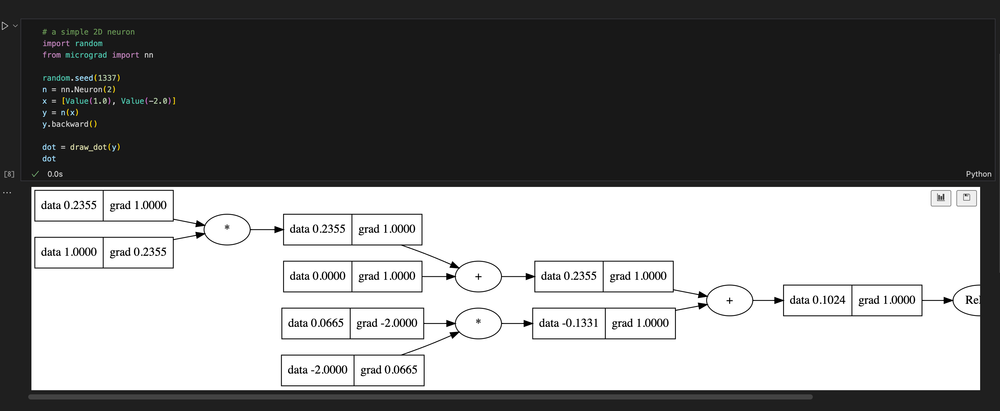
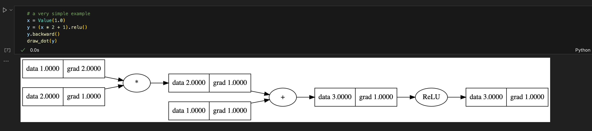

## tinygrad
1. 天才黑客 George Hotz（乔治 · 霍兹）
2. https://github.com/tinygrad/tinygrad/blob/master/tinygrad/tensor.py

## micrograd
1. https://github.com/karpathy/micrograd

### 梯度可视化




## 基础

### 有哪些计算操作有backward，哪些没有

在 `Value` 类中，**梯度计算规则（`_backward`）的显式定义与隐式复用**如下：

---

#### **显式定义 `_backward` 的操作**
以下操作直接实现了梯度计算规则：

1. **加法 (`__add__`)**  
   - 前向：`out = a + b`  
   - 梯度规则：  
     ```python
     def _backward():
         a.grad += out.grad  
         b.grad += out.grad
     ```

2. **乘法 (`__mul__`)**  
   - 前向：`out = a * b`  
   - 梯度规则：  
     ```python
     def _backward():
         a.grad += b.data * out.grad  # ∂a = b * ∂out
         b.grad += a.data * out.grad  # ∂b = a * ∂out
     ```

3. **幂运算 (`__pow__`)**  
   - 前向：`out = a ** k`（`k` 为常数）  
   - 梯度规则：  
     ```python
     def _backward():
         a.grad += (k * a.data ** (k-1)) * out.grad  # ∂a = k*a^(k-1)*∂out
     ```

4. **ReLU 激活 (`relu`)**  
   - 前向：`out = max(0, a)`  
   - 梯度规则：  
     ```python
     def _backward():
         a.grad += (out.data > 0) * out.grad  # ∂a = ∂out if a > 0 else 0
     ```

---

#### **隐式复用 `_backward` 的操作**
以下操作通过组合上述操作实现，**无需显式定义梯度规则**：

1. **取负 (`__neg__`)**  
   - 实现：`-a = a * (-1)`  
   - 梯度由 `__mul__` 处理。

2. **减法 (`__sub__`)**  
   - 实现：`a - b = a + (-b)`  
   - 梯度由 `__add__` 和 `__neg__` 处理。

3. **除法 (`__truediv__`)**  
   - 实现：`a / b = a * (b ** -1)`  
   - 梯度由 `__mul__` 和 `__pow__` 处理。

4. **反向运算符**  
   - `__radd__`（`other + self`）、`__rsub__`（`other - self`）、`__rmul__`（`other * self`）、`__rtruediv__`（`other / self`）  
   - 均通过调用正向运算符（如 `__add__`, `__mul__` 等）实现，梯度由对应正向规则处理。

---

#### **总结**
| 操作类型        | 显式定义 `_backward`? | 依赖的底层操作            |
|-----------------|-----------------------|--------------------------|
| `+`（加法）     | ✔️                    | —                        |
| `*`（乘法）     | ✔️                    | —                        |
| `**`（幂运算）  | ✔️                    | —                        |
| `relu`          | ✔️                    | —                        |
| `-`（取负）     | ❌                    | `*`（乘法）              |
| `-`（减法）     | ❌                    | `+` 和 `-`（加法与取负） |
| `/`（除法）     | ❌                    | `*` 和 `**`（乘法与幂）  |
| 反向运算符      | ❌                    | 对应的正向运算符          |

---

#### **关键设计思想**
1. **原子操作定义梯度**：仅对基础数学操作（如加、乘、幂、ReLU）显式定义梯度规则。
2. **复合操作复用规则**：复杂操作（如减法、除法）通过组合原子操作实现，复用其梯度计算逻辑。
3. **计算图与链式法则**：通过构建计算图，利用反向拓扑排序和链式法则，自动传播梯度。

这种设计减少代码冗余，提高可维护性，并确保梯度计算的正确性。