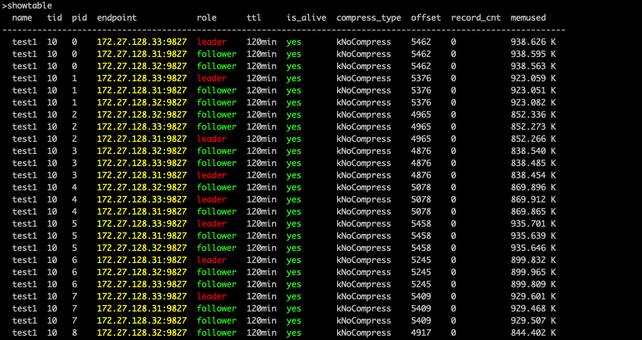

代码质量解决方案

- 代码的质量决定一个软件的生死
- 如何测试代码就是在找病因
- 如何自动化测试代码就是如何保证代码长久稳定茁壮成长

[TOC]


## 测试用例的设计

- 测试代码的状态
  - 可实现
  - 未知
  - 探索中
  - 不可实现


## 测试用例的实现

- 要明白测试的变量是什么
  - 先找变量，比如check_binlog_sync_progress_delta
- 要明白测试的结果
  - 确定好标志性的变量即可，比如状态的alive
- 明白测试的步骤
  - 这里要设计好，必须是可实现的代码才行
- 测试用例的约束条件
  - 每个测试用例都应该互不干涉
  - 每个测试用例都不能把全局条件更改，导致另外的测试用例出错
  - 比如，下线某个leader节点和副本节点。就会导致下一个测试用例无法正常创建表
- 测试结果唯一性
  - 在出现可能出现多个状态的结果的时候，单一的比较对象结果，并不一定是正确测试方案
  - 比如，在一个表中有多个副本，不断表所在的服务器，最后一个服务器将不会改变状态
  - 这个时候如果只比较是否存在一个alive的服务器是不行的
  - 三个服务器，有一个存活的状态，另外两个都是dead状态
  - 但是也有可能有两个存活状态，或者三个存活状态。只比较服务器有存活机器，是不能得到背后真正的结果。应该每个服务器的状态都要比较。保证存在且只有一台服务器存活才行。
- 高效验证测试结果
  - 尽量用代码验证结果，而不是肉眼。
  - 如果需要肉眼，那么验证小数量数据。在展示数据的时候，显示的结构一定要一眼容易看出来。也就是用列表对比法。
  - 列表对比法，将结果打印打一个列表。不同列表进行比较
  - 比如在比较数据表的所有offset，所有role相关信息
  - 总之，拒绝纯肉眼验证结果
- 获取变量要保证唯一
  - 比如获取唯一的表，而不能参杂其他的表
  - 表中获取确定的分片，而不是参杂其他分片
- 测试用例的收尾
  - 一定要干干净净，不留痕迹。创建的表，就销毁掉。留着只会影响后面的测试用例
- 异步的代码永远不能通过返回消息来判断是否执行成功
  - 项目必须给出一个入口，也就是能定位异步后的真正执行工作的代码和结果
  - 只有同步代码才能一行一行的测试
  - 异步代码一定要第三方手段进行测试

## 测试技巧

- 针对不确定等待多长时间的，为了包含它的等待限度同时具有弹性等待如何解决呢
  - 用循环，每次循环等待1秒，控制循环参数
  - 满足条件立刻跳出去
- 为了保证结果的唯一性，或者说进程能够运行完整

  - 循环法+条件法
  - 用循环不断获取结果
  - 条件法不断验证结果
  - 条件正确跳出循环
  - 然后assert验证
  - 循环次数有限一般10次，间隔时间可控一般2s。在测试环境中
- 从一张数据表，判断主从关系是否正常

  - showtable为例
  - 用map结构
  - 先列出可能需要用的信息
  - tid,pid,endpoint,role:leader/follower,offset,record_cnt
  - 主从关系是否正常的判断逻辑

    - 对于每个tid,pid代表的数据表，put数据后，leader和follower都能同步数据成功。同步数据的字段就是看offset
  - 方案一
    - tid,pid确定好表，然后再循环查看endpoints 和对应的offset是否同步成功
    - 数据结构
    - 纯list，保留每一条表的信息。按顺序循环查找pid，然后再循环查找endpoints
    - 最后做比较
    - 效果太差
  - 方案二
    - tid在测试中不需要，冗余信息，showtable 一张表
    - role也不需要，不需要判断谁是leader和follow。只需要判断offset是否一致
    - record_cnt不需要
    - 只有pid,endpoint,offset需要
    - 每个pid，有三个endpoint，然后映射着offset
    - 数据结构
    - 每个pid是list。list中的元素都是map。map中，key是endpoint,value是offset
  - 方案三
    - 每个endpoint是list。list中的元素都是map。map中，key是pid,value是offset
  - 方案四
    - 每个endpoint是list，每个list的位置直接放着offset。下标索引对着pid.
  - 方案五
    - 因为是要确定主从关系，也就是put数据后是否正常同步offset
    - 在数据表之前put的部分数据
    - 然后操作完成，再put数据
    - 最后两张表比较offset的差值，如果差值为我们的之前的定植，那么主从关系正常，同步成功
    - 一个for循环直接结束，不用构造什么数据结构，和收集相关key，values
    - 我的天，怎么现在才想到
- 异步不能用常规测试方法测试
  - changeleader 是异步操作
    - changeleader 某张表以后，立刻drop 这张表。
    - 这个时候会出现，op一直无法执行的情况
    - op一直无法执行，是代码问题不是测试问题
## 测试图片参考

### 表的基本结构



## 测试过程案例

### showTable

- 测试点：showtable显示offset, record_cnt和memused
  - 变量是offset, record_cnt和memused
- 结果：
  - 数据和gettablestatus一致
  - showtable可以显示offset、record_cnt和memused
  - 直接用assert函数判断即可
- 测试步骤
  - 创建表
    - 可实现
  - put数据
    - 可实现
  - showtable
    - 可实现
  - 到tablet执行gettablestatus看offset是否一致
    - 比较麻烦
  - assert判断
    - 可实现
- 目标明确后可以，直接操作上手代码了


- 测试点：兼容性测试
  - 变量：不同的版本软件
- 结果
  - 数据显示均正常
- 测试步骤
  - 1.3.10 nsclient连1.3.7nameserver，然后showtable
  - 1.3.7nsclient连1.3.10nameserve，然后showtable
- 经过咨询，改测试难度过大，不可能写入自动化测试，所以不写


### cancelop

- 测试点：状态为inited的op可以cancel
  - 变量：op的状态
- 结果
  - 状态改变成canceled
- 测试步骤
  - 创建32分片的表
    - 可实现
  - 执行offliendpoint endpoint 1
    - 未知
    - 探索中
    - 可行
  - 找到inited的opid
    - 未知
    - 探索中
  - 执行cancelop op_id
    - 可行
- 咨询之后，第三步的执行操作，目前比较麻烦，暂时搁置

### Auto_failover

#### 1
- 测试点：auto_failover开启时不能执行offlineendpoint
  - 变量：auto_failover
- 结果
  - 执行离线操作会失败
- 测试步骤
  - confset auto_failover true
    - 可行
  - offlineendpoint {endpoint}
    - 可行
- 可以实现
#### 2
- 测试点：auto_failover开启时不能执行recoverendpoint
  - 变量：auto_failover
- 结果
  - 执行离线操作会失败
- 测试步骤
  - confset auto_failover true
    - 可行
  - recoverendpoint {endpoint}
    - 可行
- 可以实现

#### 3

- 测试点：autofailover开启时重启节点可以自动恢复
  - 变量：autofailover
- 结果
  - table 的 alive 变成yes
- 测试步骤
  - confset auto_failover true
    - 可行
  - create table
    - 可行
  - put一定数据
    - 可行
  - 下线一个tablet节点
    - 可行
  - 重启节点
    - 探索中
    - 咨询后，不是offlineendpoint函数
    - 而是kill 一个节点
    - 然后start 一个节点
- kill和start不好把握，理解不到位，还要继续咨询才能明白测试的点

#### 4

- 测试点：开启时节点下线，然后nameserver切换后超时时间内节点恢复
  - 变量：autofailover，nameserver
- 结果
  - 恢复后的table 的 offset 和 leader 保持一致
- 测试步骤
  - confset auto_failover true
  - create table
  - put一定数据
  - 下线一个tablet节点
    - 以上可行
  - kill nameserver leader
    - 探索中
    - showns无法定位内容
  - 超时时间内恢复节点
    - 探索中
- 探索后，发现可以实现，需要细心

#### 5

- 测试点：三副本最后一个节点下线没有做故障切换
  - 节点的is_alive
- 结果
  - 下线三个节点后，最后一个节点仍然保持存活状态
- 测试步骤
  - confset auto_failover true
  - create table
  - put一定数据
    - 以上可行
  - disconnectzk endpoint1
    - 探索中
    - 不是stop_client函数
    - 是disconnectzk()
  - disconnectzk endpoint2
  - disconnectzk endpoint3
    - 探索后，发现更准确的函数。理解到位才能提高效率继续往下写
  - showtable观察tablet的存活情况和状态
    - 可行
- showtable应该查询所有服务器的状态，才能得到唯一的解

#### 6

- 测试点：任务执行超时后打印日志
  - 变量：任务执行时间
- 结果
  - 会有日志打印，关于任务超时的问题
- 测试步骤
  - 修改任务超时时间name_server_op_execute_timeout为10秒(默认两小时)
    - ns ？ Tablet conf
  - create table
    - 可行
  - put20w+数据
    - 不可行
  - addreplica
    - 探索中
    - 可行
  - showopstatus
    - 可行
  - 查看nameserver日志关键词为"The executeion time of op is too long"
    - 探索中

#### 7

- 测试点：闪断一个tablet
  - 变量：中断tablet的连接
- 结果
  - 没有做故障迁移，主从关系正常
    - 探索中
- 测试步骤
  - disconnectzk
    - 可行
  - connectzk
    - 可行
- 是否做自动恢复呢


#### 8

- 测试点：连续两次重启同一个tablet
  - 重启tablet的次数
- 结果
  - 第二次重启后数据恢复正常，主从关系正常
    - 探索中
    - 第一次和最后一次的结果转换字符串然后比较
    - 仔细分析后，不能用字符串比较，因为下线tablet后主从结构发生变化
    - 需要
- 测试步骤
  - create table
  - put数据
  - 停止一个tablet
  - 重启一个tablet
  - 数据恢复好之后
  - 再重启一下
    - 以上可行
  - 重启之后要put数据
  - 判断主从关系
    - 后面两步进一步对测试点的深入理解添加的
    - 主从关系需要判断再一次put后，是否成功即可
- 经过咨询，要加上 停止一个tablet 这个测试步骤才行


#### 9

- 测试点：添加副本后offset追平后更新alive状态为yes，check_binlog_sync_progress_delta配置默认为10w
  - 变量：offset 和 check_binlog_sync_progress_delta
- 结果
  -  有checkbinlogprogress task
  - offset数据追平
- 测试步骤
  - check_binlog_sync_progress_delta 配置修改
    - 探索中
  - 创建表
  - put20w+数据
    - 不可行
    - 探索中
    - 20条即可
  - addreplica tableName pid endpoint
    - 可行
  - showtable/showopstatus
    - 可行

#### 10

测试


## 测试代码案例

### 测试技巧的主从关系实现方案的代码对比

#### 方案四

```python
        rs = self.showtable_with_tablename(self.ns_leader, name)
        rs_after = self.parse_tb(rs, ' ', [0, 1, 2, 3], [4, 5, 6, 7,8, 9,10])
        for i in range(10):
            time.sleep(1)
            offset_number = 0
            rs = self.showtable_with_tablename(self.ns_leader, name)
            rs_after = self.parse_tb(rs, ' ', [0, 1, 2, 3], [4, 5, 6, 7,8, 9,10])
            for table_info in rs_after:
                if rs_after[table_info][4] == '2':
                    offset_number = offset_number + 1
            if offset_number == 9:
                break
        after_endpoint1 = []
        after_endpoint2 = []
        after_endpoint3 = []
        for pid_index in range(pid_number):
            after_endpoint1.append(0)
            after_endpoint2.append(0)
            after_endpoint3.append(0)
        row = 0
        for table_info in rs_after:
            if rs_after.keys()[row][3] == '127.0.0.1:37770':
                after_endpoint1[int(rs_after.keys()[row][2])] = rs_after.values()[row][4]
            if rs_after.keys()[row][3] == '127.0.0.1:37771':
                after_endpoint2[int(rs_after.keys()[row][2])] = rs_after.values()[row][4]
            if rs_after.keys()[row][3] == '127.0.0.1:37772':
                after_endpoint3[int(rs_after.keys()[row][2])] = rs_after.values()[row][4]
            row = row + 1
        infoLogger.error(str(after_endpoint1))
        infoLogger.error(str(after_endpoint2))
        infoLogger.error(str(after_endpoint3))
        for index in range(len(after_endpoint1)):
            self.assertEqual(after_endpoint1[index], after_endpoint2[index])
            self.assertEqual(after_endpoint1[index], after_endpoint3[index])
```

#### 方案五

```
        rs = self.showtable_with_tablename(self.ns_leader, name)
        rs_after = self.parse_tb(rs, ' ', [0, 1, 2, 3], [4, 5, 6, 7,8, 9,10])
        for i in range(10):
            time.sleep(1)
            offset_number = 0
            rs = self.showtable_with_tablename(self.ns_leader, name)
            rs_after = self.parse_tb(rs, ' ', [0, 1, 2, 3], [4, 5, 6, 7,8, 9,10])
            for table_info in rs_after:
                if rs_after[table_info][4] == '2':
                    offset_number = offset_number + 1
            if offset_number == 9:
                break
        diff = 1
        for table_info in rs_after:
            if rs_after.values()[row][4] == '0':
                continue
            self.assertEqual(diff, int(rs_after[table_info][4]) - int(rs_before[table_info][4]))
```

