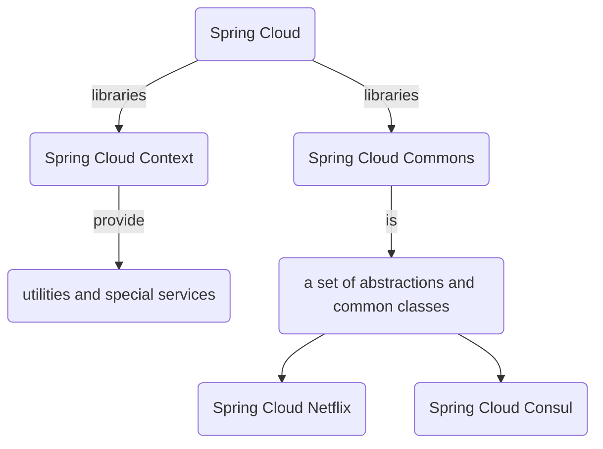
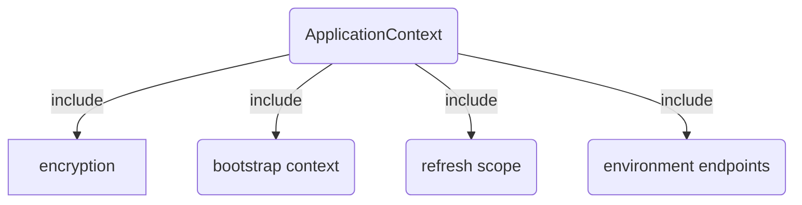
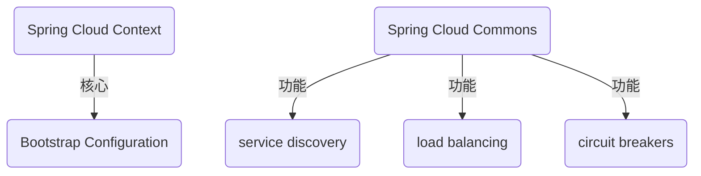

# Spring Cloud

| 作者 | MagnetoWang                                                  |
| ---- | ------------------------------------------------------------ |
| 邮箱 | 暂无                                                         |
| 说明 | 在理解spring boot之后，学习spring cloud 会有个更好的整体印象。 |
| 注意 | 请不要用于商业用途。分享学习经验是种有趣的爱好。             |
| 参考 | 官方文档                                                     |

[TOC]

## 感受

其实文档大部分内容就是教你怎么配置相关工具到你的项目。看了前面一部分后，就不怎么有耐心看后面的。边查边看吧。

## 特点

Spring Cloud focuses on providing good out of box experience for typical use cases and extensibility mechanism to cover others.

- Distributed/versioned configuration
- Service registration and discovery
- Routing
- Service-to-service calls
- Load balancing
- Circuit Breakers
- Distributed messaging

## 图解

### Spring Cloud 主要两个库

### ApplicationContext 包含的内容

### SpringCloudContext和SpringCloudCommons的功能

## 注解

| 注解                                                         | 说明                                                         |
| ------------------------------------------------------------ | ------------------------------------------------------------ |
| [@Scheduled](http://blog.didispace.com/springbootscheduled/) | 可以定时执行任务，或者设置频率执行代码。配合@EnableScheduling使用 |
| @ConfigurationProperties                                     | 把同类的配置信息自动封装成实体类 。比Configuration更好用     |
| @Configuration                                               |                                                              |
| @RefreshScope                                                |                                                              |
| @EnableDiscoveryClient                                       |                                                              |
| @LoadBalanced                                                |                                                              |
| @Bean                                                        |                                                              |
| @Autowired                                                   |                                                              |
| @Primary                                                     |                                                              |
| @EnableCircuitBreaker                                        |                                                              |
| @Component                                                   |                                                              |
| @HystrixCommand                                              |                                                              |
| @HystrixCommand                                              |                                                              |
| [@NotNull](https://stackoverflow.com/questions/17137307/in-hibernate-validator-4-1-what-is-the-difference-between-notnull-notempty) | The CharSequence, Collection, Map or Array object **is not null**, but *can* be empty. |
| [@NotEmpty](https://stackoverflow.com/questions/17137307/in-hibernate-validator-4-1-what-is-the-difference-between-notnull-notempty) | The CharSequence, Collection, Map or Array object is not null **and size > 0**. |
| [@NotBlank](https://stackoverflow.com/questions/17137307/in-hibernate-validator-4-1-what-is-the-difference-between-notnull-notempty) | The string is not null **and the trimmed length is greater than zero**. |
|                                                              |                                                              |
|                                                              |                                                              |
|                                                              |                                                              |
|                                                              |                                                              |
|                                                              |                                                              |
|                                                              |                                                              |
|                                                              |                                                              |
|                                                              |                                                              |
|                                                              |                                                              |
|                                                              |                                                              |
|                                                              |                                                              |
|                                                              |                                                              |
|                                                              |                                                              |
|                                                              |                                                              |

## 十万个什么

### 什么是Spring Cloud

是一系列框架的有序集合。它利用Spring Boot的开发便利性巧妙地简化了分布式系统基础设施的开发，如服务发现注册、配置中心、消息总线、负载均衡、断路器、数据监控等，都可以用Spring Boot的开发风格做到一键启动和部署。Spring并没有重复制造轮子，它只是将目前各家公司开发的比较成熟、经得起实际考验的服务框架组合起来，通过Spring Boot风格进行再封装屏蔽掉了复杂的配置和实现原理，最终给开发者留出了一套简单易懂、易部署和易维护的分布式系统开发工具包。

Built directly on Spring Boot's innovative approach to enterprise Java, Spring Cloud simplifies distributed, microservice-style architecture by implementing proven patterns to bring resilience, reliability, and coordination to your microservices. 

### 什么是WebFlux

### 什么是WebClient

### [什么是MockMvc](https://blog.csdn.net/zhang289202241/article/details/62042842)

MockMvc实现了对Http请求的模拟，能够直接使用网络的形式，转换到Controller的调用，这样可以使得测试速度快、不依赖网络环境，而且提供了一套验证的工具，这样可以使得请求的验证统一而且很方便。 

## 十万个为什么

 

 

 

 

 

