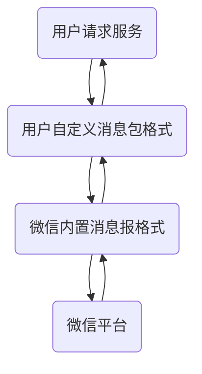
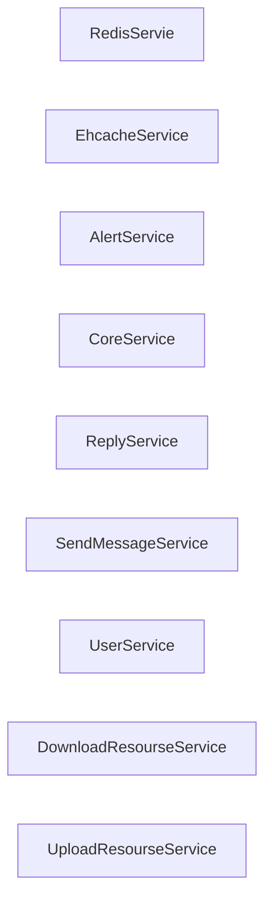
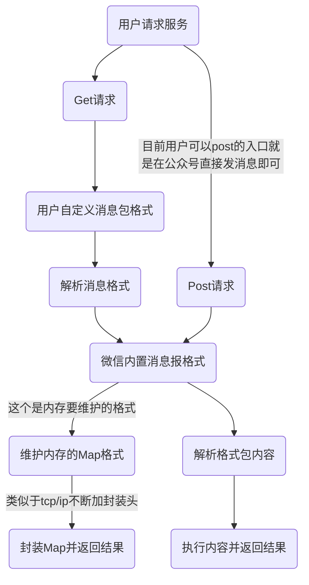
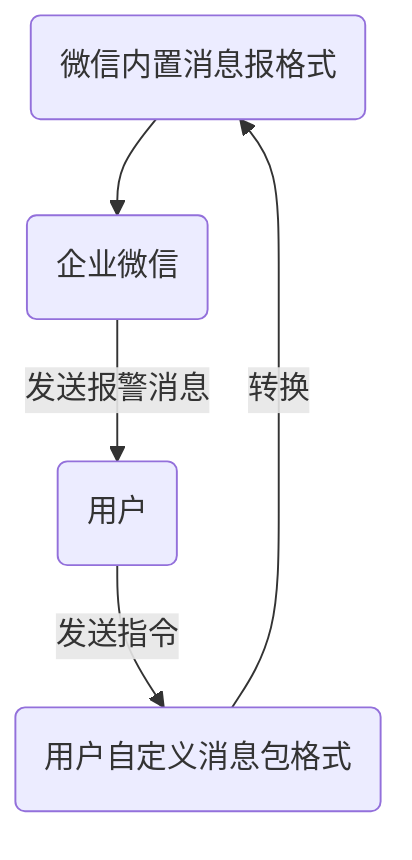

## 本来非常乱的思路，在画流程图中，变得更加清晰明了。同时流程图变得更加简洁。多亏流程图这个工具帮我理清思路

## 整体流程

```mermaid
graph TD
user(用户请求服务) 
SelfMessage(用户自定义消息包格式)
WeChatMessage(微信内置消息报格式)
wechat(微信平台)

user-->SelfMessage
SelfMessage-->WeChatMessage
WeChatMessage-->wechat
wechat-->WeChatMessage

WeChatMessage-->SelfMessage
SelfMessage-->user
```

## 基础服务

```mermaid
graph LR
RedisServie
EhcacheService
AlertService
CoreService
ReplyService
SendMessageService
UserService
DownloadResourseService
UploadResourseService
```

## 消息的post和get实现流程

```mermaid
graph TD
user(用户请求服务) 
SelfMessage(用户自定义消息包格式)
WeChatMessage(微信内置消息报格式)
user--> Get(Get请求) 
Get --> SelfMessage
    SelfMessage --> ConvertMessageToWeChatMessage(解析消息格式)
    ConvertMessageToWeChatMessage --> WeChatMessage(转换微信工具包的官方格式)
   WeChatMessage -->| 这个是内存要维护的格式| maintainID(维护内存的Map格式)
    maintainID -->|类似于tcp/ip不断加封装头| F(封装Map并返回结果)
    
    
    
 
 
user -->|目前用户可以post的入口就是在公众号直接发消息即可| Post(Post请求)
Post --> WeChatMessage(微信内置消息报格式)
WeChatMessage --> analysis(解析格式包内容)
analysis--> PostResult(执行内容并返回结果)
```

## 报警消息的远程互动流程

### 使用场景的流程抽象

本以为是个长线过程，最终抓到本质，其实是个循环过程。现在就可以抽象实现代码了。

比如：先检查指令再转换格式。

```mermaid
graph TD
WeChatMessage(微信内置消息报格式)
user(用户)
wechat(企业微信)
SelfMessage(用户自定义消息包格式)


wechat-->|发送报警消息|user


user-->|发送指令|SelfMessage
SelfMessage-->|转换|WeChatMessage
WeChatMessage-->wechat


```