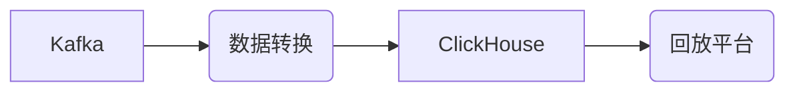
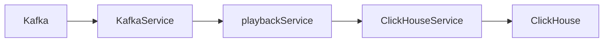
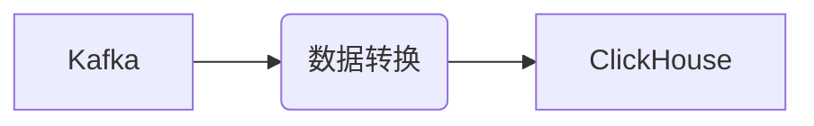
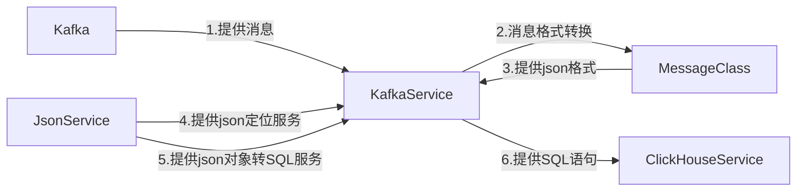
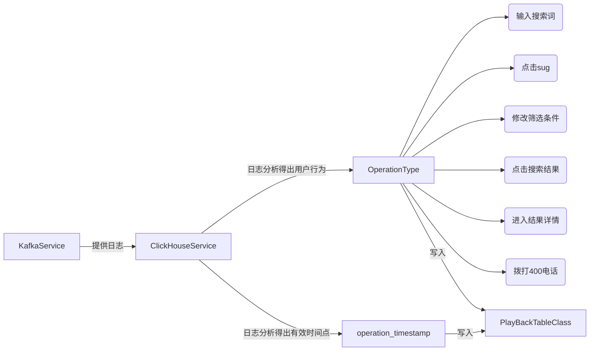
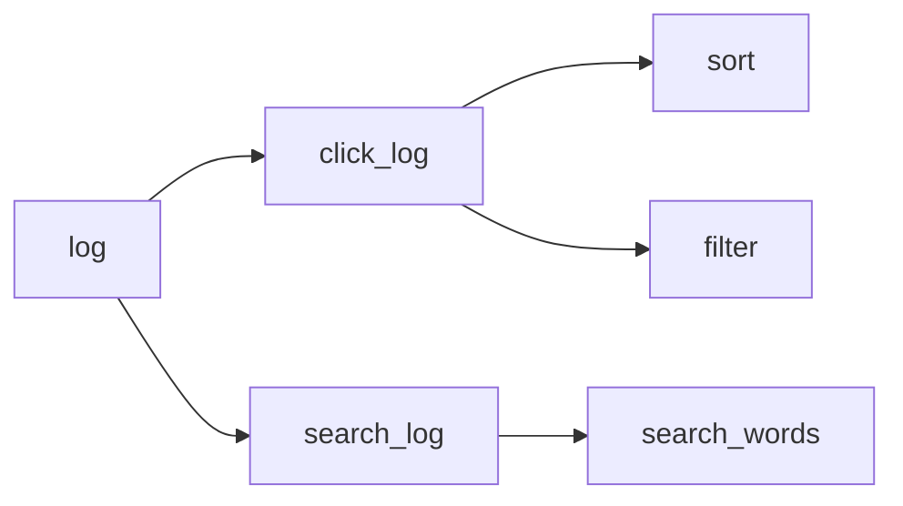
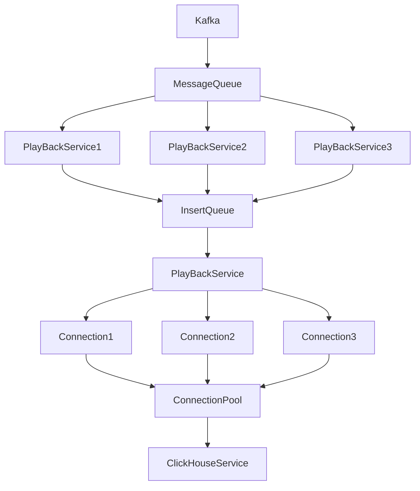

## 整体过程

## 服务

## 数据转换

## KafkaService

## ClickHouseService

## 用户行为逻辑

- 问题：如何从已有的日志数据提取我们想要的有用的数据呢？

## 多线程PlayBackService

- 原则
  - run函数：必须只执行一个工作
  - 线程池数据必须加约束条件
- 方案
  - 只生成insert语句
  - 用队列维护数据，确保多线程下操作不冲突
- 问题
  - 高并发大流量情况下，连接池始终不够用
  - 而且数据库那边拒绝100个以上的并发请求
  - 不过小流量情况，跑的挺稳定的

## 回放平台

