## 整体过程

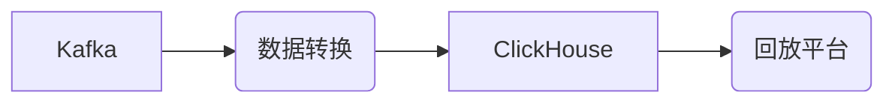

## 服务

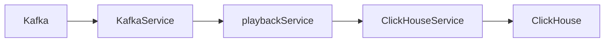

## 数据转换

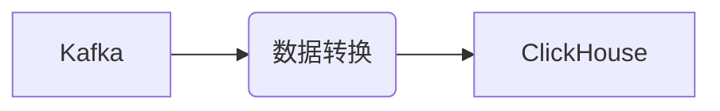

## KafkaService
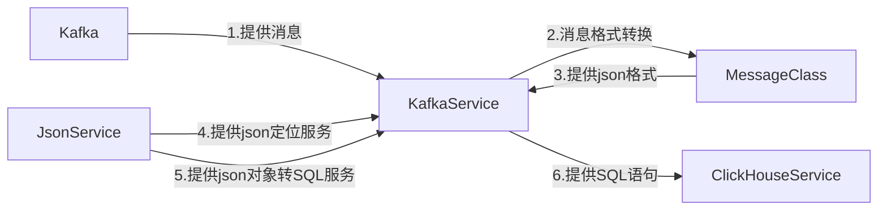

## ClickHouseService
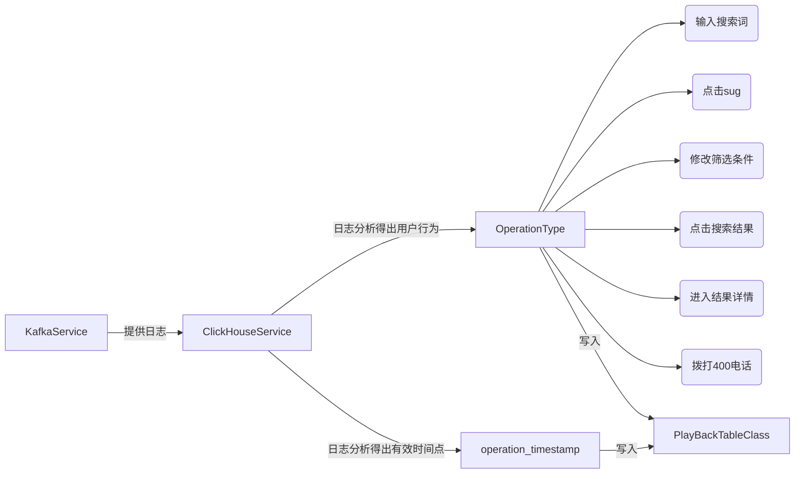

## 用户行为逻辑

- 问题：如何从已有的日志数据提取我们想要的有用的数据呢？

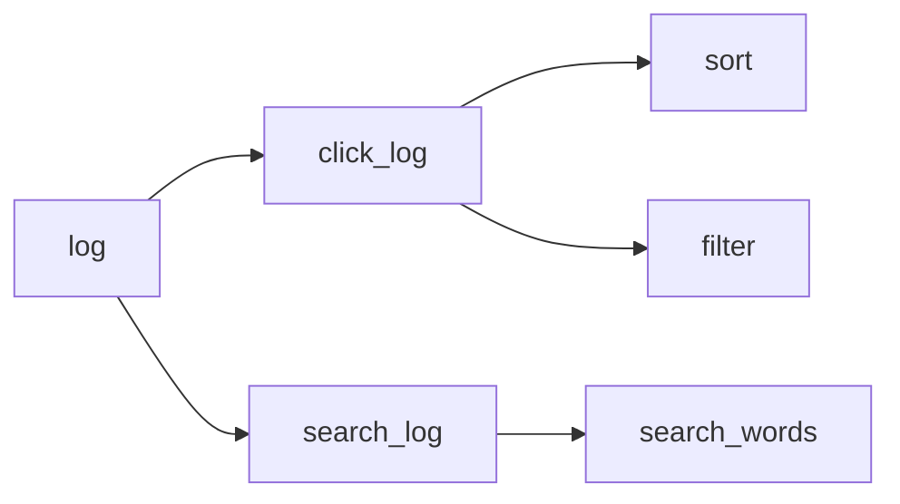

## 多线程PlayBackService

- 原则
  - run函数：必须只执行一个工作
  - 线程池数据必须加约束条件
- 方案
  - 只生成insert语句
  - 用队列维护数据，确保多线程下操作不冲突
- 问题
  - 高并发大流量情况下，连接池始终不够用
  - 而且数据库那边拒绝100个以上的并发请求
  - 不过小流量情况，跑的挺稳定的

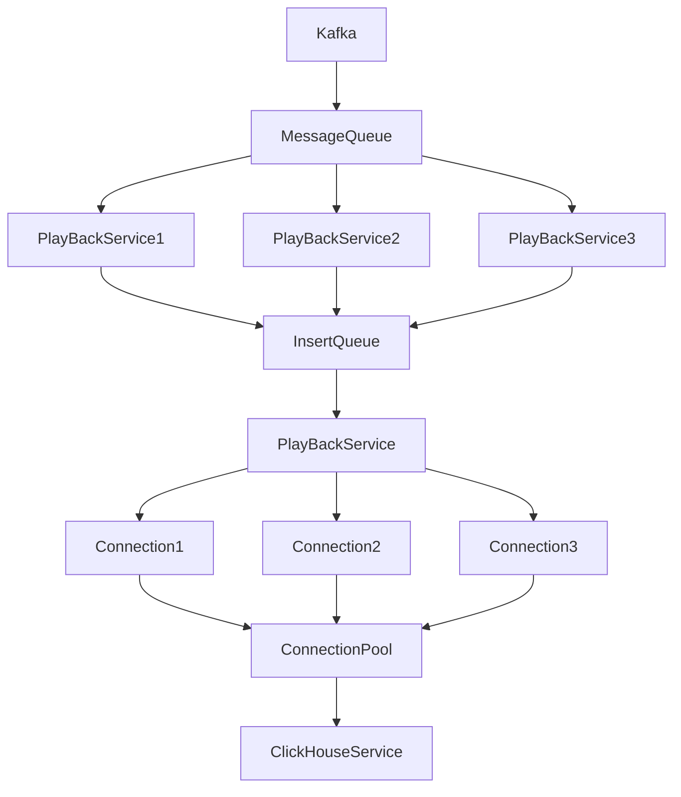

## 用户行为总结

1. 输入搜索词，显示搜索词结果
2. 点击sug
3. 修改筛选条件，filter字段
4. 点击搜索结果，显示点击的位置
5. 进入结果详情
6. 拨打400电话
7. 排序，sort字段

## PlayBackTable的填充

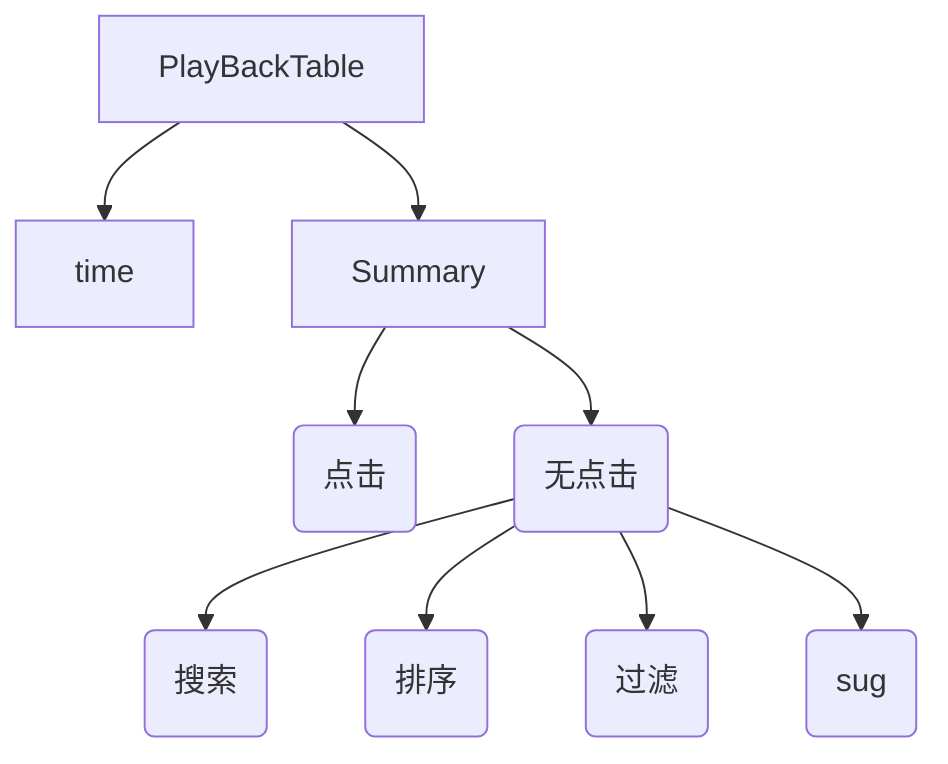

## PlayBackTypeTable的填充

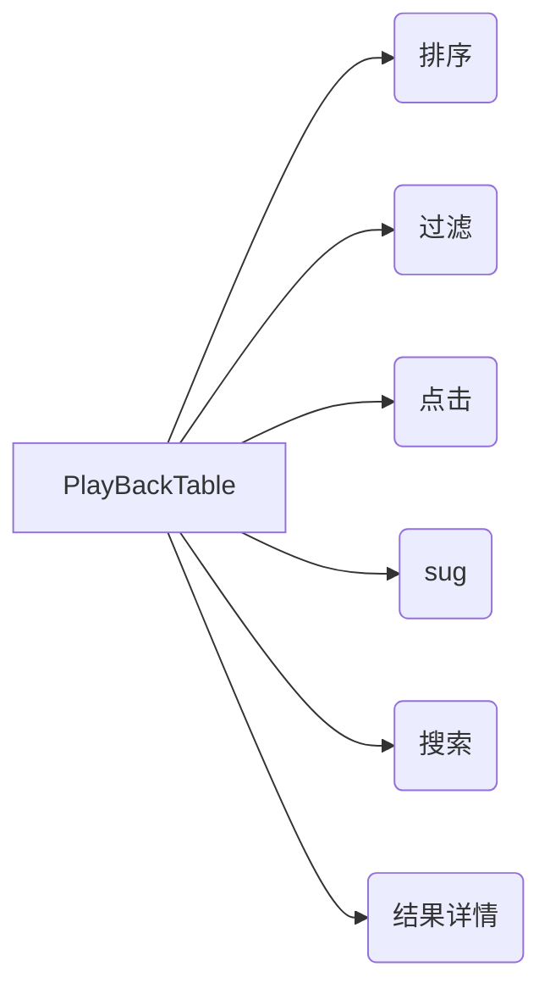

## 问题

- clickhouse连接池超时问题
  - 单连接方案
  - 自己建立连接池
  - 使用C3P0可是不熟悉，折腾到后面也没有跑动代码
  - 用clickhouseDataSource明显减少这个问题
  - 如何达到一万条不漏数据呢！
  - 因为连接超时丢出的是异常！所以在catch段中在执行一次。目前1万条数据，不少1条。可以说比较完美的解决方案了
  - 

## 回放平台

## 显示房源详细信息

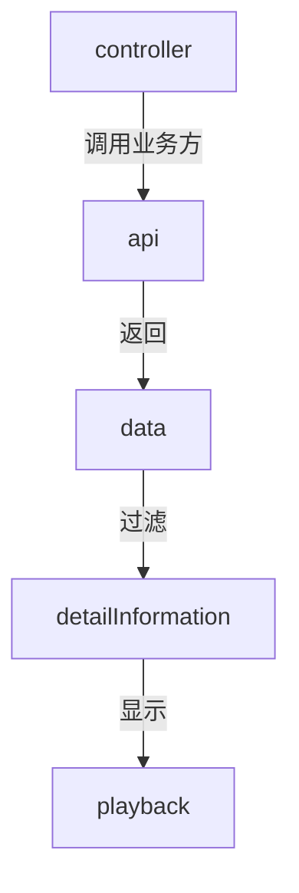

## 字段解析

### filter字段

- and 和 or 
- 无论match，range直接选中
- 过滤字段的id映射文件

### sort字段

- 上升或下降
- 同样需要映射文件

### 难点

- id映射特别容易出错，为了保证以后的扩展是容易调用，必须切割成一个个功能模块
- filter解析后的格式应该是怎样的
- sort解析格式又是怎样的

## 字段解析流程图一般化

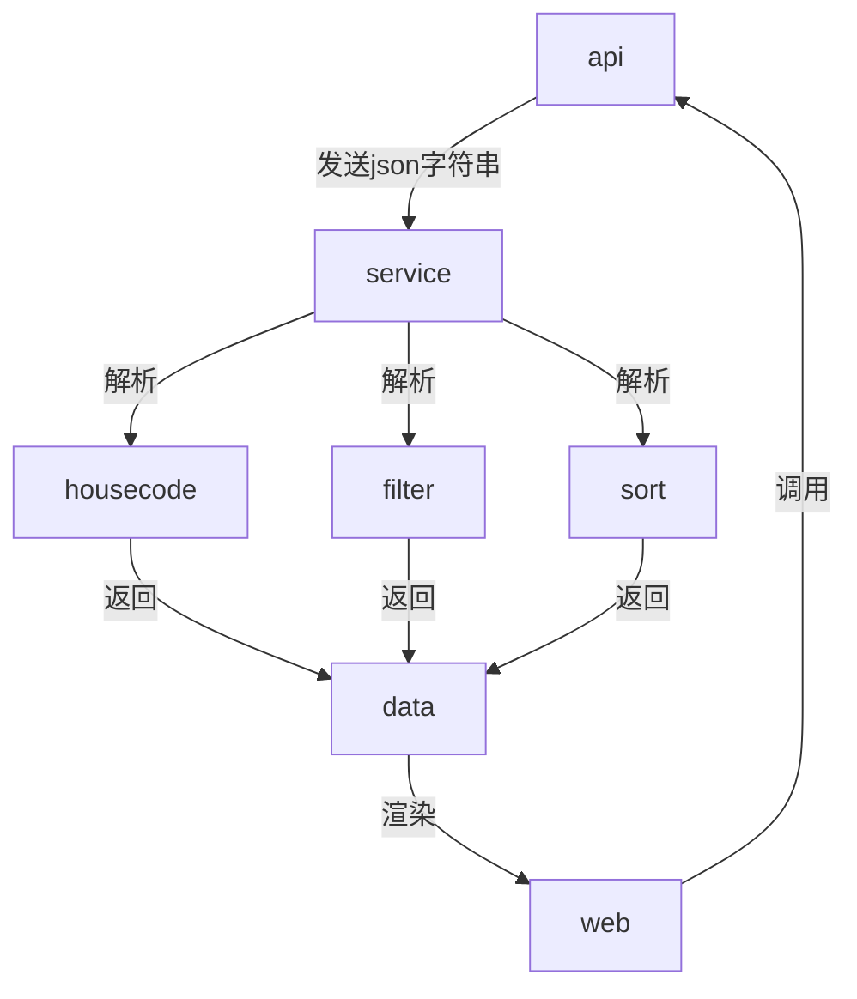