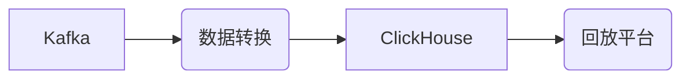
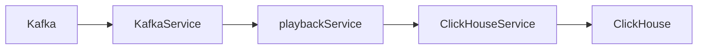
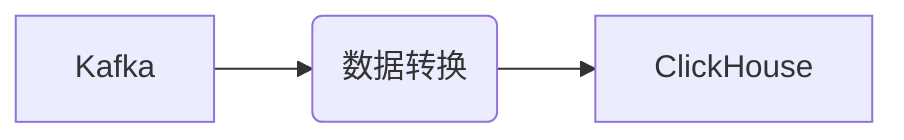
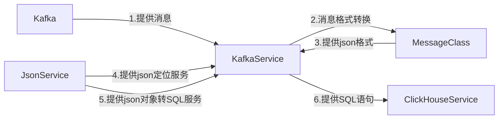
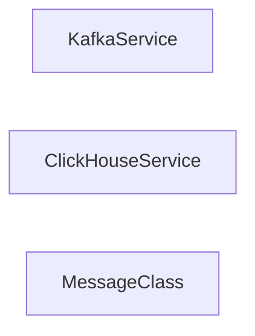

## 整体过程

```mermaid
graph LR
Kafka
ClickHouse
playback(数据转换)
search(回放平台)
Kafka-->playback
playback-->ClickHouse
ClickHouse-->search

```

## 服务

```mermaid
graph LR
Kafka
ClickHouse
KafkaService
ClickHouseService
playbackService

Kafka-->KafkaService
ClickHouseService-->ClickHouse

KafkaService-->playbackService
playbackService-->ClickHouseService


```

## 数据转换

```mermaid
graph LR
Kafka
ClickHouse
playback(数据转换)

Kafka-->playback
playback-->ClickHouse
```

## KafkaService

```mermaid
graph LR
Kafka
KafkaService
JsonService
ClickHouseService
MessageClass

Kafka-->|1.提供消息|KafkaService
KafkaService-->|2.消息格式转换|MessageClass
MessageClass-->|3.提供json格式|KafkaService
JsonService-->|4.提供json定位服务|KafkaService
JsonService-->|5.提供json对象转SQL服务|KafkaService


KafkaService-->|6.提供SQL语句|ClickHouseService


```

## ClickHouseService

```mermaid
graph LR
KafkaService
ClickHouseService
MessageClass


```

## 回放平台