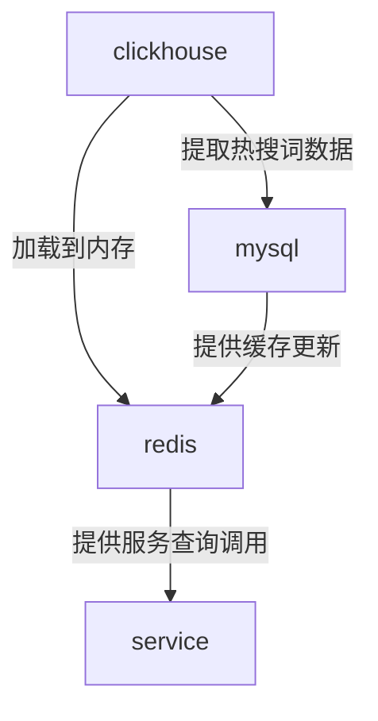

## 流程图

- 读取clickhouse数据
- 放到redis
- 需要的时候一次性从redis加载出来

## 时间

- 30天内：2678400000

## 数据库操作

### 获取该城市的热搜词

- select count(*) as search_count , operation_value from  search.playbacktype  where  operation_type=1  and pt < '2018-08-13' and pt >= '2018-07-13' and route = '110000' group by operation_value having search_count>=3 order by  search_count desc  limit 0 , 5000 

### 获取城市列表

- select count(*) as search_count,route from   search.playbacktype group by route order by  search_count desc  limit 0 , 5000 

## 问题

- 无法找出包：clean 然后 install

## 设计框架

- jpa
  - https://www.jianshu.com/p/633922bb189f
- 

