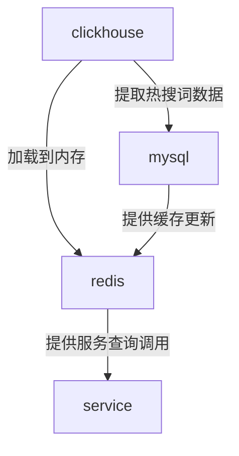

## 流程图

- 读取clickhouse数据
- 放到redis
- 需要的时候一次性从redis加载出来



## 时间

- 30天内：2678400000


## 数据库操作

### 获取该城市的热搜词

- select count(*) as search_count , operation_value from  search.playbacktype  where  operation_type=1  and pt < '2018-08-13' and pt >= '2018-07-13' and route = '110000' group by operation_value having search_count>=3 order by  search_count desc  limit 0 , 5000 

### 获取城市列表

- select count(*) as search_count,route from   search.playbacktype group by route order by  search_count desc  limit 0 , 5000 


## 问题

- 无法找出包：clean 然后 install
- 出现跨模块bug
  - 原因：直接调用另一个模块的方法
  - 出错：无法直接调用
  - 解答：模块的使用两种方法。一种是打包成jar包，然后maven依赖即可
  - 另一种是模块上线到服务中，然后再用服务注册的方法使用方法。不能用maven依赖的方法。否则报错
- 服务调用超时
  - http://www.itmuch.com/spring-cloud-sum/spring-cloud-timeout/


## 设计框架

- jpa
  - https://www.jianshu.com/p/633922bb189f
  - https://blog.csdn.net/tony308001970/article/details/74999680
  - https://www.cnblogs.com/chenpi/p/6357527.html

- redis集成sprIng

  - https://www.bysocket.com/?p=1756
  - https://coolshell.cn/articles/17416.html

- json

  - 解析list：List<Student> studentList1 = JSON.parseArray(JSON.parseObject(json).getString("studentList"), Student.class); 

- @Schedule

  - 定时任务

  - `fixedRate = 5000`表示每隔5000ms，Spring scheduling会调用一次该方法，不论该方法的执行时间是多少

  - `fixedDelay = 5000`表示当方法执行完毕5000ms后，Spring scheduling会再次调用该方法

  - `cron = "*/5 * * * * * *"`提供了一种通用的定时任务表达式，这里表示每隔5秒执行一次，更加详细的信息可以参考

  - https://www.jianshu.com/p/4500b0890fda

  - ```
    0 0 10,14,16 * * ? 每天上午10点，下午2点，4点
     0 0/30 9-17 * * ? 朝九晚五工作时间内每半小时
     0 0 12 ? * WED 表示每个星期三中午12点
     "0 0 12 * * ?" 每天中午12点触发
     "0 15 10 ? * *" 每天上午10:15触发
     "0 15 10 * * ?" 每天上午10:15触发
     "0 15 10 * * ? *" 每天上午10:15触发
     "0 15 10 * * ? 2005" 2005年的每天上午10:15触发
     "0 * 14 * * ?" 在每天下午2点到下午2:59期间的每1分钟触发
     "0 0/5 14 * * ?" 在每天下午2点到下午2:55期间的每5分钟触发
     "0 0/5 14,18 * * ?" 在每天下午2点到2:55期间和下午6点到6:55期间的每5分钟触发
     "0 0-5 14 * * ?" 在每天下午2点到下午2:05期间的每1分钟触发
     "0 10,44 14 ? 3 WED" 每年三月的星期三的下午2:10和2:44触发
     "0 15 10 ? * MON-FRI" 周一至周五的上午10:15触发
     "0 15 10 15 * ?" 每月15日上午10:15触发
     "0 15 10 L * ?" 每月最后一日的上午10:15触发
     "0 15 10 ? * 6L" 每月的最后一个星期五上午10:15触发
     "0 15 10 ? * 6L 2002-2005" 2002年至2005年的每月的最后一个星期五上午10:15触发
     "0 15 10 ? * 6#3" 每月的第三个星期五上午10:15触发
    
    ```

    


